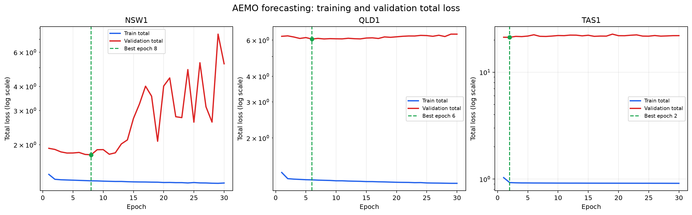
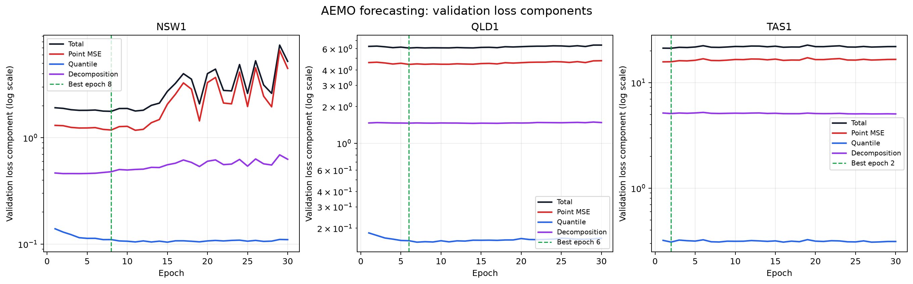

# AEMO NSW/QLD/TAS forecasting experiments

This file records the first completed three-region forecasting run. All values under **Local results** were produced by this repository. The RE-Price values are external `paper-reported` references and were not reproduced here.

## Run scope

| Item | Value |
|---|---|
| Regions | NSW1, QLD1, TAS1 |
| Data period | 2015-01-01 00:00 to 2024-12-31 23:00, Australia/Brisbane |
| Train | 2015-01-01 to 2021-12-31 |
| Validation | 2022-01-01 to 2022-12-31 |
| Test | 2023-01-01 to 2024-12-31 |
| History / horizon / stride | 72 hours / 24 hours / 1 hour |
| Random seed | 2026 |
| Result timestamp | 2026-09-21 UTC |

## Reproduction commands

```bash
CUDA_VISIBLE_DEVICES=0 python -m forecasting.train --config configs/aemo_forecast.yaml --region NSW1 2>&1 | tee logs/forecasting/nsw1.log
CUDA_VISIBLE_DEVICES=1 python -m forecasting.train --config configs/aemo_forecast.yaml --region QLD1 2>&1 | tee logs/forecasting/qld1.log
CUDA_VISIBLE_DEVICES=2 python -m forecasting.train --config configs/aemo_forecast.yaml --region TAS1 2>&1 | tee logs/forecasting/tas1.log
```

These commands reproduce the three-GPU layout. The original log files do not record `CUDA_VISIBLE_DEVICES`, so the exact GPU indices used by the completed run are unknown.

## Configuration

Source: [`configs/aemo_forecast.yaml`](../../configs/aemo_forecast.yaml)

| Group | Setting | Value |
|---|---|---|
| Inputs | Historical variables | `rrp_aud_per_mwh`, `total_demand_mw` |
| Inputs | Known future variables | hour, weekday, day-of-year and month sine/cosine; weekend flag; standardized year |
| Target | Variable | `rrp_aud_per_mwh` |
| Model | CTF frequencies / cutoff | 16 / 10 |
| Model | Hidden dimension / layers | 64 / 3 |
| Model | DGF atoms / base sigma | 16 / 0.05 |
| Model | Quantiles | 0.05, 0.10, 0.50, 0.90, 0.95 |
| Loss | Point / quantile / decomposition weights | 1.0 / 1.0 / 1.0 |
| Loss | Smoothness / sparsity weights | 0.001 / 0.001 |
| Loss | Target sparsity / excess weight | 0.3 / 10.0 |
| Training | Batch size / epochs | 128 / 30 |
| Training | Learning rate / weight decay | 0.0003 / 0.0001 |
| Training | Optimizer | AdamW |
| Training | Device / workers | CUDA / 0 |

## Environment

| Python | PyTorch | CUDA runtime | NumPy | pandas | SciPy | scikit-learn |
|---:|---:|---:|---:|---:|---:|---:|
| 3.11.0 | 2.5.1+cu124 | 12.4 | 2.4.6 | 3.0.6 | 1.17.1 | 1.9.1 |

The machine exposes eight NVIDIA L40 GPUs with 46,068 MiB each. The exact physical GPU assigned to each completed run was not persisted.

## Files

| Region | Console log | Metrics | Training history | Best checkpoint |
|---|---|---|---|---|
| NSW1 | [`nsw1.log`](nsw1.log) | [`metrics.json`](../../outputs/forecasting/NSW1/metrics.json) | [`training_history.csv`](../../outputs/forecasting/NSW1/training_history.csv) | [`best_model.pt`](../../outputs/forecasting/NSW1/best_model.pt) |
| QLD1 | [`qld1.log`](qld1.log) | [`metrics.json`](../../outputs/forecasting/QLD1/metrics.json) | [`training_history.csv`](../../outputs/forecasting/QLD1/training_history.csv) | [`best_model.pt`](../../outputs/forecasting/QLD1/best_model.pt) |
| TAS1 | [`tas1.log`](tas1.log) | [`metrics.json`](../../outputs/forecasting/TAS1/metrics.json) | [`training_history.csv`](../../outputs/forecasting/TAS1/training_history.csv) | [`best_model.pt`](../../outputs/forecasting/TAS1/best_model.pt) |

## Local results

### Training curves





### Dataset sizes and model selection

| Region | Train windows | Validation windows | Test windows | Best epoch | Best validation total loss | Final training total loss |
|---|---:|---:|---:|---:|---:|---:|
| NSW1 | 61,273 | 8,737 | 17,521 | 8/30 | 1.774037 | 1.268737 |
| QLD1 | 61,273 | 8,737 | 17,521 | 6/30 | 6.076369 | 1.202618 |
| TAS1 | 61,273 | 8,737 | 17,521 | 2/30 | 21.200955 | 0.912223 |

`metrics.json` stores zero-based best epochs (7, 5, and 1); the table uses human-readable epoch numbers (8, 6, and 2).

### Validation metrics at the selected checkpoint

| Region | MAE (AUD/MWh) | RMSE (AUD/MWh) | 80% coverage | 80% mean width | 90% coverage | 90% mean width |
|---|---:|---:|---:|---:|---:|---:|
| NSW1 | 56.3191 | 179.3832 | 64.15% | 125.3292 | 85.85% | 218.4768 |
| QLD1 | 96.1624 | 427.3042 | 64.87% | 188.0268 | 90.47% | 355.4294 |
| TAS1 | 62.2210 | 273.1233 | 38.49% | 71.8134 | 65.61% | 142.1390 |

### Test metrics at the selected checkpoint

| Region | MAE (AUD/MWh) | RMSE (AUD/MWh) | 80% coverage | 80% mean width | 90% coverage | 90% mean width |
|---|---:|---:|---:|---:|---:|---:|
| NSW1 | 60.9251 | 400.5916 | 62.55% | 89.1850 | 83.97% | 174.0480 |
| QLD1 | 65.6180 | 279.9669 | 67.37% | 106.1958 | 90.61% | 208.9505 |
| TAS1 | 37.1264 | 161.6860 | 39.37% | 46.2584 | 68.66% | 92.2706 |

### Test loss components

| Region | Total | Point | Quantile | Decomposition | Smoothness | Sparsity |
|---|---:|---:|---:|---:|---:|---:|
| NSW1 | 7.856348 | 5.903404 | 0.125783 | 1.826783 | 0.126397 | 0.252075 |
| QLD1 | 2.728067 | 1.912101 | 0.086434 | 0.729157 | 0.068527 | 0.307171 |
| TAS1 | 7.622208 | 5.533191 | 0.173170 | 1.914390 | 0.075824 | 1.381370 |

## External RE-Price reference

| Region | Local MAE | RE-Price MAE | MAE reduction needed | Local RMSE | RE-Price RMSE | RMSE reduction needed | RE-Price CRPS |
|---|---:|---:|---:|---:|---:|---:|---:|
| NSW | 60.9251 | 23.48 | 61.5% | 400.5916 | 34.15 | 91.5% | 17.36 |
| QLD | 65.6180 | 25.85 | 60.6% | 279.9669 | 37.15 | 86.7% | 20.58 |
| TAS | 37.1264 | 18.96 | 48.9% | 161.6860 | 22.81 | 85.9% | 13.13 |

RE-Price uses price, load forecast, temperature, and more than 2,000 WattClarity news articles. The local pipeline uses price, demand, and known calendar variables without news. The external values are therefore a closely related reference, not a directly comparable local leaderboard. Reference: [Chen et al., Applied Energy (2026), DOI 10.1016/j.apenergy.2026.128712](https://doi.org/10.1016/j.apenergy.2026.128712).

## Interpretation and missing measurements

| Finding | Evidence |
|---|---|
| Extreme errors dominate | Test RMSE is 4.35–6.58 times MAE across the three regions. |
| More epochs alone did not improve selection | The best checkpoints occur at epochs 8, 6, and 2 while training loss continues to decrease. |
| Interval calibration is incomplete | NSW and TAS under-cover both nominal intervals; QLD reaches 90.61% coverage for the nominal 90% interval but under-covers the 80% interval. |
| Probability comparison is incomplete | The local evaluator does not yet calculate CRPS, AIS, NLL, or PIAW under the RE-Price definitions. |
| Replication metadata is incomplete | Start/end timestamps, wall-clock duration, exact GPU mapping, GPU driver, and git revision were not saved by this run. |
