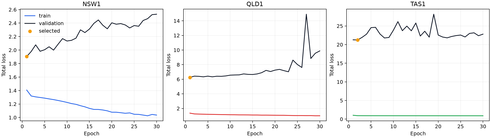
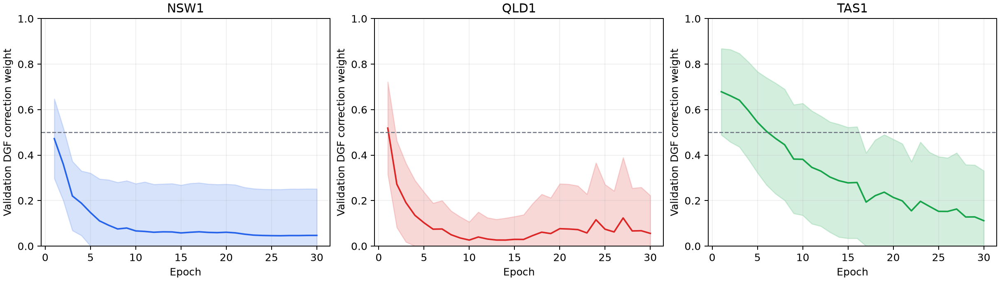
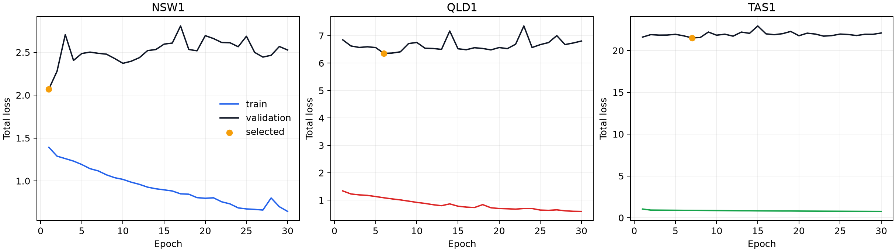
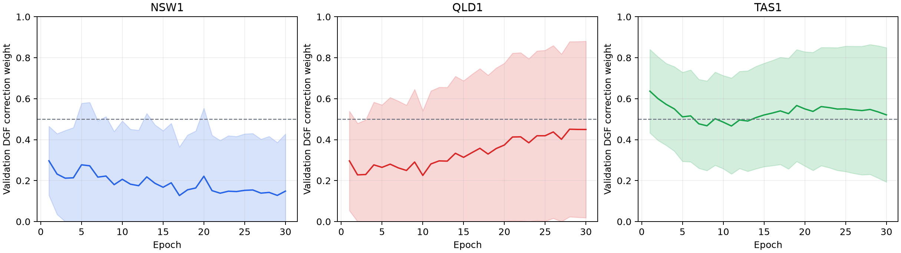
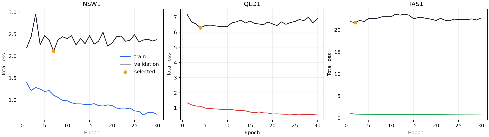
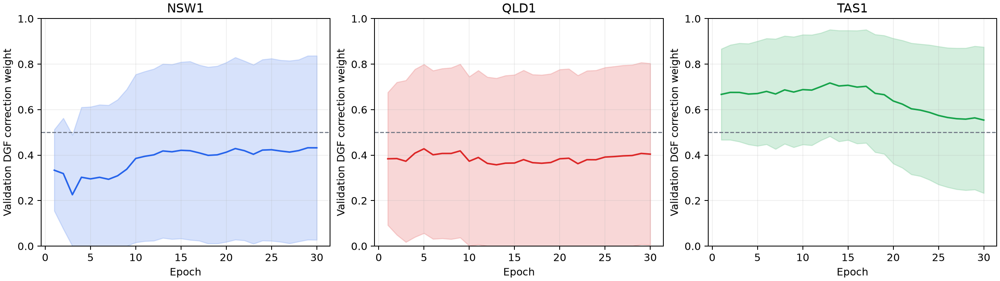
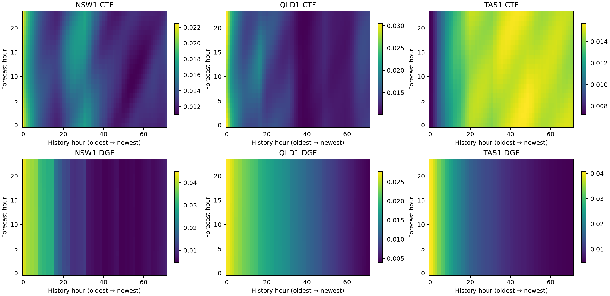

# AEMO NSW/QLD/TAS forecasting experiments

This file records the first completed three-region forecasting run. All values under **Local results** were produced by this repository. The RE-Price values are external `paper-reported` references and were not reproduced here.

## Run scope

| Item | Value |
|---|---|
| Regions | NSW1, QLD1, TAS1 |
| Data period | 2015-01-01 00:00 to 2024-12-31 23:00, Australia/Brisbane |
| Train | 2015-01-01 to 2021-12-31 |
| Validation | 2022-01-01 to 2022-12-31 |
| Test | 2023-01-01 to 2024-12-31 |
| History / horizon / stride | 72 hours / 24 hours / 1 hour |
| Random seed | 2026 |
| Result timestamp | 2026-09-21 UTC |

## Reproduction commands

```bash
CUDA_VISIBLE_DEVICES=0 python -m forecasting.train --config configs/aemo_forecast.yaml --region NSW1 2>&1 | tee logs/forecasting/nsw1.log
CUDA_VISIBLE_DEVICES=1 python -m forecasting.train --config configs/aemo_forecast.yaml --region QLD1 2>&1 | tee logs/forecasting/qld1.log
CUDA_VISIBLE_DEVICES=2 python -m forecasting.train --config configs/aemo_forecast.yaml --region TAS1 2>&1 | tee logs/forecasting/tas1.log
```

These commands reproduce the three-GPU layout. The original log files do not record `CUDA_VISIBLE_DEVICES`, so the exact GPU indices used by the completed run are unknown.

## Configuration

Source: [`configs/aemo_forecast.yaml`](../../configs/aemo_forecast.yaml)

| Group | Setting | Value |
|---|---|---|
| Inputs | Historical variables | `rrp_aud_per_mwh`, `total_demand_mw` |
| Inputs | Known future variables | hour, weekday, day-of-year and month sine/cosine; weekend flag; standardized year |
| Target | Variable | `rrp_aud_per_mwh` |
| Model | CTF frequencies / cutoff | 16 / 10 |
| Model | Hidden dimension / layers | 64 / 3 |
| Model | DGF atoms / base sigma | 16 / 0.05 |
| Model | Quantiles | 0.05, 0.10, 0.50, 0.90, 0.95 |
| Loss | Point / quantile / decomposition weights | 1.0 / 1.0 / 1.0 |
| Loss | Smoothness / sparsity weights | 0.001 / 0.001 |
| Loss | Target sparsity / excess weight | 0.3 / 10.0 |
| Training | Batch size / epochs | 128 / 30 |
| Training | Learning rate / weight decay | 0.0003 / 0.0001 |
| Training | Optimizer | AdamW |
| Training | Device / workers | CUDA / 0 |

## Environment

| Python | PyTorch | CUDA runtime | NumPy | pandas | SciPy | scikit-learn |
|---:|---:|---:|---:|---:|---:|---:|
| 3.11.0 | 2.5.1+cu124 | 12.4 | 2.4.6 | 3.0.6 | 1.17.1 | 1.9.1 |

The machine exposes eight NVIDIA L40 GPUs with 46,068 MiB each. The exact physical GPU assigned to each completed run was not persisted.

## Files

| Region | Console log | Metrics | Training history | Best checkpoint |
|---|---|---|---|---|
| NSW1 | [`nsw1.log`](nsw1.log) | [`metrics.json`](../../outputs/forecasting/static_train/NSW1/metrics.json) | [`training_history.csv`](../../outputs/forecasting/static_train/NSW1/training_history.csv) | [`best_model.pt`](../../outputs/forecasting/static_train/NSW1/best_model.pt) |
| QLD1 | [`qld1.log`](qld1.log) | [`metrics.json`](../../outputs/forecasting/static_train/QLD1/metrics.json) | [`training_history.csv`](../../outputs/forecasting/static_train/QLD1/training_history.csv) | [`best_model.pt`](../../outputs/forecasting/static_train/QLD1/best_model.pt) |
| TAS1 | [`tas1.log`](tas1.log) | [`metrics.json`](../../outputs/forecasting/static_train/TAS1/metrics.json) | [`training_history.csv`](../../outputs/forecasting/static_train/TAS1/training_history.csv) | [`best_model.pt`](../../outputs/forecasting/static_train/TAS1/best_model.pt) |

## Local results

### Training curves


### Dataset sizes and model selection

| Region | Train windows | Validation windows | Test windows | Best epoch | Best validation total loss | Final training total loss |
|---|---:|---:|---:|---:|---:|---:|
| NSW1 | 61,273 | 8,737 | 17,521 | 8/30 | 1.774037 | 1.268737 |
| QLD1 | 61,273 | 8,737 | 17,521 | 6/30 | 6.076369 | 1.202618 |
| TAS1 | 61,273 | 8,737 | 17,521 | 2/30 | 21.200955 | 0.912223 |

`metrics.json` stores zero-based best epochs (7, 5, and 1); the table uses human-readable epoch numbers (8, 6, and 2).

### Validation metrics at the selected checkpoint

| Region | MAE (AUD/MWh) | RMSE (AUD/MWh) | 80% coverage | 80% mean width | 90% coverage | 90% mean width |
|---|---:|---:|---:|---:|---:|---:|
| NSW1 | 56.3191 | 179.3832 | 64.15% | 125.3292 | 85.85% | 218.4768 |
| QLD1 | 96.1624 | 427.3042 | 64.87% | 188.0268 | 90.47% | 355.4294 |
| TAS1 | 62.2210 | 273.1233 | 38.49% | 71.8134 | 65.61% | 142.1390 |

### Test metrics at the selected checkpoint

| Region | MAE (AUD/MWh) | RMSE (AUD/MWh) | 80% coverage | 80% mean width | 90% coverage | 90% mean width |
|---|---:|---:|---:|---:|---:|---:|
| NSW1 | 60.9251 | 400.5916 | 62.55% | 89.1850 | 83.97% | 174.0480 |
| QLD1 | 65.6180 | 279.9669 | 67.37% | 106.1958 | 90.61% | 208.9505 |
| TAS1 | 37.1264 | 161.6860 | 39.37% | 46.2584 | 68.66% | 92.2706 |

### Test loss components

| Region | Total | Point | Quantile | Decomposition | Smoothness | Sparsity |
|---|---:|---:|---:|---:|---:|---:|
| NSW1 | 7.856348 | 5.903404 | 0.125783 | 1.826783 | 0.126397 | 0.252075 |
| QLD1 | 2.728067 | 1.912101 | 0.086434 | 0.729157 | 0.068527 | 0.307171 |
| TAS1 | 7.622208 | 5.533191 | 0.173170 | 1.914390 | 0.075824 | 1.381370 |

## Trigonometric gated-fusion experiment

This experiment keeps the static normalization, rolling hourly protocol, split,
loss weights, optimizer, learning rate, epoch budget, and seed unchanged. It
replaces concatenation followed by one linear forecast head with separate linear
CTF and DGF experts followed by a horizon-specific nonlinear gate. The gate uses
`cos(theta)^2` and `sin(theta)^2` weights, initialized to an equal mixture.

| Item | Value |
|---|---|
| Configuration | [`configs/aemo_forecast_trigonometric_gate.yaml`](../../configs/aemo_forecast_trigonometric_gate.yaml) |
| Epochs / learning rate | 30 / 0.0003 |
| Best epochs, NSW1 / QLD1 / TAS1 | 24 / 4 / 29 |
| GPU mapping | NSW1 / QLD1 / TAS1 on physical GPUs 5 / 6 / 7 |
| Output directory | `outputs/forecasting/trigonometric_gate/` |

### Artifacts

| Region | Console log | Metrics | Training history | Best checkpoint |
|---|---|---|---|---|
| NSW1 | [`nsw1.log`](trigonometric_gate/nsw1.log) | [`metrics.json`](../../outputs/forecasting/trigonometric_gate/NSW1/metrics.json) | [`training_history.csv`](../../outputs/forecasting/trigonometric_gate/NSW1/training_history.csv) | [`best_model.pt`](../../outputs/forecasting/trigonometric_gate/NSW1/best_model.pt) |
| QLD1 | [`qld1.log`](trigonometric_gate/qld1.log) | [`metrics.json`](../../outputs/forecasting/trigonometric_gate/QLD1/metrics.json) | [`training_history.csv`](../../outputs/forecasting/trigonometric_gate/QLD1/training_history.csv) | [`best_model.pt`](../../outputs/forecasting/trigonometric_gate/QLD1/best_model.pt) |
| TAS1 | [`tas1.log`](trigonometric_gate/tas1.log) | [`metrics.json`](../../outputs/forecasting/trigonometric_gate/TAS1/metrics.json) | [`training_history.csv`](../../outputs/forecasting/trigonometric_gate/TAS1/training_history.csv) | [`best_model.pt`](../../outputs/forecasting/trigonometric_gate/TAS1/best_model.pt) |

### Validation metrics at the selected checkpoint

| Region | MAE | RMSE | 80% coverage | 90% coverage | Mean DGF weight | DGF weight std. |
|---|---:|---:|---:|---:|---:|---:|
| NSW1 | 64.4656 | 189.4906 | 67.20% | 79.83% | 99.85% | 1.48% |
| QLD1 | 108.6560 | 433.0052 | 66.81% | 85.77% | 69.38% | 25.10% |
| TAS1 | 73.4418 | 284.2861 | 43.43% | 66.56% | 48.90% | 30.28% |

### Test metrics and static-baseline change

| Region | MAE | MAE change | RMSE | RMSE change | 80% coverage / width | 90% coverage / width | Mean DGF weight | DGF weight std. |
|---|---:|---:|---:|---:|---:|---:|---:|---:|
| NSW1 | 84.4436 | +38.60% | 445.4598 | +11.20% | 59.09% / 126.7615 | 77.91% / 198.7455 | 99.03% | 5.94% |
| QLD1 | 68.8983 | +5.00% | 280.5253 | +0.20% | 67.94% / 124.8967 | 90.80% / 225.3520 | 78.88% | 19.89% |
| TAS1 | 39.0713 | +5.24% | 162.7952 | +0.69% | 50.43% / 56.9452 | 75.90% / 101.2208 | 51.60% | 22.62% |

The gated model does not improve point forecasting in any region. NSW1 collapses
almost completely onto the DGF expert, while QLD1 also strongly favors DGF. TAS1
retains a balanced and variable gate, but still loses point accuracy. The result
shows that unconstrained trigonometric gating can collapse to one expert and is
retained as a negative fusion ablation.

## Complementary additive trigonometric-fusion experiment

This experiment changes the competitive convex mixture into an additive
residual form: `forecast = CTF forecast + sin(theta)^2 * DGF correction`.
The CTF path therefore always has weight 1 and receives an unscaled gradient;
the dynamic gate controls only the non-negative strength of the DGF event
correction. All data, normalization, split, loss, optimizer, learning rate,
epoch budget, and random seed settings remain unchanged.

| Item | Value |
|---|---|
| Configuration | [`configs/aemo_forecast_additive_trigonometric_gate.yaml`](../../configs/aemo_forecast_additive_trigonometric_gate.yaml) |
| Epochs / learning rate | 30 / 0.0003 |
| Best epochs, NSW1 / QLD1 / TAS1 | 1 / 1 / 2 |
| GPU mapping | NSW1 / QLD1 / TAS1 on physical GPUs 5 / 6 / 7 |
| Output directory | `outputs/forecasting/additive_trigonometric_gate/` |

### Artifacts

| Region | Console log | Metrics | Training history | Best checkpoint |
|---|---|---|---|---|
| NSW1 | [`nsw1.log`](additive_trigonometric_gate/nsw1.log) | [`metrics.json`](../../outputs/forecasting/additive_trigonometric_gate/NSW1/metrics.json) | [`training_history.csv`](../../outputs/forecasting/additive_trigonometric_gate/NSW1/training_history.csv) | [`best_model.pt`](../../outputs/forecasting/additive_trigonometric_gate/NSW1/best_model.pt) |
| QLD1 | [`qld1.log`](additive_trigonometric_gate/qld1.log) | [`metrics.json`](../../outputs/forecasting/additive_trigonometric_gate/QLD1/metrics.json) | [`training_history.csv`](../../outputs/forecasting/additive_trigonometric_gate/QLD1/training_history.csv) | [`best_model.pt`](../../outputs/forecasting/additive_trigonometric_gate/QLD1/best_model.pt) |
| TAS1 | [`tas1.log`](additive_trigonometric_gate/tas1.log) | [`metrics.json`](../../outputs/forecasting/additive_trigonometric_gate/TAS1/metrics.json) | [`training_history.csv`](../../outputs/forecasting/additive_trigonometric_gate/TAS1/training_history.csv) | [`best_model.pt`](../../outputs/forecasting/additive_trigonometric_gate/TAS1/best_model.pt) |





### Validation metrics at the selected checkpoint

| Region | MAE | RMSE | 80% coverage | 90% coverage | Mean DGF correction weight | DGF weight std. |
|---|---:|---:|---:|---:|---:|---:|
| NSW1 | 69.0112 | 187.8241 | 60.12% | 78.60% | 47.24% | 17.51% |
| QLD1 | 95.9668 | 434.4366 | 62.20% | 85.61% | 51.87% | 20.30% |
| TAS1 | 63.7030 | 273.8954 | 46.75% | 73.65% | 66.09% | 20.33% |

### Test metrics and comparisons

| Region | MAE | vs. static | vs. competitive gate | RMSE | vs. static | vs. competitive gate | Mean DGF correction weight |
|---|---:|---:|---:|---:|---:|---:|---:|
| NSW1 | 67.5852 | +10.93% | -19.96% | 400.3284 | -0.07% | -10.13% | 45.43% |
| QLD1 | 59.5623 | -9.23% | -13.55% | 278.2809 | -0.60% | -0.80% | 50.73% |
| TAS1 | 37.7484 | +1.68% | -3.39% | 161.7574 | +0.04% | -0.64% | 56.51% |

Negative comparison values are improvements. The additive design outperforms
the competitive trigonometric gate on both point metrics in all three regions.
Against the original concatenation baseline, it improves both point metrics on
QLD1, slightly improves NSW1 RMSE but worsens NSW1 MAE, and is effectively tied
on TAS1 RMSE while slightly worsening TAS1 MAE.

### CTF backbone and DGF correction ablation

| Region | CTF-only MAE | Fused MAE | CTF-only RMSE | Fused RMSE | Mean absolute DGF correction (AUD/MWh) |
|---|---:|---:|---:|---:|---:|
| NSW1 | 79.8787 | 67.5852 | 406.3610 | 400.3284 | 52.5739 |
| QLD1 | 73.6634 | 59.5623 | 285.0789 | 278.2809 | 47.9608 |
| TAS1 | 39.0819 | 37.7484 | 164.3688 | 161.7574 | 17.0854 |

The DGF correction improves its paired CTF backbone in every region on both
MAE and RMSE, which supports the intended complementary interpretation. The
test DGF weights remain distributed around 45--57% instead of collapsing near
100% as in competitive NSW1. However, the best validation checkpoints occur at
epochs 1, 1, and 2, so the new parameterization still overfits quickly and does
not consistently beat the original concatenation head.

## Temporal convolutional forecast-head experiment

This experiment preserves the complementary additive CTF/DGF fusion and
replaces the flattened linear heads with separate temporal convolutional
heads. Each head uses 40 channels and five causal residual blocks with kernel
size 3 and dilations 1, 2, 4, 8, and 16. Two convolutions per block give a
125-step receptive field, covering the full 72-hour history. The final temporal
state is combined independently with each future hour's calendar vector before
point and quantile decoding. The two TCN heads contain 104,892 parameters,
compared with 110,880 for the additive linear heads and 117,280 for the minimal
GELU heads.

| Item | Value |
|---|---|
| Configuration | [`configs/aemo_forecast_additive_tcn_head.yaml`](../../configs/aemo_forecast_additive_tcn_head.yaml) |
| Epochs / learning rate | 30 / 0.0003 |
| Best epochs, NSW1 / QLD1 / TAS1 | 1 / 6 / 7 |
| GPU mapping | NSW1 / QLD1 / TAS1 on physical GPUs 5 / 6 / 7 |
| Output directory | `outputs/forecasting/additive_tcn_head/` |

### Artifacts

| Region | Console log | Metrics | Training history | Best checkpoint |
|---|---|---|---|---|
| NSW1 | [`nsw1.log`](additive_tcn_head/nsw1.log) | [`metrics.json`](../../outputs/forecasting/additive_tcn_head/NSW1/metrics.json) | [`training_history.csv`](../../outputs/forecasting/additive_tcn_head/NSW1/training_history.csv) | [`best_model.pt`](../../outputs/forecasting/additive_tcn_head/NSW1/best_model.pt) |
| QLD1 | [`qld1.log`](additive_tcn_head/qld1.log) | [`metrics.json`](../../outputs/forecasting/additive_tcn_head/QLD1/metrics.json) | [`training_history.csv`](../../outputs/forecasting/additive_tcn_head/QLD1/training_history.csv) | [`best_model.pt`](../../outputs/forecasting/additive_tcn_head/QLD1/best_model.pt) |
| TAS1 | [`tas1.log`](additive_tcn_head/tas1.log) | [`metrics.json`](../../outputs/forecasting/additive_tcn_head/TAS1/metrics.json) | [`training_history.csv`](../../outputs/forecasting/additive_tcn_head/TAS1/training_history.csv) | [`best_model.pt`](../../outputs/forecasting/additive_tcn_head/TAS1/best_model.pt) |





### Test metrics and comparisons

| Region | MAE | vs. GELU head | vs. additive linear head | RMSE | vs. GELU head | vs. additive linear head | Mean DGF correction weight |
|---|---:|---:|---:|---:|---:|---:|---:|
| NSW1 | 65.8118 | -9.01% | -2.62% | 401.5297 | +0.11% | +0.30% | 33.98% |
| QLD1 | 75.2342 | +16.01% | +26.31% | 286.0702 | +2.42% | +2.80% | 37.44% |
| TAS1 | 41.1317 | +0.46% | +8.96% | 162.6147 | -0.19% | +0.53% | 48.30% |

Negative comparison values are improvements. The TCN improves NSW1 MAE over
both matched alternatives and slightly improves TAS1 RMSE over the GELU head,
but substantially degrades QLD1 and does not improve consistently across
regions. Training loss falls much faster than validation loss, showing that
the TCN learns stronger temporal patterns but also widens the generalization
gap. Retaining only the final TCN state as a single summary of all 72 hours is
a likely information bottleneck and is recorded as part of this ablation.

## Horizon-specific TCN history-attention experiment

This experiment retains the complete 72-step output from each CTF/DGF TCN.
Each of the 24 future calendar embeddings produces a query over historical
key/value vectors, yielding separate `[24, 72]` attention maps for the two
fields. The convolutional encoder, additive trigonometric gate, data, loss,
optimizer, learning rate, epoch budget, and seed remain unchanged. The two
attention TCN heads contain 114,492 parameters, close to the 104,892-parameter
last-state TCN and 117,280-parameter GELU alternatives.

| Item | Value |
|---|---|
| Configuration | [`configs/aemo_forecast_additive_tcn_attention_head.yaml`](../../configs/aemo_forecast_additive_tcn_attention_head.yaml) |
| Epochs / learning rate | 30 / 0.0003 |
| Best epochs, NSW1 / QLD1 / TAS1 | 7 / 4 / 2 |
| GPU mapping | NSW1 / QLD1 / TAS1 on physical GPUs 5 / 6 / 7 |
| Output directory | `outputs/forecasting/additive_tcn_attention_head/` |

### Artifacts

| Region | Console log | Metrics | Training history | Attention diagnostics | Best checkpoint |
|---|---|---|---|---|---|
| NSW1 | [`nsw1.log`](additive_tcn_attention_head/nsw1.log) | [`metrics.json`](../../outputs/forecasting/additive_tcn_attention_head/NSW1/metrics.json) | [`training_history.csv`](../../outputs/forecasting/additive_tcn_attention_head/NSW1/training_history.csv) | [`attention_diagnostics.json`](../../outputs/forecasting/additive_tcn_attention_head/NSW1/attention_diagnostics.json) | [`best_model.pt`](../../outputs/forecasting/additive_tcn_attention_head/NSW1/best_model.pt) |
| QLD1 | [`qld1.log`](additive_tcn_attention_head/qld1.log) | [`metrics.json`](../../outputs/forecasting/additive_tcn_attention_head/QLD1/metrics.json) | [`training_history.csv`](../../outputs/forecasting/additive_tcn_attention_head/QLD1/training_history.csv) | [`attention_diagnostics.json`](../../outputs/forecasting/additive_tcn_attention_head/QLD1/attention_diagnostics.json) | [`best_model.pt`](../../outputs/forecasting/additive_tcn_attention_head/QLD1/best_model.pt) |
| TAS1 | [`tas1.log`](additive_tcn_attention_head/tas1.log) | [`metrics.json`](../../outputs/forecasting/additive_tcn_attention_head/TAS1/metrics.json) | [`training_history.csv`](../../outputs/forecasting/additive_tcn_attention_head/TAS1/training_history.csv) | [`attention_diagnostics.json`](../../outputs/forecasting/additive_tcn_attention_head/TAS1/attention_diagnostics.json) | [`best_model.pt`](../../outputs/forecasting/additive_tcn_attention_head/TAS1/best_model.pt) |







### Test metrics and last-state TCN comparison

| Region | MAE | MAE change | RMSE | RMSE change | Mean DGF correction weight |
|---|---:|---:|---:|---:|---:|
| NSW1 | 70.9050 | +7.74% | 409.3162 | +1.94% | 40.27% |
| QLD1 | 60.2609 | -19.90% | 280.3577 | -2.00% | 47.07% |
| TAS1 | 41.9712 | +2.04% | 163.9216 | +0.80% | 59.12% |

Negative changes are improvements. Full-history attention substantially fixes
the QLD1 degradation of the last-state TCN and approaches the additive linear
head (59.5623 MAE), but it degrades NSW1 and TAS1. The effect of removing the
single-state bottleneck is therefore market-dependent.

### Attention selectivity on the test split

| Region | CTF normalized entropy | DGF normalized entropy | CTF max weight | DGF max weight | CTF adjacent-horizon TV | DGF adjacent-horizon TV |
|---|---:|---:|---:|---:|---:|---:|
| NSW1 | 0.9361 | 0.8562 | 3.78% | 6.11% | 0.0166 | 0.0480 |
| QLD1 | 0.9033 | 0.9485 | 4.16% | 2.75% | 0.0148 | 0.0106 |
| TAS1 | 0.9781 | 0.9458 | 2.72% | 4.07% | 0.0102 | 0.0112 |

Normalized entropy is one for uniform attention; a uniform maximum over 72
positions is 1.39%. The learned maps are non-uniform but remain diffuse, and
adjacent forecast hours have very similar distributions. Thus the QLD1 gain is
mainly attributable to full-history weighted pooling rather than strongly
horizon-specific historical selection.

## Maximum-spare future-context experiment

This experiment adds one point-in-time known-future AEMO factor,
`MAXSPARECAPACITY`, to the horizon-specific TCN attention model. Each hourly
forecast uses the latest PD PASA publication available at its origin, with the
remaining market-day tail supplied by the latest already-published ST PASA
run. Two half-hour intervals are aggregated by their minimum. The factor is
standardized with training data only and projected into both the CTF and DGF
future attention contexts. Historical inputs, target, split, loss weights,
optimizer, epoch budget, and random seed remain unchanged.

| Item | Value |
|---|---|
| Configuration | [`configs/aemo_forecast_max_spare.yaml`](../../configs/aemo_forecast_max_spare.yaml) |
| Future factor | AEMO `MAXSPARECAPACITY`, hourly minimum |
| Vintage rule | Latest available PD PASA with an already-published ST PASA tail |
| Epochs / learning rate | 30 / 0.0003 |
| Best epochs, NSW1 / QLD1 / TAS1 | 1 / 1 / 2 |
| GPU mapping | NSW1 / QLD1 / TAS1 on physical GPUs 5 / 6 / 7 |
| Output directory | `outputs/forecasting/max_spare_future_context/` |

### Artifacts

| Region | Console log | Metrics | Training history | Best checkpoint |
|---|---|---|---|---|
| NSW1 | [`train.log`](../../outputs/forecasting/max_spare_future_context/NSW1/train.log) | [`metrics.json`](../../outputs/forecasting/max_spare_future_context/NSW1/metrics.json) | [`training_history.csv`](../../outputs/forecasting/max_spare_future_context/NSW1/training_history.csv) | [`best_model.pt`](../../outputs/forecasting/max_spare_future_context/NSW1/best_model.pt) |
| QLD1 | [`train.log`](../../outputs/forecasting/max_spare_future_context/QLD1/train.log) | [`metrics.json`](../../outputs/forecasting/max_spare_future_context/QLD1/metrics.json) | [`training_history.csv`](../../outputs/forecasting/max_spare_future_context/QLD1/training_history.csv) | [`best_model.pt`](../../outputs/forecasting/max_spare_future_context/QLD1/best_model.pt) |
| TAS1 | [`train.log`](../../outputs/forecasting/max_spare_future_context/TAS1/train.log) | [`metrics.json`](../../outputs/forecasting/max_spare_future_context/TAS1/metrics.json) | [`training_history.csv`](../../outputs/forecasting/max_spare_future_context/TAS1/training_history.csv) | [`best_model.pt`](../../outputs/forecasting/max_spare_future_context/TAS1/best_model.pt) |

### Validation metrics at the selected checkpoint

| Region | MAE | RMSE | 80% coverage | 80% mean width | 90% coverage | 90% mean width |
|---|---:|---:|---:|---:|---:|---:|
| NSW1 | 88.1851 | 198.1391 | 42.20% | 109.4059 | 63.50% | 165.0661 |
| QLD1 | 175.8848 | 465.3082 | 56.13% | 180.2693 | 80.10% | 301.7551 |
| TAS1 | 68.0684 | 276.7955 | 53.47% | 114.0317 | 76.21% | 192.4702 |

### Test metrics and attention-baseline comparison

| Region | MAE | MAE change | RMSE | RMSE change | 80% coverage | 90% coverage |
|---|---:|---:|---:|---:|---:|---:|
| NSW1 | 74.9394 | +5.69% | 395.0977 | -3.47% | 60.50% | 78.23% |
| QLD1 | 75.4752 | +25.25% | 277.1987 | -1.13% | 44.79% | 80.08% |
| TAS1 | 41.8536 | -0.28% | 163.3747 | -0.33% | 54.15% | 73.84% |

Negative changes are improvements. `MAXSPARECAPACITY` reduces RMSE in every
region and reduces the MAE of the highest-price one percent by 8.6%, 5.8%, and
3.5% in NSW1, QLD1, and TAS1, respectively. It nevertheless increases ordinary
hour errors enough to worsen overall MAE in NSW1 and QLD1. NSW1 and QLD1 select
the first epoch while their training losses continue to fall, showing rapid
overfitting. The one-dimensional exogenous projection is also initialized with
substantially greater per-feature norm than a calendar column and directly
changes both experts' attention queries. The follow-up experiment therefore
keeps attention calendar-driven and introduces the factor only as a
zero-initialized post-attention residual adapter in the DGF event branch.

## DGF-only maximum-spare residual-adapter experiment

This is the recommended and best-controlled maximum-spare version. It starts
from each region's selected TCN-attention checkpoint, keeps the calendar-only
attention queries unchanged, freezes all existing parameters, and trains only
a 672-parameter nonlinear adapter after DGF history attention. The adapter's
final layer is zero-initialized, so its warm-start predictions reproduce the
baseline to floating-point precision. Validation total loss, MAE, and RMSE are
selected independently; the canonical `best_model.pt` uses validation total
loss, while the other two selections remain available for metric-specific use.

| Item | Value |
|---|---|
| Configuration | [`configs/aemo_forecast_max_spare_dgf_adapter.yaml`](../../configs/aemo_forecast_max_spare_dgf_adapter.yaml) |
| Initialization | Regional `additive_tcn_attention_head` best checkpoint |
| Trainable parameters | 672, DGF exogenous adapter only |
| Adapter | `1 -> 16 -> GELU -> 40`, zero-initialized final projection |
| Epochs / learning rate | 30 / 0.0003 |
| Best total epochs, NSW1 / QLD1 / TAS1 | 2 / 30 / 21 |
| GPU mapping | NSW1 / QLD1 / TAS1 on physical GPUs 5 / 6 / 7 |
| Output directory | `outputs/forecasting/max_spare_dgf_residual_adapter/` |
| Status | Recommended maximum-spare implementation |

### Artifacts

| Region | Console log | Metrics | Training history | Total / MAE / RMSE checkpoints |
|---|---|---|---|---|
| NSW1 | [`train.log`](../../outputs/forecasting/max_spare_dgf_residual_adapter/NSW1/train.log) | [`metrics.json`](../../outputs/forecasting/max_spare_dgf_residual_adapter/NSW1/metrics.json) | [`training_history.csv`](../../outputs/forecasting/max_spare_dgf_residual_adapter/NSW1/training_history.csv) | [`total`](../../outputs/forecasting/max_spare_dgf_residual_adapter/NSW1/best_model.pt) / [`MAE`](../../outputs/forecasting/max_spare_dgf_residual_adapter/NSW1/best_mae_model.pt) / [`RMSE`](../../outputs/forecasting/max_spare_dgf_residual_adapter/NSW1/best_rmse_model.pt) |
| QLD1 | [`train.log`](../../outputs/forecasting/max_spare_dgf_residual_adapter/QLD1/train.log) | [`metrics.json`](../../outputs/forecasting/max_spare_dgf_residual_adapter/QLD1/metrics.json) | [`training_history.csv`](../../outputs/forecasting/max_spare_dgf_residual_adapter/QLD1/training_history.csv) | [`total`](../../outputs/forecasting/max_spare_dgf_residual_adapter/QLD1/best_model.pt) / [`MAE`](../../outputs/forecasting/max_spare_dgf_residual_adapter/QLD1/best_mae_model.pt) / [`RMSE`](../../outputs/forecasting/max_spare_dgf_residual_adapter/QLD1/best_rmse_model.pt) |
| TAS1 | [`train.log`](../../outputs/forecasting/max_spare_dgf_residual_adapter/TAS1/train.log) | [`metrics.json`](../../outputs/forecasting/max_spare_dgf_residual_adapter/TAS1/metrics.json) | [`training_history.csv`](../../outputs/forecasting/max_spare_dgf_residual_adapter/TAS1/training_history.csv) | [`total`](../../outputs/forecasting/max_spare_dgf_residual_adapter/TAS1/best_model.pt) / [`MAE`](../../outputs/forecasting/max_spare_dgf_residual_adapter/TAS1/best_mae_model.pt) / [`RMSE`](../../outputs/forecasting/max_spare_dgf_residual_adapter/TAS1/best_rmse_model.pt) |

### Canonical total-loss-selected test results

| Region | MAE | vs. TCN attention | RMSE | vs. TCN attention | 80% coverage | 90% coverage |
|---|---:|---:|---:|---:|---:|---:|
| NSW1 | 70.0587 | -1.19% | 406.7138 | -0.64% | 60.51% | 76.49% |
| QLD1 | 63.2004 | +4.88% | 276.8303 | -1.26% | 51.52% | 77.81% |
| TAS1 | 41.8432 | -0.31% | 163.6939 | -0.14% | 46.92% | 70.23% |

Negative changes are improvements. NSW1 improves both point metrics, TAS1 is
effectively tied with a small improvement, and QLD1 trades a 1.26% RMSE gain
for a 4.88% MAE loss. QLD1's validation-MAE checkpoint remains the untouched
warm start, proving that no trained adapter checkpoint improves its validation
MAE. Compared with query injection, this residual design reduces MAE by 6.51%
on NSW1 and 16.26% on QLD1 and removes the catastrophic ordinary-hour error.

## Stable full-model training from scratch

This run tests the stable optimizer recipe without loading a prior checkpoint.
All 150,584 parameters are trained from their seeded initialization. The setup
uses AdamW with betas 0.9/0.95, blended Huber/MSE point loss, gradient clipping
at 1.0, EMA decay 0.999, five warmup epochs from `6e-5` to `3e-4`, and cosine
decay toward `3e-6`. Early stopping monitors validation total loss with a
minimum of 80 epochs and patience of 20. All regions stopped at epoch 99.

Configuration: [`configs/aemo_forecast_stable_from_scratch.yaml`](../../configs/aemo_forecast_stable_from_scratch.yaml)

| Region | Best total epoch | Validation MAE | Validation RMSE | Test MAE | Test RMSE | 80% coverage | 90% coverage |
|---|---:|---:|---:|---:|---:|---:|---:|
| NSW1 | 6 | 85.1333 | 199.4683 | 65.7883 | 398.2677 | 72.86% | 83.44% |
| QLD1 | 10 | 106.1321 | 430.6047 | 64.8411 | 279.3281 | 43.41% | 64.18% |
| TAS1 | 10 | 76.1095 | 282.7228 | 43.0753 | 166.6315 | 46.82% | 67.00% |
| Mean | - | 89.1249 | 304.2653 | 57.9016 | 281.4091 | 54.37% | 71.54% |

Although optimization continued stably to epoch 99, the total-loss-selected
checkpoints remained at epochs 6, 10, and 10. The run improves the residual
adapter's average test MAE from 58.367 to 57.902 and RMSE from 282.413 to
281.409, but does not surpass the static baseline's 54.556 average MAE. This
confirms that longer stable optimization alone does not remove the validation
generalization bottleneck.

### Artifacts

| Region | Console log | Metrics | Training history | Total / MAE / RMSE checkpoints |
|---|---|---|---|---|
| NSW1 | [`train.log`](../../outputs/forecasting/stable_from_scratch/NSW1/train.log) | [`metrics.json`](../../outputs/forecasting/stable_from_scratch/NSW1/metrics.json) | [`training_history.csv`](../../outputs/forecasting/stable_from_scratch/NSW1/training_history.csv) | [`total`](../../outputs/forecasting/stable_from_scratch/NSW1/best_model.pt) / [`MAE`](../../outputs/forecasting/stable_from_scratch/NSW1/best_mae_model.pt) / [`RMSE`](../../outputs/forecasting/stable_from_scratch/NSW1/best_rmse_model.pt) |
| QLD1 | [`train.log`](../../outputs/forecasting/stable_from_scratch/QLD1/train.log) | [`metrics.json`](../../outputs/forecasting/stable_from_scratch/QLD1/metrics.json) | [`training_history.csv`](../../outputs/forecasting/stable_from_scratch/QLD1/training_history.csv) | [`total`](../../outputs/forecasting/stable_from_scratch/QLD1/best_model.pt) / [`MAE`](../../outputs/forecasting/stable_from_scratch/QLD1/best_mae_model.pt) / [`RMSE`](../../outputs/forecasting/stable_from_scratch/QLD1/best_rmse_model.pt) |
| TAS1 | [`train.log`](../../outputs/forecasting/stable_from_scratch/TAS1/train.log) | [`metrics.json`](../../outputs/forecasting/stable_from_scratch/TAS1/metrics.json) | [`training_history.csv`](../../outputs/forecasting/stable_from_scratch/TAS1/training_history.csv) | [`total`](../../outputs/forecasting/stable_from_scratch/TAS1/best_model.pt) / [`MAE`](../../outputs/forecasting/stable_from_scratch/TAS1/best_mae_model.pt) / [`RMSE`](../../outputs/forecasting/stable_from_scratch/TAS1/best_rmse_model.pt) |

## Asinh price-target experiment

This experiment keeps the complementary additive trigonometric CTF/DGF model,
data, split, loss weights, optimizer, learning rate, 30-epoch budget, and seed
unchanged. The only change is a variance-stabilizing transform of the price
channel, applied to both the historical input and the forecast target before
standardization:
`asinh((price - median) / (MAD / 0.6745))`. The median and MAD are fitted on
the training split only (NSW1 58.03 / 30.34, QLD1 55.19 / 29.30, TAS1
57.60 / 41.44 AUD/MWh). Point forecasts and quantiles are mapped back with the
inverse transform before every metric, so all values remain in AUD/MWh.

| Item | Value |
|---|---|
| Configuration | [`configs/aemo_forecast_asinh_additive_trigonometric_gate.yaml`](../../configs/aemo_forecast_asinh_additive_trigonometric_gate.yaml) |
| Epochs / learning rate | 30 / 0.0003 |
| Best epochs, NSW1 / QLD1 / TAS1 | 16 / 4 / 2 |
| GPU mapping | NSW1 / QLD1 / TAS1 on physical GPUs 5 / 6 / 7 |
| Output directory | `outputs/forecasting/asinh_additive_trigonometric_gate/` |

### Artifacts

| Region | Console log | Metrics | Training history | Best checkpoint |
|---|---|---|---|---|
| NSW1 | [`nsw1.log`](asinh_additive_trigonometric_gate/nsw1.log) | [`metrics.json`](../../outputs/forecasting/asinh_additive_trigonometric_gate/NSW1/metrics.json) | [`training_history.csv`](../../outputs/forecasting/asinh_additive_trigonometric_gate/NSW1/training_history.csv) | [`best_model.pt`](../../outputs/forecasting/asinh_additive_trigonometric_gate/NSW1/best_model.pt) |
| QLD1 | [`qld1.log`](asinh_additive_trigonometric_gate/qld1.log) | [`metrics.json`](../../outputs/forecasting/asinh_additive_trigonometric_gate/QLD1/metrics.json) | [`training_history.csv`](../../outputs/forecasting/asinh_additive_trigonometric_gate/QLD1/training_history.csv) | [`best_model.pt`](../../outputs/forecasting/asinh_additive_trigonometric_gate/QLD1/best_model.pt) |
| TAS1 | [`tas1.log`](asinh_additive_trigonometric_gate/tas1.log) | [`metrics.json`](../../outputs/forecasting/asinh_additive_trigonometric_gate/TAS1/metrics.json) | [`training_history.csv`](../../outputs/forecasting/asinh_additive_trigonometric_gate/TAS1/training_history.csv) | [`best_model.pt`](../../outputs/forecasting/asinh_additive_trigonometric_gate/TAS1/best_model.pt) |

### Validation metrics at the selected checkpoint

| Region | MAE | RMSE | 80% coverage | 90% coverage | Mean DGF correction weight |
|---|---:|---:|---:|---:|---:|
| NSW1 | 65.7256 | 184.3621 | 57.50% | 81.28% | 28.46% |
| QLD1 | 92.4641 | 432.2614 | 65.84% | 86.42% | 43.27% |
| TAS1 | 59.2845 | 271.0506 | 49.51% | 72.93% | 52.98% |

### Test metrics and comparisons

| Region | MAE | vs. additive | vs. static | RMSE | vs. additive | vs. static | 80% coverage / width | 90% coverage / width | Mean DGF correction weight |
|---|---:|---:|---:|---:|---:|---:|---:|---:|---:|
| NSW1 | 53.4716 | -20.88% | -12.23% | 396.3959 | -0.98% | -1.05% | 63.10% / 108.9388 | 84.16% / 238.2870 | 30.68% |
| QLD1 | 48.4728 | -18.62% | -26.13% | 275.8854 | -0.86% | -1.46% | 74.23% / 155.0740 | 92.66% / 410.8170 | 38.86% |
| TAS1 | 36.0219 | -4.57% | -2.97% | 160.5065 | -0.77% | -0.73% | 47.39% / 52.5858 | 73.57% / 97.9439 | 51.84% |

Negative comparison values are improvements. The transform improves both
point metrics in every region against both the additive model and the static
baseline. Average test MAE falls from 54.965 to 45.989 (-16.33%) against the
additive model and by 15.70% against the static baseline, and QLD1 now beats
the 24-hour seasonal naive MAE of 59.17. The gain is concentrated in ordinary
hours: global RMSE improves by less than 1.5% because spike hours remain
unforecast.

Two costs remain. First, the inverse `sinh` widens upper quantiles, so 90%
interval width grows from 165.3 to 249.0 AUD/MWh on average and the 90% AIS
worsens from 485.4 to 508.6 under the RE-Price metric definitions. Second, the
mean DGF correction weight falls from 45-57% to 31-52%, confirming that
compressing spikes also reduces the event field's share of the forecast.

## Conformal interval-calibration experiment

This post-hoc experiment reuses the asinh price-target checkpoints without
retraining. Asymmetric conformalized quantile regression (Romano et al., 2019)
is fitted separately for each region and each of the 24 horizons. The lower and
upper offsets of the 80% and 90% intervals are estimated on the 2022
validation split in the model's normalized asinh space and then mapped back to
AUD/MWh. Point forecasts are unchanged, so MAE and RMSE are identical to the
asinh run.

| Item | Value |
|---|---|
| Base checkpoints | `outputs/forecasting/asinh_additive_trigonometric_gate/` |
| Calibration | Validation split, per-horizon asymmetric CQR, finite-sample `(n + 1) / n` correction |
| Calibration files | `outputs/forecasting/asinh_conformal_intervals/{NSW1,QLD1,TAS1}/interval_calibration.json` |
| Results | [`paper_metrics/17_asinh_conformal_intervals/`](paper_metrics/17_asinh_conformal_intervals/) |

### Test interval metrics before and after calibration

| Region | 90% coverage | 90% mean width | 90% AIS | 80% coverage | 80% AIS | CRPS~ |
|---|---:|---:|---:|---:|---:|---:|
| NSW1 | 84.16% -> 89.05% | 238.29 -> 310.08 | 621.44 -> 644.82 | 63.10% -> 75.67% | 379.45 -> 392.61 | 38.44 -> 39.43 |
| QLD1 | 92.66% -> 93.83% | 410.82 -> 450.67 | 614.53 -> 629.90 | 74.23% -> 82.51% | 338.76 -> 356.02 | 35.91 -> 36.91 |
| TAS1 | 73.57% -> 93.64% | 97.94 -> 192.66 | 289.68 -> 290.43 | 47.39% -> 82.35% | 222.64 -> 194.94 | 21.95 -> 20.86 |
| Mean | 83.46% -> 92.17% | 249.02 -> 317.80 | 508.55 -> 521.72 | 61.57% -> 80.18% | 313.61 -> 314.53 | 32.10 -> 32.40 |

Calibration restores nominal coverage on average, but it widens every
interval and worsens the mean 90% AIS. The 2022 validation year is far more
volatile than the 2023-2024 test period, so validation residuals overstate the
test uncertainty. Coverage alone is therefore not the bottleneck and this
calibration is retained as a negative interval ablation.

The asinh model's interval problem is concentrated in a heavy tail of very
wide intervals rather than in typical widths. On the test split its median
90% width is below the additive model's in NSW1 and TAS1 (112.2 vs. 132.4 and
84.0 vs. 95.9 AUD/MWh), while the 99th-percentile width rises from 891.7 to
2292.1 in NSW1 and from 741.9 to 3382.2 in QLD1. Pinball loss in asinh space
does not penalize the price-space cost of tail-quantile errors, which the
inverse `sinh` amplifies.

## Price-space quantile experiment

This experiment keeps the asinh price-target model, inputs, point target,
architecture, parameter count, optimizer, 30-epoch budget, and seed unchanged.
Only the quantile head's pinball-loss target changes: instead of the
standardized asinh price, it is the raw price standardized with the training
mean and standard deviation. Quantiles are therefore learned and
denormalized in price space, where AIS and CRPS are scored, while the point
head still benefits from the asinh target.

| Item | Value |
|---|---|
| Configuration | [`configs/aemo_forecast_asinh_price_space_quantiles.yaml`](../../configs/aemo_forecast_asinh_price_space_quantiles.yaml) |
| Epochs / learning rate | 30 / 0.0003 |
| Best epochs, NSW1 / QLD1 / TAS1 | 16 / 4 / 2 |
| GPU mapping | NSW1 / QLD1 / TAS1 on physical GPUs 5 / 6 / 7 |
| Output directory | `outputs/forecasting/asinh_price_space_quantiles/` |

### Artifacts

| Region | Console log | Metrics | Training history | Best checkpoint |
|---|---|---|---|---|
| NSW1 | [`nsw1.log`](asinh_price_space_quantiles/nsw1.log) | [`metrics.json`](../../outputs/forecasting/asinh_price_space_quantiles/NSW1/metrics.json) | [`training_history.csv`](../../outputs/forecasting/asinh_price_space_quantiles/NSW1/training_history.csv) | [`best_model.pt`](../../outputs/forecasting/asinh_price_space_quantiles/NSW1/best_model.pt) |
| QLD1 | [`qld1.log`](asinh_price_space_quantiles/qld1.log) | [`metrics.json`](../../outputs/forecasting/asinh_price_space_quantiles/QLD1/metrics.json) | [`training_history.csv`](../../outputs/forecasting/asinh_price_space_quantiles/QLD1/training_history.csv) | [`best_model.pt`](../../outputs/forecasting/asinh_price_space_quantiles/QLD1/best_model.pt) |
| TAS1 | [`tas1.log`](asinh_price_space_quantiles/tas1.log) | [`metrics.json`](../../outputs/forecasting/asinh_price_space_quantiles/TAS1/metrics.json) | [`training_history.csv`](../../outputs/forecasting/asinh_price_space_quantiles/TAS1/training_history.csv) | [`best_model.pt`](../../outputs/forecasting/asinh_price_space_quantiles/TAS1/best_model.pt) |

### Validation metrics at the selected checkpoint

| Region | MAE | RMSE | 80% coverage | 90% coverage | Mean DGF correction weight |
|---|---:|---:|---:|---:|---:|
| NSW1 | 63.5551 | 183.1007 | 45.16% | 61.64% | 28.89% |
| QLD1 | 91.4597 | 431.9146 | 46.91% | 64.92% | 41.59% |
| TAS1 | 58.7115 | 270.6377 | 36.66% | 59.57% | 54.45% |

### Test metrics and asinh-target comparison

| Region | MAE | RMSE | 80% coverage / width | 90% coverage / width | 90% AIS, asinh -> this run | CRPS~, asinh -> this run | Mean DGF correction weight |
|---|---:|---:|---:|---:|---:|---:|---:|
| NSW1 | 53.4777 | 395.5884 | 66.07% / 80.1144 | 84.05% / 126.4861 | 621.44 -> 613.61 | 38.44 -> 38.68 | 31.70% |
| QLD1 | 48.3792 | 275.7535 | 74.39% / 101.3219 | 90.71% / 165.5996 | 614.53 -> 494.69 | 35.91 -> 33.16 | 39.06% |
| TAS1 | 36.0075 | 160.4607 | 45.22% / 47.4670 | 73.22% / 90.8656 | 289.68 -> 307.55 | 21.95 -> 23.14 | 48.98% |

Point accuracy is preserved: average MAE moves from 45.989 to 45.955 and
global RMSE from 277.596 to 277.268. The intervals change substantially. The
average 90% width falls from 249.02 to 127.65 AUD/MWh at nearly the same
coverage (83.46% to 82.66%), and the mean 90% AIS falls from 508.55 to 471.95,
below the static baseline's 486.34. Mean 80% AIS falls from 313.61 to 311.88
and CRPS~ from 32.10 to 31.66, both the best local values. QLD1 benefits most;
TAS1 still under-covers both intervals and its AIS worsens slightly. The low
validation coverage again reflects the 2022 volatility shift rather than the
test behavior.

## Reconstruction residual-path experiment

The trunk model's forecast heads only read the reconstructed CTF and DGF
fields. On the test split the discarded remainder
`history - CTF - DGF` averages 0.47, 0.50, and 0.33 standardized units on the
NSW1, QLD1, and TAS1 price channel, and the one-hour-ahead MAE is no better
than last-value persistence (49.2 vs. 50.1, 44.7 vs. 48.2, and 30.7 vs. 22.1).
This experiment adds that remainder, flattened over both input variables, to
the CTF expert's point and quantile heads. The decomposition therefore becomes
CTF + DGF + remainder at the forecast head. Everything else matches the
price-space quantile trunk, including the asinh point target, loss weights,
optimizer, 30-epoch budget, and seed. Parameters increase from 146,300 to
167,036.

| Item | Value |
|---|---|
| Configuration | [`configs/aemo_forecast_residual_skip_path.yaml`](../../configs/aemo_forecast_residual_skip_path.yaml) |
| Epochs / learning rate | 30 / 0.0003 |
| Best epochs, NSW1 / QLD1 / TAS1 | 2 / 4 / 2 |
| GPU mapping | NSW1 / QLD1 / TAS1 on physical GPUs 5 / 6 / 7 |
| Output directory | `outputs/forecasting/residual_skip_path/` |

### Artifacts

| Region | Console log | Metrics | Training history | Best checkpoint |
|---|---|---|---|---|
| NSW1 | [`nsw1.log`](residual_skip_path/nsw1.log) | [`metrics.json`](../../outputs/forecasting/residual_skip_path/NSW1/metrics.json) | [`training_history.csv`](../../outputs/forecasting/residual_skip_path/NSW1/training_history.csv) | [`best_model.pt`](../../outputs/forecasting/residual_skip_path/NSW1/best_model.pt) |
| QLD1 | [`qld1.log`](residual_skip_path/qld1.log) | [`metrics.json`](../../outputs/forecasting/residual_skip_path/QLD1/metrics.json) | [`training_history.csv`](../../outputs/forecasting/residual_skip_path/QLD1/training_history.csv) | [`best_model.pt`](../../outputs/forecasting/residual_skip_path/QLD1/best_model.pt) |
| TAS1 | [`tas1.log`](residual_skip_path/tas1.log) | [`metrics.json`](../../outputs/forecasting/residual_skip_path/TAS1/metrics.json) | [`training_history.csv`](../../outputs/forecasting/residual_skip_path/TAS1/training_history.csv) | [`best_model.pt`](../../outputs/forecasting/residual_skip_path/TAS1/best_model.pt) |

### Validation metrics at the selected checkpoint

| Region | MAE | RMSE | 80% coverage | 90% coverage | Mean DGF correction weight |
|---|---:|---:|---:|---:|---:|
| NSW1 | 63.4074 | 182.5430 | 42.17% | 60.18% | 48.78% |
| QLD1 | 85.7597 | 422.3746 | 48.61% | 65.86% | 50.70% |
| TAS1 | 57.0928 | 269.3322 | 35.59% | 59.07% | 51.87% |

### Test metrics and trunk comparison

| Region | MAE | MAE change | RMSE | RMSE change | 90% coverage / width | 90% AIS, trunk -> this run | CRPS~, trunk -> this run | Mean DGF correction weight |
|---|---:|---:|---:|---:|---:|---:|---:|---:|
| NSW1 | 52.1061 | -2.56% | 397.7381 | +0.54% | 83.39% / 115.8712 | 613.61 -> 616.57 | 38.68 -> 38.74 | 42.89% |
| QLD1 | 45.2573 | -6.45% | 271.6738 | -1.48% | 90.62% / 157.1635 | 494.69 -> 479.59 | 33.16 -> 31.99 | 44.09% |
| TAS1 | 35.5779 | -1.19% | 160.1102 | -0.22% | 73.36% / 88.5526 | 307.55 -> 305.21 | 23.14 -> 22.89 | 46.25% |

### Horizon and hour-type diagnostics on the test split

| Region | MAE h1, trunk -> this run | MAE h24, trunk -> this run | Persistence MAE h1 | Ordinary-hour MAE, trunk -> this run |
|---|---:|---:|---:|---:|
| NSW1 | 49.2 -> 45.1 | 55.6 -> 54.1 | 50.1 | 31.96 -> 30.30 |
| QLD1 | 44.7 -> 36.2 | 49.2 -> 47.2 | 48.2 | 33.00 -> 30.37 |
| TAS1 | 30.7 -> 26.5 | 37.9 -> 36.5 | 22.1 | 31.91 -> 31.53 |

Negative changes are improvements. MAE improves in every region and the
average falls from 45.955 to 44.314 (-3.57%). The gain is largest at the first
horizons, as intended: one-hour-ahead MAE now beats persistence in NSW1 and
QLD1, although TAS1 still trails it. Mean 90% width narrows from 127.65 to
120.53 and mean 90% AIS improves from 471.95 to 467.12, while NSW1 AIS and
RMSE are slightly worse. The NSW1 checkpoint is now selected at epoch 2
instead of 16, so the extra path also makes early overfitting more visible.
The DGF correction weight moves from 32-49% to 43-46%, so the event field is
not displaced by the new path.

## Gas-price CTF context experiment

The 2022 validation year is mainly a level shift rather than a spike year:
median prices rose from 50 to 135 (NSW1), 47 to 140 (QLD1), and 30 to 105
(TAS1) AUD/MWh, while hours above 300 AUD/MWh explain only 12-23% of the 2022
mean. Fuel cost is a slow, publicly observable driver of that level. This
experiment feeds one gas-price scalar per forecast origin to the CTF expert's
linear heads, on top of the reconstruction residual-path trunk. Everything
else is unchanged. Parameters increase from 167,036 to 167,180.

| Item | Value |
|---|---|
| Configuration | [`configs/aemo_forecast_gas_price_ctf.yaml`](../../configs/aemo_forecast_gas_price_ctf.yaml) |
| Source | AEMO Declared Wholesale Gas Market (Victoria) `dwgm-prices-and-demand.xlsx`, sheet `Prices`, 2007-02-01 to 2026-08-31, five schedule prices per gas day; SHA-256 `31d87a9e...52ad8` |
| Feature | Log of the mean daily DWGM price over the 7 gas days that ended before the forecast origin, standardized on training origins |
| Leakage rule | A gas day D runs from 06:00 D to 06:00 D + 1 AEST; the NEM timestamps are also AEST, and only completed gas days are used |
| Regions | The same east-coast gas signal is used for NSW1, QLD1, and TAS1 |
| Epochs / learning rate | 30 / 0.0003 |
| Best epochs, NSW1 / QLD1 / TAS1 | 3 / 13 / 5 |
| GPU mapping | NSW1 / QLD1 / TAS1 on physical GPUs 5 / 6 / 7 |
| Output directory | `outputs/forecasting/gas_price_ctf/` |

The yearly mean of the feature tracks NSW1's median electricity price with a
correlation of 0.949 over 2015-2024 (gas 8.3 AUD/GJ in 2021 and 20.0 in 2022).
Training-period gas prices are far lower than in 2022, so the linear head
extrapolates by up to about 4.6 standard deviations during the crisis.

### Artifacts

| Region | Console log | Metrics | Training history | Best checkpoint |
|---|---|---|---|---|
| NSW1 | [`nsw1.log`](gas_price_ctf/nsw1.log) | [`metrics.json`](../../outputs/forecasting/gas_price_ctf/NSW1/metrics.json) | [`training_history.csv`](../../outputs/forecasting/gas_price_ctf/NSW1/training_history.csv) | [`best_model.pt`](../../outputs/forecasting/gas_price_ctf/NSW1/best_model.pt) |
| QLD1 | [`qld1.log`](gas_price_ctf/qld1.log) | [`metrics.json`](../../outputs/forecasting/gas_price_ctf/QLD1/metrics.json) | [`training_history.csv`](../../outputs/forecasting/gas_price_ctf/QLD1/training_history.csv) | [`best_model.pt`](../../outputs/forecasting/gas_price_ctf/QLD1/best_model.pt) |
| TAS1 | [`tas1.log`](gas_price_ctf/tas1.log) | [`metrics.json`](../../outputs/forecasting/gas_price_ctf/TAS1/metrics.json) | [`training_history.csv`](../../outputs/forecasting/gas_price_ctf/TAS1/training_history.csv) | [`best_model.pt`](../../outputs/forecasting/gas_price_ctf/TAS1/best_model.pt) |

### Validation metrics, residual-path trunk -> this run

| Region | MAE | RMSE | 90% coverage |
|---|---:|---:|---:|
| NSW1 | 63.4074 -> 61.3412 | 182.5430 -> 179.8364 | 59.98% |
| QLD1 | 85.7597 -> 85.0190 | 422.3746 -> 420.7616 | 70.66% |
| TAS1 | 57.0928 -> 57.6648 | 269.3322 -> 269.1254 | 60.00% |

### Test metrics and trunk comparison

| Region | MAE | MAE change | RMSE | RMSE change | 90% coverage / width | 90% AIS, trunk -> this run | CRPS~, trunk -> this run |
|---|---:|---:|---:|---:|---:|---:|---:|
| NSW1 | 52.1837 | +0.15% | 396.7044 | -0.26% | 82.62% / 114.3629 | 616.57 -> 617.47 | 38.74 -> 38.90 |
| QLD1 | 45.0320 | -0.50% | 269.8738 | -0.66% | 90.06% / 155.6315 | 479.59 -> 468.31 | 31.99 -> 30.94 |
| TAS1 | 36.1842 | +1.70% | 160.1457 | +0.02% | 75.10% / 92.7504 | 305.21 -> 301.77 | 22.89 -> 22.84 |

### Crisis-month level tracking on the 2022 validation split

Median one-hour-ahead forecast error by month, residual-path trunk -> this run:

| Region | April | May | June | July |
|---|---:|---:|---:|---:|
| NSW1 | -28 -> -12 | -65 -> -19 | -89 -> -28 | -82 -> -21 |
| QLD1 | -13 -> -14 | -52 -> -37 | -60 -> -37 | -56 -> -25 |

The gas context does what it was designed for: during the April-July 2022
crisis it removes most of the level under-forecast that the 72-hour price
history alone leaves, and validation MAE falls from 68.75 to 68.01 on average.
The 2023-2024 test period has no comparable fuel shock, so the test effect is
small. Mean RMSE improves from 276.51 to 275.57, mean 90% AIS from 467.12 to
462.52, and CRPS~ from 31.20 to 30.89, while mean MAE moves from 44.314 to
44.467 (+0.35%) with QLD1 better and TAS1 worse. The single run cannot
separate differences of this size from seed variance.

### Seed variance: residual-path trunk vs. gas-price context

Both configurations were retrained with seeds 2027 and 2028 through
`python -m forecasting.train --config <config> --region <region> --seed <N>`,
which writes to `<output_directory>_seed<N>`. Together with the original seed
2026, each cell below is the mean and sample standard deviation of the
three-region average over three seeds.

| Version | Test MAE | Test RMSE | Window RMSE | 90% AIS | CRPS~ | Validation MAE |
|---|---:|---:|---:|---:|---:|---:|
| Residual-path trunk | 44.69 ± 0.37 | 275.96 ± 1.04 | 82.81 ± 0.45 | 457.89 ± 8.04 | 30.70 ± 0.46 | 69.53 ± 2.81 |
| Gas-price CTF context | **44.37 ± 0.15** | **275.43 ± 0.39** | **82.28 ± 0.26** | **452.92 ± 8.41** | **30.40 ± 0.44** | **67.38 ± 2.29** |

| Paired difference, gas - trunk | Seed 2026 | Seed 2027 | Seed 2028 | Mean |
|---|---:|---:|---:|---:|
| Test MAE | +0.15 | -0.86 | -0.27 | -0.32 |
| 90% AIS | -4.61 | -7.27 | -3.03 | -4.97 |
| CRPS~ | -0.31 | -0.53 | -0.05 | -0.30 |
| Validation MAE | -0.74 | -2.35 | -3.35 | -2.15 |

Per-region test MAE over three seeds is 52.30 ± 0.69 -> 51.59 ± 0.60 (NSW1),
45.36 ± 0.12 -> 45.02 ± 0.02 (QLD1), and 36.41 ± 0.73 -> 36.49 ± 0.28 (TAS1).
The gas context improves 90% AIS, CRPS~, and validation MAE for every seed and
test MAE for two of three seeds, and it roughly halves the seed-to-seed MAE
spread. Seed 2026 happened to be the residual-path trunk's best seed (44.31
against a 44.69 mean), which is why the single-seed comparison looked flat.
A seed standard deviation near 0.4 MAE also means that earlier single-seed
differences smaller than about 0.5 MAE should be treated as unresolved.
Artifacts are under `logs/forecasting/seed_variance/` and
`outputs/forecasting/{residual_skip_path,gas_price_ctf}_seed{2027,2028}/`.

## PD PASA scarcity DGF experiment

This experiment gives the DGF event expert a forward-looking scarcity signal
on top of the gas-price trunk. The 24-hour AEMO `MAXSPARECAPACITY` trajectory
is available capacity minus forecast demand. It is built with the existing
point-in-time rule: the latest PD PASA run published before the origin, with
the remaining market-day tail from an already-published ST PASA run. It is
standardized on training origins and concatenated to the inputs of the DGF
point head, the DGF quantile head, and the trigonometric fusion gate
(`future_exogenous_mode: dgf_linear`). The CTF expert is unchanged.
Parameters increase from 167,180 to 171,212. On the test split, hours whose
spare capacity is in the lowest 5% have a price above 300 AUD/MWh 19.1%
(NSW1), 17.7% (QLD1), and 3.0% (TAS1) of the time, compared with 1.8%, 1.8%,
and 0.5% overall.

| Item | Value |
|---|---|
| Configuration | [`configs/aemo_forecast_pdpasa_dgf.yaml`](../../configs/aemo_forecast_pdpasa_dgf.yaml) |
| Future factor | `MAXSPARECAPACITY`, hourly minimum, 24 horizons |
| Vintage rule | Latest available PD PASA with an already-published ST PASA tail |
| Epochs / learning rate | 30 / 0.0003 |
| Seeds | 2026 (canonical) plus 2027 and 2028 |
| Best epochs, seed 2026, NSW1 / QLD1 / TAS1 | 16 / 13 / 21 |
| GPU mapping | NSW1 / QLD1 / TAS1 on physical GPUs 5 / 6 / 7 |
| Output directories | `outputs/forecasting/pdpasa_dgf/` and `outputs/forecasting/pdpasa_dgf_seed{2027,2028}/` |

### Artifacts

| Region | Console log | Metrics | Training history | Best checkpoint |
|---|---|---|---|---|
| NSW1 | [`nsw1.log`](pdpasa_dgf/nsw1.log) | [`metrics.json`](../../outputs/forecasting/pdpasa_dgf/NSW1/metrics.json) | [`training_history.csv`](../../outputs/forecasting/pdpasa_dgf/NSW1/training_history.csv) | [`best_model.pt`](../../outputs/forecasting/pdpasa_dgf/NSW1/best_model.pt) |
| QLD1 | [`qld1.log`](pdpasa_dgf/qld1.log) | [`metrics.json`](../../outputs/forecasting/pdpasa_dgf/QLD1/metrics.json) | [`training_history.csv`](../../outputs/forecasting/pdpasa_dgf/QLD1/training_history.csv) | [`best_model.pt`](../../outputs/forecasting/pdpasa_dgf/QLD1/best_model.pt) |
| TAS1 | [`tas1.log`](pdpasa_dgf/tas1.log) | [`metrics.json`](../../outputs/forecasting/pdpasa_dgf/TAS1/metrics.json) | [`training_history.csv`](../../outputs/forecasting/pdpasa_dgf/TAS1/training_history.csv) | [`best_model.pt`](../../outputs/forecasting/pdpasa_dgf/TAS1/best_model.pt) |

### Seed-2026 validation metrics

| Region | MAE | RMSE | 90% coverage | Mean DGF correction weight |
|---|---:|---:|---:|---:|
| NSW1 | 60.7908 | 174.6969 | 62.22% | 50.49% |
| QLD1 | 84.7436 | 414.0851 | 70.81% | 53.72% |
| TAS1 | 57.6208 | 268.6266 | 70.15% | 45.01% |

### Seed-2026 test metrics and gas-price trunk comparison

| Region | MAE | MAE change | RMSE | RMSE change | 90% coverage / width | 90% AIS, trunk -> this run | CRPS~, trunk -> this run | Mean DGF correction weight |
|---|---:|---:|---:|---:|---:|---:|---:|---:|
| NSW1 | 50.6312 | -2.97% | 389.2845 | -1.87% | 86.24% / 124.6976 | 617.47 -> 585.64 | 38.90 -> 36.61 | 48.83% |
| QLD1 | 44.7860 | -0.55% | 267.9551 | -0.71% | 89.06% / 142.3451 | 468.31 -> 455.71 | 30.94 -> 30.43 | 37.78% |
| TAS1 | 36.7762 | +1.64% | 160.3372 | +0.12% | 80.54% / 105.0939 | 301.77 -> 270.47 | 22.84 -> 21.46 | 43.24% |

### Three-seed comparison with the gas-price trunk

| Version | Test MAE | Test RMSE | Window RMSE | 90% AIS | CRPS~ | Validation MAE |
|---|---:|---:|---:|---:|---:|---:|
| Gas-price CTF trunk | 44.37 ± 0.15 | 275.43 ± 0.39 | 82.28 ± 0.26 | 452.92 ± 8.41 | 30.40 ± 0.44 | 67.38 ± 2.29 |
| PD PASA scarcity DGF | **43.82 ± 0.27** | **273.51 ± 0.88** | **81.26 ± 0.09** | **435.63 ± 1.85** | **29.39 ± 0.11** | **67.17 ± 1.36** |

| Paired difference, PD PASA - trunk | Seed 2026 | Seed 2027 | Seed 2028 | Mean |
|---|---:|---:|---:|---:|
| Test MAE | -0.40 | -0.66 | -0.58 | -0.55 |
| Test RMSE | -3.05 | -0.76 | -1.95 | -1.92 |
| 90% AIS | -25.24 | -10.84 | -15.79 | -17.29 |
| CRPS~ | -1.39 | -0.64 | -0.99 | -1.01 |

Three-seed per-region test MAE moves from 51.59 to 50.44 (NSW1), 45.02 to
44.51 (QLD1), and 36.49 to 36.50 (TAS1). 90% AIS moves from 606.2 to 584.2,
473.1 to 459.2, and 279.5 to 263.5.

### Event-gate diagnostics on the seed-2026 test split

| Region | Spike-hour MAE, trunk -> this run | Ordinary-hour MAE, trunk -> this run | DGF weight in lowest-5% spare hours, trunk -> this run | DGF weight in other hours, trunk -> this run |
|---|---:|---:|---:|---:|
| NSW1 | 1269 -> 1220 | 30.48 -> 29.79 | 0.55 -> 0.76 | 0.42 -> 0.47 |
| QLD1 | 831 -> 818 | 30.23 -> 30.23 | 0.37 -> 0.64 | 0.27 -> 0.36 |
| TAS1 | 852 -> 858 | 32.11 -> 32.68 | 0.44 -> 0.44 | 0.45 -> 0.43 |

The scarcity signal improves test MAE, RMSE, window RMSE, 90% AIS, and CRPS~
for every seed, and it cuts the seed spread of 90% AIS from 8.41 to 1.85. The
mechanism matches the dual-field design. When low spare capacity is
forecast, the fusion gate opens the DGF event expert much wider in NSW1 and
QLD1, and spike-hour errors fall. Spike magnitudes remain far from solved:
spike-hour MAE is still above 800 AUD/MWh. TAS1, where spare capacity is only
weakly linked to price spikes, is unchanged.

## All archived local versions

The following table uses each run's canonical validation-selected checkpoint.
Except where noted, every row uses the same rolling-hour test set with 17,521
origins per region. Average MAE and RMSE are unweighted means across NSW1,
QLD1, and TAS1. This is a comparison of completed local experiments, not a
claim that later versions must dominate earlier ones.

| Rank by average MAE | Version | Test origins / region | Average MAE | Average RMSE | Average 80% coverage | Average 90% coverage |
|---:|---|---:|---:|---:|---:|---:|
| 1 | **PD PASA scarcity DGF** | 17,521 | **44.064** | **272.526** | 65.8% | 85.3% |
| 2 | Reconstruction residual path | 17,521 | 44.314 | 276.507 | 60.4% | 82.5% |
| 3 | Gas-price CTF context | 17,521 | 44.467 | 275.575 | 61.2% | 82.6% |
| 4 | Asinh price target with price-space quantiles | 17,521 | 45.955 | 277.268 | 61.9% | 82.7% |
| 5 | Asinh price target, additive trigonometric fusion | 17,521 | 45.989 | 277.596 | 61.6% | 83.5% |
| 6 | `main` static normalization | 17,521 | 54.556 | 280.748 | 56.4% | 81.1% |
| 7 | Additive trigonometric fusion | 17,521 | 54.965 | 280.122 | 59.8% | 85.1% |
| 8 | Time-weighted training | 17,521 | 57.035 | 279.850 | 61.4% | 85.0% |
| 9 | TCN history attention | 17,521 | 57.712 | 284.532 | 52.5% | 73.5% |
| 10 | Stable full-model training from scratch | 17,521 | 57.902 | 281.409 | 54.4% | 71.5% |
| 11 | **DGF maximum-spare residual adapter (recommended exogenous version)** | 17,521 | 58.367 | 282.413 | 53.0% | 74.8% |
| 12 | Nonlinear GELU head | 17,521 | 59.374 | 281.103 | 61.6% | 84.3% |
| 13 | TCN last-state head | 17,521 | 60.726 | 283.405 | 60.9% | 74.5% |
| 14 | Daily grouped sampling, 30 epochs | 17,521 | 63.259 | 284.067 | 47.9% | 77.4% |
| 15 | Maximum-spare query injection V1 | 17,521 | 64.089 | 278.557 | 53.1% | 77.4% |
| 16 | Competitive trigonometric gate | 17,521 | 64.138 | 296.260 | 59.2% | 81.5% |
| 17 | Daily grouped sampling, 240 epochs | 17,521 | 67.104 | 285.342 | 48.1% | 78.5% |
| 18 | Dynamic window normalization | 17,521 | 74.510 | 318.513 | 68.7% | 91.0% |

The asinh price-target versions lead on both aggregate MAE and aggregate RMSE
and are the first dual-field versions to beat the `main` static baseline.
Learning the quantiles in price space keeps that point accuracy, and the
reconstruction residual path adds the best MAE so far. The gas-price context
has the best RMSE and interval scores and tracks the 2022 price level better.
Its single-seed MAE is slightly higher, but over three seeds it has the lower
mean MAE (44.37 ± 0.15 vs. 44.69 ± 0.37) and replaces the residual path as
the research trunk. The PD PASA scarcity DGF version improves on it for every
seed (three-seed MAE 43.82 ± 0.27) and leads this table on seed-2026 MAE and
RMSE. The conformal calibration run reuses the asinh
checkpoints, so it has the same point metrics and is not ranked separately. Maximum-spare V1 has the second-lowest aggregate RMSE because
it emphasizes extreme errors, but its ordinary-hour MAE is poor. The recommended residual-adapter version is the
best scientific control for using the new factor: it starts exactly from the
baseline, cannot lose the baseline MAE checkpoint, and isolates the factor to
the DGF event branch. Its value is architectural stability rather than a new
overall leaderboard record.

Fixed-origin experiments evaluate only 731 daily origins per region and are
therefore not ranked directly with the rolling-hour table:

| Version | Test origins / region | Average MAE | Average RMSE | Average 80% coverage | Average 90% coverage |
|---|---:|---:|---:|---:|---:|
| Fixed origin, 30 epochs | 731 | 54.576 | 277.852 | 57.6% | 84.3% |
| Fixed origin, 100 epochs | 731 | 55.970 | 279.420 | 55.1% | 83.4% |

Because the fixed-origin rows score a much smaller and differently sampled
test set, their lower RMSE cannot be interpreted as a direct win over rolling
hourly models.

## External RE-Price reference

| Region | Local MAE | RE-Price MAE | MAE reduction needed | Local RMSE | RE-Price RMSE | RMSE reduction needed | RE-Price CRPS |
|---|---:|---:|---:|---:|---:|---:|---:|
| NSW | 60.9251 | 23.48 | 61.5% | 400.5916 | 34.15 | 91.5% | 17.36 |
| QLD | 65.6180 | 25.85 | 60.6% | 279.9669 | 37.15 | 86.7% | 20.58 |
| TAS | 37.1264 | 18.96 | 48.9% | 161.6860 | 22.81 | 85.9% | 13.13 |

RE-Price uses price, load forecast, temperature, and more than 2,000 WattClarity news articles. The local pipeline uses price, demand, and known calendar variables without news. The external values are therefore a closely related reference, not a directly comparable local leaderboard. Reference: [Chen et al., Applied Energy (2026), DOI 10.1016/j.apenergy.2026.128712](https://doi.org/10.1016/j.apenergy.2026.128712).

## Interpretation and missing measurements

| Finding | Evidence |
|---|---|
| Extreme errors dominate | Test RMSE is 4.35–6.58 times MAE across the three regions. |
| More epochs alone did not improve selection | The best checkpoints occur at epochs 8, 6, and 2 while training loss continues to decrease. |
| Interval calibration is incomplete | NSW and TAS under-cover both nominal intervals; QLD reaches 90.61% coverage for the nominal 90% interval but under-covers the 80% interval. |
| Probability comparison is incomplete | The local evaluator does not yet calculate CRPS, AIS, NLL, or PIAW under the RE-Price definitions. |
| Replication metadata is incomplete | Start/end timestamps, wall-clock duration, exact GPU mapping, GPU driver, and git revision were not saved by this run. |
