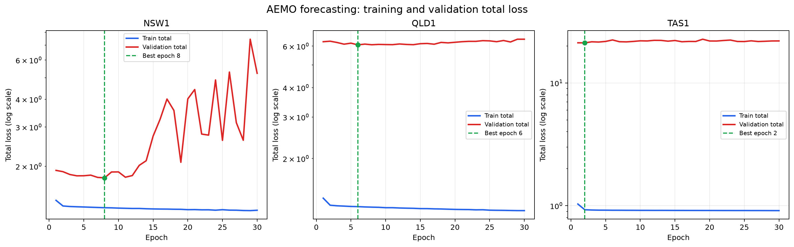
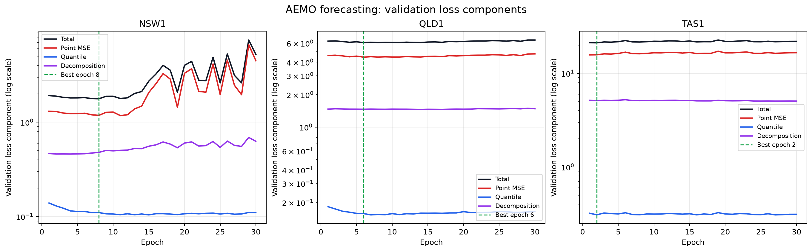
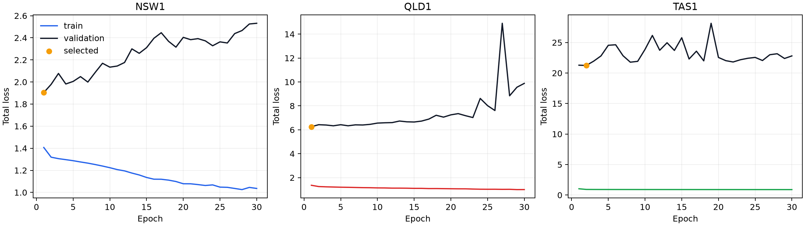
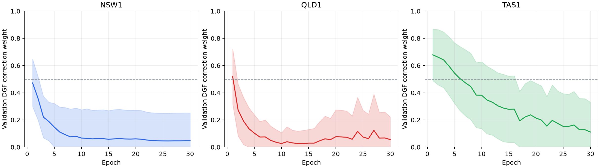
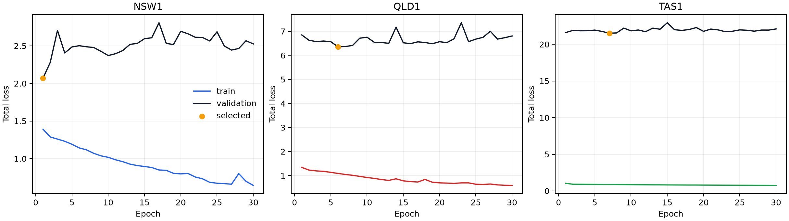
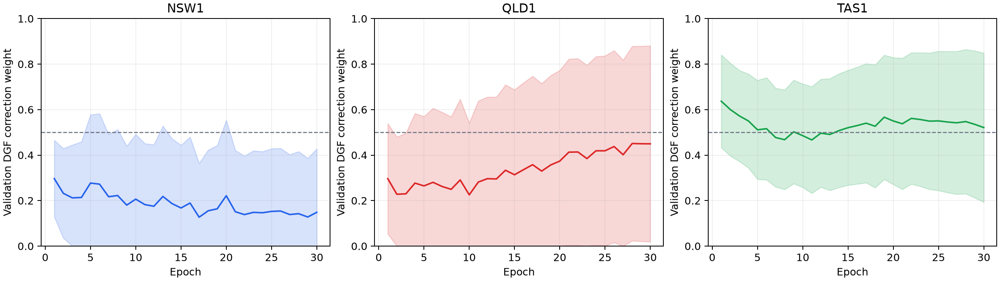
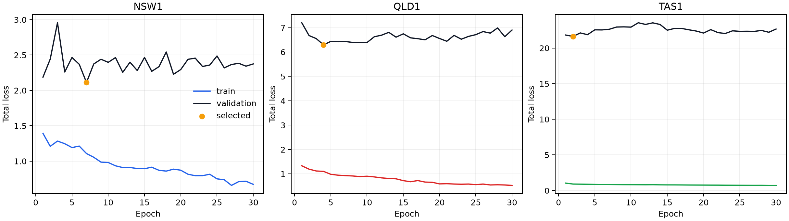
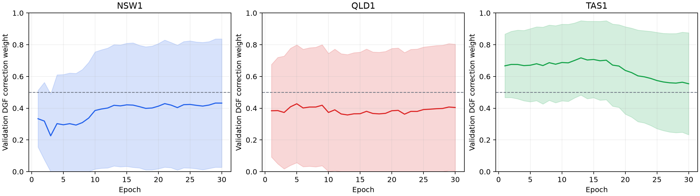
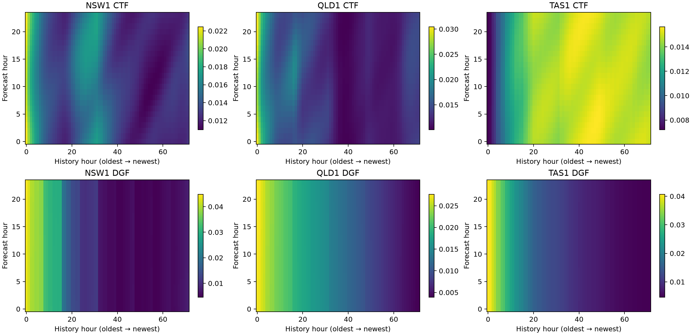

# AEMO NSW/QLD/TAS forecasting experiments

This file records the first completed three-region forecasting run. All values under **Local results** were produced by this repository. The RE-Price values are external `paper-reported` references and were not reproduced here.

## Run scope

| Item | Value |
|---|---|
| Regions | NSW1, QLD1, TAS1 |
| Data period | 2015-01-01 00:00 to 2024-12-31 23:00, Australia/Brisbane |
| Train | 2015-01-01 to 2021-12-31 |
| Validation | 2022-01-01 to 2022-12-31 |
| Test | 2023-01-01 to 2024-12-31 |
| History / horizon / stride | 72 hours / 24 hours / 1 hour |
| Random seed | 2026 |
| Result timestamp | 2026-09-21 UTC |

## Reproduction commands

```bash
CUDA_VISIBLE_DEVICES=0 python -m forecasting.train --config configs/aemo_forecast.yaml --region NSW1 2>&1 | tee logs/forecasting/nsw1.log
CUDA_VISIBLE_DEVICES=1 python -m forecasting.train --config configs/aemo_forecast.yaml --region QLD1 2>&1 | tee logs/forecasting/qld1.log
CUDA_VISIBLE_DEVICES=2 python -m forecasting.train --config configs/aemo_forecast.yaml --region TAS1 2>&1 | tee logs/forecasting/tas1.log
```

These commands reproduce the three-GPU layout. The original log files do not record `CUDA_VISIBLE_DEVICES`, so the exact GPU indices used by the completed run are unknown.

## Configuration

Source: [`configs/aemo_forecast.yaml`](../../configs/aemo_forecast.yaml)

| Group | Setting | Value |
|---|---|---|
| Inputs | Historical variables | `rrp_aud_per_mwh`, `total_demand_mw` |
| Inputs | Known future variables | hour, weekday, day-of-year and month sine/cosine; weekend flag; standardized year |
| Target | Variable | `rrp_aud_per_mwh` |
| Model | CTF frequencies / cutoff | 16 / 10 |
| Model | Hidden dimension / layers | 64 / 3 |
| Model | DGF atoms / base sigma | 16 / 0.05 |
| Model | Quantiles | 0.05, 0.10, 0.50, 0.90, 0.95 |
| Loss | Point / quantile / decomposition weights | 1.0 / 1.0 / 1.0 |
| Loss | Smoothness / sparsity weights | 0.001 / 0.001 |
| Loss | Target sparsity / excess weight | 0.3 / 10.0 |
| Training | Batch size / epochs | 128 / 30 |
| Training | Learning rate / weight decay | 0.0003 / 0.0001 |
| Training | Optimizer | AdamW |
| Training | Device / workers | CUDA / 0 |

## Environment

| Python | PyTorch | CUDA runtime | NumPy | pandas | SciPy | scikit-learn |
|---:|---:|---:|---:|---:|---:|---:|
| 3.11.0 | 2.5.1+cu124 | 12.4 | 2.4.6 | 3.0.6 | 1.17.1 | 1.9.1 |

The machine exposes eight NVIDIA L40 GPUs with 46,068 MiB each. The exact physical GPU assigned to each completed run was not persisted.

## Files

| Region | Console log | Metrics | Training history | Best checkpoint |
|---|---|---|---|---|
| NSW1 | [`nsw1.log`](nsw1.log) | [`metrics.json`](../../outputs/forecasting/static_train/NSW1/metrics.json) | [`training_history.csv`](../../outputs/forecasting/static_train/NSW1/training_history.csv) | [`best_model.pt`](../../outputs/forecasting/static_train/NSW1/best_model.pt) |
| QLD1 | [`qld1.log`](qld1.log) | [`metrics.json`](../../outputs/forecasting/static_train/QLD1/metrics.json) | [`training_history.csv`](../../outputs/forecasting/static_train/QLD1/training_history.csv) | [`best_model.pt`](../../outputs/forecasting/static_train/QLD1/best_model.pt) |
| TAS1 | [`tas1.log`](tas1.log) | [`metrics.json`](../../outputs/forecasting/static_train/TAS1/metrics.json) | [`training_history.csv`](../../outputs/forecasting/static_train/TAS1/training_history.csv) | [`best_model.pt`](../../outputs/forecasting/static_train/TAS1/best_model.pt) |

## Local results

### Training curves





### Dataset sizes and model selection

| Region | Train windows | Validation windows | Test windows | Best epoch | Best validation total loss | Final training total loss |
|---|---:|---:|---:|---:|---:|---:|
| NSW1 | 61,273 | 8,737 | 17,521 | 8/30 | 1.774037 | 1.268737 |
| QLD1 | 61,273 | 8,737 | 17,521 | 6/30 | 6.076369 | 1.202618 |
| TAS1 | 61,273 | 8,737 | 17,521 | 2/30 | 21.200955 | 0.912223 |

`metrics.json` stores zero-based best epochs (7, 5, and 1); the table uses human-readable epoch numbers (8, 6, and 2).

### Validation metrics at the selected checkpoint

| Region | MAE (AUD/MWh) | RMSE (AUD/MWh) | 80% coverage | 80% mean width | 90% coverage | 90% mean width |
|---|---:|---:|---:|---:|---:|---:|
| NSW1 | 56.3191 | 179.3832 | 64.15% | 125.3292 | 85.85% | 218.4768 |
| QLD1 | 96.1624 | 427.3042 | 64.87% | 188.0268 | 90.47% | 355.4294 |
| TAS1 | 62.2210 | 273.1233 | 38.49% | 71.8134 | 65.61% | 142.1390 |

### Test metrics at the selected checkpoint

| Region | MAE (AUD/MWh) | RMSE (AUD/MWh) | 80% coverage | 80% mean width | 90% coverage | 90% mean width |
|---|---:|---:|---:|---:|---:|---:|
| NSW1 | 60.9251 | 400.5916 | 62.55% | 89.1850 | 83.97% | 174.0480 |
| QLD1 | 65.6180 | 279.9669 | 67.37% | 106.1958 | 90.61% | 208.9505 |
| TAS1 | 37.1264 | 161.6860 | 39.37% | 46.2584 | 68.66% | 92.2706 |

### Test loss components

| Region | Total | Point | Quantile | Decomposition | Smoothness | Sparsity |
|---|---:|---:|---:|---:|---:|---:|
| NSW1 | 7.856348 | 5.903404 | 0.125783 | 1.826783 | 0.126397 | 0.252075 |
| QLD1 | 2.728067 | 1.912101 | 0.086434 | 0.729157 | 0.068527 | 0.307171 |
| TAS1 | 7.622208 | 5.533191 | 0.173170 | 1.914390 | 0.075824 | 1.381370 |

## Trigonometric gated-fusion experiment

This experiment keeps the static normalization, rolling hourly protocol, split,
loss weights, optimizer, learning rate, epoch budget, and seed unchanged. It
replaces concatenation followed by one linear forecast head with separate linear
CTF and DGF experts followed by a horizon-specific nonlinear gate. The gate uses
`cos(theta)^2` and `sin(theta)^2` weights, initialized to an equal mixture.

| Item | Value |
|---|---|
| Configuration | [`configs/aemo_forecast_trigonometric_gate.yaml`](../../configs/aemo_forecast_trigonometric_gate.yaml) |
| Epochs / learning rate | 30 / 0.0003 |
| Best epochs, NSW1 / QLD1 / TAS1 | 24 / 4 / 29 |
| GPU mapping | NSW1 / QLD1 / TAS1 on physical GPUs 5 / 6 / 7 |
| Output directory | `outputs/forecasting/trigonometric_gate/` |

### Artifacts

| Region | Console log | Metrics | Training history | Best checkpoint |
|---|---|---|---|---|
| NSW1 | [`nsw1.log`](trigonometric_gate/nsw1.log) | [`metrics.json`](../../outputs/forecasting/trigonometric_gate/NSW1/metrics.json) | [`training_history.csv`](../../outputs/forecasting/trigonometric_gate/NSW1/training_history.csv) | [`best_model.pt`](../../outputs/forecasting/trigonometric_gate/NSW1/best_model.pt) |
| QLD1 | [`qld1.log`](trigonometric_gate/qld1.log) | [`metrics.json`](../../outputs/forecasting/trigonometric_gate/QLD1/metrics.json) | [`training_history.csv`](../../outputs/forecasting/trigonometric_gate/QLD1/training_history.csv) | [`best_model.pt`](../../outputs/forecasting/trigonometric_gate/QLD1/best_model.pt) |
| TAS1 | [`tas1.log`](trigonometric_gate/tas1.log) | [`metrics.json`](../../outputs/forecasting/trigonometric_gate/TAS1/metrics.json) | [`training_history.csv`](../../outputs/forecasting/trigonometric_gate/TAS1/training_history.csv) | [`best_model.pt`](../../outputs/forecasting/trigonometric_gate/TAS1/best_model.pt) |

### Validation metrics at the selected checkpoint

| Region | MAE | RMSE | 80% coverage | 90% coverage | Mean DGF weight | DGF weight std. |
|---|---:|---:|---:|---:|---:|---:|
| NSW1 | 64.4656 | 189.4906 | 67.20% | 79.83% | 99.85% | 1.48% |
| QLD1 | 108.6560 | 433.0052 | 66.81% | 85.77% | 69.38% | 25.10% |
| TAS1 | 73.4418 | 284.2861 | 43.43% | 66.56% | 48.90% | 30.28% |

### Test metrics and static-baseline change

| Region | MAE | MAE change | RMSE | RMSE change | 80% coverage / width | 90% coverage / width | Mean DGF weight | DGF weight std. |
|---|---:|---:|---:|---:|---:|---:|---:|---:|
| NSW1 | 84.4436 | +38.60% | 445.4598 | +11.20% | 59.09% / 126.7615 | 77.91% / 198.7455 | 99.03% | 5.94% |
| QLD1 | 68.8983 | +5.00% | 280.5253 | +0.20% | 67.94% / 124.8967 | 90.80% / 225.3520 | 78.88% | 19.89% |
| TAS1 | 39.0713 | +5.24% | 162.7952 | +0.69% | 50.43% / 56.9452 | 75.90% / 101.2208 | 51.60% | 22.62% |

The gated model does not improve point forecasting in any region. NSW1 collapses
almost completely onto the DGF expert, while QLD1 also strongly favors DGF. TAS1
retains a balanced and variable gate, but still loses point accuracy. The result
shows that unconstrained trigonometric gating can collapse to one expert and is
retained as a negative fusion ablation.

## Complementary additive trigonometric-fusion experiment

This experiment changes the competitive convex mixture into an additive
residual form: `forecast = CTF forecast + sin(theta)^2 * DGF correction`.
The CTF path therefore always has weight 1 and receives an unscaled gradient;
the dynamic gate controls only the non-negative strength of the DGF event
correction. All data, normalization, split, loss, optimizer, learning rate,
epoch budget, and random seed settings remain unchanged.

| Item | Value |
|---|---|
| Configuration | [`configs/aemo_forecast_additive_trigonometric_gate.yaml`](../../configs/aemo_forecast_additive_trigonometric_gate.yaml) |
| Epochs / learning rate | 30 / 0.0003 |
| Best epochs, NSW1 / QLD1 / TAS1 | 1 / 1 / 2 |
| GPU mapping | NSW1 / QLD1 / TAS1 on physical GPUs 5 / 6 / 7 |
| Output directory | `outputs/forecasting/additive_trigonometric_gate/` |

### Artifacts

| Region | Console log | Metrics | Training history | Best checkpoint |
|---|---|---|---|---|
| NSW1 | [`nsw1.log`](additive_trigonometric_gate/nsw1.log) | [`metrics.json`](../../outputs/forecasting/additive_trigonometric_gate/NSW1/metrics.json) | [`training_history.csv`](../../outputs/forecasting/additive_trigonometric_gate/NSW1/training_history.csv) | [`best_model.pt`](../../outputs/forecasting/additive_trigonometric_gate/NSW1/best_model.pt) |
| QLD1 | [`qld1.log`](additive_trigonometric_gate/qld1.log) | [`metrics.json`](../../outputs/forecasting/additive_trigonometric_gate/QLD1/metrics.json) | [`training_history.csv`](../../outputs/forecasting/additive_trigonometric_gate/QLD1/training_history.csv) | [`best_model.pt`](../../outputs/forecasting/additive_trigonometric_gate/QLD1/best_model.pt) |
| TAS1 | [`tas1.log`](additive_trigonometric_gate/tas1.log) | [`metrics.json`](../../outputs/forecasting/additive_trigonometric_gate/TAS1/metrics.json) | [`training_history.csv`](../../outputs/forecasting/additive_trigonometric_gate/TAS1/training_history.csv) | [`best_model.pt`](../../outputs/forecasting/additive_trigonometric_gate/TAS1/best_model.pt) |





### Validation metrics at the selected checkpoint

| Region | MAE | RMSE | 80% coverage | 90% coverage | Mean DGF correction weight | DGF weight std. |
|---|---:|---:|---:|---:|---:|---:|
| NSW1 | 69.0112 | 187.8241 | 60.12% | 78.60% | 47.24% | 17.51% |
| QLD1 | 95.9668 | 434.4366 | 62.20% | 85.61% | 51.87% | 20.30% |
| TAS1 | 63.7030 | 273.8954 | 46.75% | 73.65% | 66.09% | 20.33% |

### Test metrics and comparisons

| Region | MAE | vs. static | vs. competitive gate | RMSE | vs. static | vs. competitive gate | Mean DGF correction weight |
|---|---:|---:|---:|---:|---:|---:|---:|
| NSW1 | 67.5852 | +10.93% | -19.96% | 400.3284 | -0.07% | -10.13% | 45.43% |
| QLD1 | 59.5623 | -9.23% | -13.55% | 278.2809 | -0.60% | -0.80% | 50.73% |
| TAS1 | 37.7484 | +1.68% | -3.39% | 161.7574 | +0.04% | -0.64% | 56.51% |

Negative comparison values are improvements. The additive design outperforms
the competitive trigonometric gate on both point metrics in all three regions.
Against the original concatenation baseline, it improves both point metrics on
QLD1, slightly improves NSW1 RMSE but worsens NSW1 MAE, and is effectively tied
on TAS1 RMSE while slightly worsening TAS1 MAE.

### CTF backbone and DGF correction ablation

| Region | CTF-only MAE | Fused MAE | CTF-only RMSE | Fused RMSE | Mean absolute DGF correction (AUD/MWh) |
|---|---:|---:|---:|---:|---:|
| NSW1 | 79.8787 | 67.5852 | 406.3610 | 400.3284 | 52.5739 |
| QLD1 | 73.6634 | 59.5623 | 285.0789 | 278.2809 | 47.9608 |
| TAS1 | 39.0819 | 37.7484 | 164.3688 | 161.7574 | 17.0854 |

The DGF correction improves its paired CTF backbone in every region on both
MAE and RMSE, which supports the intended complementary interpretation. The
test DGF weights remain distributed around 45--57% instead of collapsing near
100% as in competitive NSW1. However, the best validation checkpoints occur at
epochs 1, 1, and 2, so the new parameterization still overfits quickly and does
not consistently beat the original concatenation head.

## Temporal convolutional forecast-head experiment

This experiment preserves the complementary additive CTF/DGF fusion and
replaces the flattened linear heads with separate temporal convolutional
heads. Each head uses 40 channels and five causal residual blocks with kernel
size 3 and dilations 1, 2, 4, 8, and 16. Two convolutions per block give a
125-step receptive field, covering the full 72-hour history. The final temporal
state is combined independently with each future hour's calendar vector before
point and quantile decoding. The two TCN heads contain 104,892 parameters,
compared with 110,880 for the additive linear heads and 117,280 for the minimal
GELU heads.

| Item | Value |
|---|---|
| Configuration | [`configs/aemo_forecast_additive_tcn_head.yaml`](../../configs/aemo_forecast_additive_tcn_head.yaml) |
| Epochs / learning rate | 30 / 0.0003 |
| Best epochs, NSW1 / QLD1 / TAS1 | 1 / 6 / 7 |
| GPU mapping | NSW1 / QLD1 / TAS1 on physical GPUs 5 / 6 / 7 |
| Output directory | `outputs/forecasting/additive_tcn_head/` |

### Artifacts

| Region | Console log | Metrics | Training history | Best checkpoint |
|---|---|---|---|---|
| NSW1 | [`nsw1.log`](additive_tcn_head/nsw1.log) | [`metrics.json`](../../outputs/forecasting/additive_tcn_head/NSW1/metrics.json) | [`training_history.csv`](../../outputs/forecasting/additive_tcn_head/NSW1/training_history.csv) | [`best_model.pt`](../../outputs/forecasting/additive_tcn_head/NSW1/best_model.pt) |
| QLD1 | [`qld1.log`](additive_tcn_head/qld1.log) | [`metrics.json`](../../outputs/forecasting/additive_tcn_head/QLD1/metrics.json) | [`training_history.csv`](../../outputs/forecasting/additive_tcn_head/QLD1/training_history.csv) | [`best_model.pt`](../../outputs/forecasting/additive_tcn_head/QLD1/best_model.pt) |
| TAS1 | [`tas1.log`](additive_tcn_head/tas1.log) | [`metrics.json`](../../outputs/forecasting/additive_tcn_head/TAS1/metrics.json) | [`training_history.csv`](../../outputs/forecasting/additive_tcn_head/TAS1/training_history.csv) | [`best_model.pt`](../../outputs/forecasting/additive_tcn_head/TAS1/best_model.pt) |





### Test metrics and comparisons

| Region | MAE | vs. GELU head | vs. additive linear head | RMSE | vs. GELU head | vs. additive linear head | Mean DGF correction weight |
|---|---:|---:|---:|---:|---:|---:|---:|
| NSW1 | 65.8118 | -9.01% | -2.62% | 401.5297 | +0.11% | +0.30% | 33.98% |
| QLD1 | 75.2342 | +16.01% | +26.31% | 286.0702 | +2.42% | +2.80% | 37.44% |
| TAS1 | 41.1317 | +0.46% | +8.96% | 162.6147 | -0.19% | +0.53% | 48.30% |

Negative comparison values are improvements. The TCN improves NSW1 MAE over
both matched alternatives and slightly improves TAS1 RMSE over the GELU head,
but substantially degrades QLD1 and does not improve consistently across
regions. Training loss falls much faster than validation loss, showing that
the TCN learns stronger temporal patterns but also widens the generalization
gap. Retaining only the final TCN state as a single summary of all 72 hours is
a likely information bottleneck and is recorded as part of this ablation.

## Horizon-specific TCN history-attention experiment

This experiment retains the complete 72-step output from each CTF/DGF TCN.
Each of the 24 future calendar embeddings produces a query over historical
key/value vectors, yielding separate `[24, 72]` attention maps for the two
fields. The convolutional encoder, additive trigonometric gate, data, loss,
optimizer, learning rate, epoch budget, and seed remain unchanged. The two
attention TCN heads contain 114,492 parameters, close to the 104,892-parameter
last-state TCN and 117,280-parameter GELU alternatives.

| Item | Value |
|---|---|
| Configuration | [`configs/aemo_forecast_additive_tcn_attention_head.yaml`](../../configs/aemo_forecast_additive_tcn_attention_head.yaml) |
| Epochs / learning rate | 30 / 0.0003 |
| Best epochs, NSW1 / QLD1 / TAS1 | 7 / 4 / 2 |
| GPU mapping | NSW1 / QLD1 / TAS1 on physical GPUs 5 / 6 / 7 |
| Output directory | `outputs/forecasting/additive_tcn_attention_head/` |

### Artifacts

| Region | Console log | Metrics | Training history | Attention diagnostics | Best checkpoint |
|---|---|---|---|---|---|
| NSW1 | [`nsw1.log`](additive_tcn_attention_head/nsw1.log) | [`metrics.json`](../../outputs/forecasting/additive_tcn_attention_head/NSW1/metrics.json) | [`training_history.csv`](../../outputs/forecasting/additive_tcn_attention_head/NSW1/training_history.csv) | [`attention_diagnostics.json`](../../outputs/forecasting/additive_tcn_attention_head/NSW1/attention_diagnostics.json) | [`best_model.pt`](../../outputs/forecasting/additive_tcn_attention_head/NSW1/best_model.pt) |
| QLD1 | [`qld1.log`](additive_tcn_attention_head/qld1.log) | [`metrics.json`](../../outputs/forecasting/additive_tcn_attention_head/QLD1/metrics.json) | [`training_history.csv`](../../outputs/forecasting/additive_tcn_attention_head/QLD1/training_history.csv) | [`attention_diagnostics.json`](../../outputs/forecasting/additive_tcn_attention_head/QLD1/attention_diagnostics.json) | [`best_model.pt`](../../outputs/forecasting/additive_tcn_attention_head/QLD1/best_model.pt) |
| TAS1 | [`tas1.log`](additive_tcn_attention_head/tas1.log) | [`metrics.json`](../../outputs/forecasting/additive_tcn_attention_head/TAS1/metrics.json) | [`training_history.csv`](../../outputs/forecasting/additive_tcn_attention_head/TAS1/training_history.csv) | [`attention_diagnostics.json`](../../outputs/forecasting/additive_tcn_attention_head/TAS1/attention_diagnostics.json) | [`best_model.pt`](../../outputs/forecasting/additive_tcn_attention_head/TAS1/best_model.pt) |







### Test metrics and last-state TCN comparison

| Region | MAE | MAE change | RMSE | RMSE change | Mean DGF correction weight |
|---|---:|---:|---:|---:|---:|
| NSW1 | 70.9050 | +7.74% | 409.3162 | +1.94% | 40.27% |
| QLD1 | 60.2609 | -19.90% | 280.3577 | -2.00% | 47.07% |
| TAS1 | 41.9712 | +2.04% | 163.9216 | +0.80% | 59.12% |

Negative changes are improvements. Full-history attention substantially fixes
the QLD1 degradation of the last-state TCN and approaches the additive linear
head (59.5623 MAE), but it degrades NSW1 and TAS1. The effect of removing the
single-state bottleneck is therefore market-dependent.

### Attention selectivity on the test split

| Region | CTF normalized entropy | DGF normalized entropy | CTF max weight | DGF max weight | CTF adjacent-horizon TV | DGF adjacent-horizon TV |
|---|---:|---:|---:|---:|---:|---:|
| NSW1 | 0.9361 | 0.8562 | 3.78% | 6.11% | 0.0166 | 0.0480 |
| QLD1 | 0.9033 | 0.9485 | 4.16% | 2.75% | 0.0148 | 0.0106 |
| TAS1 | 0.9781 | 0.9458 | 2.72% | 4.07% | 0.0102 | 0.0112 |

Normalized entropy is one for uniform attention; a uniform maximum over 72
positions is 1.39%. The learned maps are non-uniform but remain diffuse, and
adjacent forecast hours have very similar distributions. Thus the QLD1 gain is
mainly attributable to full-history weighted pooling rather than strongly
horizon-specific historical selection.

## Maximum-spare future-context experiment

This experiment adds one point-in-time known-future AEMO factor,
`MAXSPARECAPACITY`, to the horizon-specific TCN attention model. Each hourly
forecast uses the latest PD PASA publication available at its origin, with the
remaining market-day tail supplied by the latest already-published ST PASA
run. Two half-hour intervals are aggregated by their minimum. The factor is
standardized with training data only and projected into both the CTF and DGF
future attention contexts. Historical inputs, target, split, loss weights,
optimizer, epoch budget, and random seed remain unchanged.

| Item | Value |
|---|---|
| Configuration | [`configs/aemo_forecast_max_spare.yaml`](../../configs/aemo_forecast_max_spare.yaml) |
| Future factor | AEMO `MAXSPARECAPACITY`, hourly minimum |
| Vintage rule | Latest available PD PASA with an already-published ST PASA tail |
| Epochs / learning rate | 30 / 0.0003 |
| Best epochs, NSW1 / QLD1 / TAS1 | 1 / 1 / 2 |
| GPU mapping | NSW1 / QLD1 / TAS1 on physical GPUs 5 / 6 / 7 |
| Output directory | `outputs/forecasting/max_spare_future_context/` |

### Artifacts

| Region | Console log | Metrics | Training history | Best checkpoint |
|---|---|---|---|---|
| NSW1 | [`train.log`](../../outputs/forecasting/max_spare_future_context/NSW1/train.log) | [`metrics.json`](../../outputs/forecasting/max_spare_future_context/NSW1/metrics.json) | [`training_history.csv`](../../outputs/forecasting/max_spare_future_context/NSW1/training_history.csv) | [`best_model.pt`](../../outputs/forecasting/max_spare_future_context/NSW1/best_model.pt) |
| QLD1 | [`train.log`](../../outputs/forecasting/max_spare_future_context/QLD1/train.log) | [`metrics.json`](../../outputs/forecasting/max_spare_future_context/QLD1/metrics.json) | [`training_history.csv`](../../outputs/forecasting/max_spare_future_context/QLD1/training_history.csv) | [`best_model.pt`](../../outputs/forecasting/max_spare_future_context/QLD1/best_model.pt) |
| TAS1 | [`train.log`](../../outputs/forecasting/max_spare_future_context/TAS1/train.log) | [`metrics.json`](../../outputs/forecasting/max_spare_future_context/TAS1/metrics.json) | [`training_history.csv`](../../outputs/forecasting/max_spare_future_context/TAS1/training_history.csv) | [`best_model.pt`](../../outputs/forecasting/max_spare_future_context/TAS1/best_model.pt) |

### Validation metrics at the selected checkpoint

| Region | MAE | RMSE | 80% coverage | 80% mean width | 90% coverage | 90% mean width |
|---|---:|---:|---:|---:|---:|---:|
| NSW1 | 88.1851 | 198.1391 | 42.20% | 109.4059 | 63.50% | 165.0661 |
| QLD1 | 175.8848 | 465.3082 | 56.13% | 180.2693 | 80.10% | 301.7551 |
| TAS1 | 68.0684 | 276.7955 | 53.47% | 114.0317 | 76.21% | 192.4702 |

### Test metrics and attention-baseline comparison

| Region | MAE | MAE change | RMSE | RMSE change | 80% coverage | 90% coverage |
|---|---:|---:|---:|---:|---:|---:|
| NSW1 | 74.9394 | +5.69% | 395.0977 | -3.47% | 60.50% | 78.23% |
| QLD1 | 75.4752 | +25.25% | 277.1987 | -1.13% | 44.79% | 80.08% |
| TAS1 | 41.8536 | -0.28% | 163.3747 | -0.33% | 54.15% | 73.84% |

Negative changes are improvements. `MAXSPARECAPACITY` reduces RMSE in every
region and reduces the MAE of the highest-price one percent by 8.6%, 5.8%, and
3.5% in NSW1, QLD1, and TAS1, respectively. It nevertheless increases ordinary
hour errors enough to worsen overall MAE in NSW1 and QLD1. NSW1 and QLD1 select
the first epoch while their training losses continue to fall, showing rapid
overfitting. The one-dimensional exogenous projection is also initialized with
substantially greater per-feature norm than a calendar column and directly
changes both experts' attention queries. The follow-up experiment therefore
keeps attention calendar-driven and introduces the factor only as a
zero-initialized post-attention residual adapter in the DGF event branch.

## DGF-only maximum-spare residual-adapter experiment

This is the recommended and best-controlled maximum-spare version. It starts
from each region's selected TCN-attention checkpoint, keeps the calendar-only
attention queries unchanged, freezes all existing parameters, and trains only
a 672-parameter nonlinear adapter after DGF history attention. The adapter's
final layer is zero-initialized, so its warm-start predictions reproduce the
baseline to floating-point precision. Validation total loss, MAE, and RMSE are
selected independently; the canonical `best_model.pt` uses validation total
loss, while the other two selections remain available for metric-specific use.

| Item | Value |
|---|---|
| Configuration | [`configs/aemo_forecast_max_spare_dgf_adapter.yaml`](../../configs/aemo_forecast_max_spare_dgf_adapter.yaml) |
| Initialization | Regional `additive_tcn_attention_head` best checkpoint |
| Trainable parameters | 672, DGF exogenous adapter only |
| Adapter | `1 -> 16 -> GELU -> 40`, zero-initialized final projection |
| Epochs / learning rate | 30 / 0.0003 |
| Best total epochs, NSW1 / QLD1 / TAS1 | 2 / 30 / 21 |
| GPU mapping | NSW1 / QLD1 / TAS1 on physical GPUs 5 / 6 / 7 |
| Output directory | `outputs/forecasting/max_spare_dgf_residual_adapter/` |
| Status | Recommended maximum-spare implementation |

### Artifacts

| Region | Console log | Metrics | Training history | Total / MAE / RMSE checkpoints |
|---|---|---|---|---|
| NSW1 | [`train.log`](../../outputs/forecasting/max_spare_dgf_residual_adapter/NSW1/train.log) | [`metrics.json`](../../outputs/forecasting/max_spare_dgf_residual_adapter/NSW1/metrics.json) | [`training_history.csv`](../../outputs/forecasting/max_spare_dgf_residual_adapter/NSW1/training_history.csv) | [`total`](../../outputs/forecasting/max_spare_dgf_residual_adapter/NSW1/best_model.pt) / [`MAE`](../../outputs/forecasting/max_spare_dgf_residual_adapter/NSW1/best_mae_model.pt) / [`RMSE`](../../outputs/forecasting/max_spare_dgf_residual_adapter/NSW1/best_rmse_model.pt) |
| QLD1 | [`train.log`](../../outputs/forecasting/max_spare_dgf_residual_adapter/QLD1/train.log) | [`metrics.json`](../../outputs/forecasting/max_spare_dgf_residual_adapter/QLD1/metrics.json) | [`training_history.csv`](../../outputs/forecasting/max_spare_dgf_residual_adapter/QLD1/training_history.csv) | [`total`](../../outputs/forecasting/max_spare_dgf_residual_adapter/QLD1/best_model.pt) / [`MAE`](../../outputs/forecasting/max_spare_dgf_residual_adapter/QLD1/best_mae_model.pt) / [`RMSE`](../../outputs/forecasting/max_spare_dgf_residual_adapter/QLD1/best_rmse_model.pt) |
| TAS1 | [`train.log`](../../outputs/forecasting/max_spare_dgf_residual_adapter/TAS1/train.log) | [`metrics.json`](../../outputs/forecasting/max_spare_dgf_residual_adapter/TAS1/metrics.json) | [`training_history.csv`](../../outputs/forecasting/max_spare_dgf_residual_adapter/TAS1/training_history.csv) | [`total`](../../outputs/forecasting/max_spare_dgf_residual_adapter/TAS1/best_model.pt) / [`MAE`](../../outputs/forecasting/max_spare_dgf_residual_adapter/TAS1/best_mae_model.pt) / [`RMSE`](../../outputs/forecasting/max_spare_dgf_residual_adapter/TAS1/best_rmse_model.pt) |

### Canonical total-loss-selected test results

| Region | MAE | vs. TCN attention | RMSE | vs. TCN attention | 80% coverage | 90% coverage |
|---|---:|---:|---:|---:|---:|---:|
| NSW1 | 70.0587 | -1.19% | 406.7138 | -0.64% | 60.51% | 76.49% |
| QLD1 | 63.2004 | +4.88% | 276.8303 | -1.26% | 51.52% | 77.81% |
| TAS1 | 41.8432 | -0.31% | 163.6939 | -0.14% | 46.92% | 70.23% |

Negative changes are improvements. NSW1 improves both point metrics, TAS1 is
effectively tied with a small improvement, and QLD1 trades a 1.26% RMSE gain
for a 4.88% MAE loss. QLD1's validation-MAE checkpoint remains the untouched
warm start, proving that no trained adapter checkpoint improves its validation
MAE. Compared with query injection, this residual design reduces MAE by 6.51%
on NSW1 and 16.26% on QLD1 and removes the catastrophic ordinary-hour error.

## Stable full-model training from scratch

This run tests the stable optimizer recipe without loading a prior checkpoint.
All 150,584 parameters are trained from their seeded initialization. The setup
uses AdamW with betas 0.9/0.95, blended Huber/MSE point loss, gradient clipping
at 1.0, EMA decay 0.999, five warmup epochs from `6e-5` to `3e-4`, and cosine
decay toward `3e-6`. Early stopping monitors validation total loss with a
minimum of 80 epochs and patience of 20. All regions stopped at epoch 99.

Configuration: [`configs/aemo_forecast_stable_from_scratch.yaml`](../../configs/aemo_forecast_stable_from_scratch.yaml)

| Region | Best total epoch | Validation MAE | Validation RMSE | Test MAE | Test RMSE | 80% coverage | 90% coverage |
|---|---:|---:|---:|---:|---:|---:|---:|
| NSW1 | 6 | 85.1333 | 199.4683 | 65.7883 | 398.2677 | 72.86% | 83.44% |
| QLD1 | 10 | 106.1321 | 430.6047 | 64.8411 | 279.3281 | 43.41% | 64.18% |
| TAS1 | 10 | 76.1095 | 282.7228 | 43.0753 | 166.6315 | 46.82% | 67.00% |
| Mean | - | 89.1249 | 304.2653 | 57.9016 | 281.4091 | 54.37% | 71.54% |

Although optimization continued stably to epoch 99, the total-loss-selected
checkpoints remained at epochs 6, 10, and 10. The run improves the residual
adapter's average test MAE from 58.367 to 57.902 and RMSE from 282.413 to
281.409, but does not surpass the static baseline's 54.556 average MAE. This
confirms that longer stable optimization alone does not remove the validation
generalization bottleneck.

### Artifacts

| Region | Console log | Metrics | Training history | Total / MAE / RMSE checkpoints |
|---|---|---|---|---|
| NSW1 | [`train.log`](../../outputs/forecasting/stable_from_scratch/NSW1/train.log) | [`metrics.json`](../../outputs/forecasting/stable_from_scratch/NSW1/metrics.json) | [`training_history.csv`](../../outputs/forecasting/stable_from_scratch/NSW1/training_history.csv) | [`total`](../../outputs/forecasting/stable_from_scratch/NSW1/best_model.pt) / [`MAE`](../../outputs/forecasting/stable_from_scratch/NSW1/best_mae_model.pt) / [`RMSE`](../../outputs/forecasting/stable_from_scratch/NSW1/best_rmse_model.pt) |
| QLD1 | [`train.log`](../../outputs/forecasting/stable_from_scratch/QLD1/train.log) | [`metrics.json`](../../outputs/forecasting/stable_from_scratch/QLD1/metrics.json) | [`training_history.csv`](../../outputs/forecasting/stable_from_scratch/QLD1/training_history.csv) | [`total`](../../outputs/forecasting/stable_from_scratch/QLD1/best_model.pt) / [`MAE`](../../outputs/forecasting/stable_from_scratch/QLD1/best_mae_model.pt) / [`RMSE`](../../outputs/forecasting/stable_from_scratch/QLD1/best_rmse_model.pt) |
| TAS1 | [`train.log`](../../outputs/forecasting/stable_from_scratch/TAS1/train.log) | [`metrics.json`](../../outputs/forecasting/stable_from_scratch/TAS1/metrics.json) | [`training_history.csv`](../../outputs/forecasting/stable_from_scratch/TAS1/training_history.csv) | [`total`](../../outputs/forecasting/stable_from_scratch/TAS1/best_model.pt) / [`MAE`](../../outputs/forecasting/stable_from_scratch/TAS1/best_mae_model.pt) / [`RMSE`](../../outputs/forecasting/stable_from_scratch/TAS1/best_rmse_model.pt) |

## Asinh price-target experiment

This experiment keeps the complementary additive trigonometric CTF/DGF model,
data, split, loss weights, optimizer, learning rate, 30-epoch budget, and seed
unchanged. The only change is a variance-stabilizing transform of the price
channel, applied to both the historical input and the forecast target before
standardization:
`asinh((price - median) / (MAD / 0.6745))`. The median and MAD are fitted on
the training split only (NSW1 58.03 / 30.34, QLD1 55.19 / 29.30, TAS1
57.60 / 41.44 AUD/MWh). Point forecasts and quantiles are mapped back with the
inverse transform before every metric, so all values remain in AUD/MWh.

| Item | Value |
|---|---|
| Configuration | [`configs/aemo_forecast_asinh_additive_trigonometric_gate.yaml`](../../configs/aemo_forecast_asinh_additive_trigonometric_gate.yaml) |
| Epochs / learning rate | 30 / 0.0003 |
| Best epochs, NSW1 / QLD1 / TAS1 | 16 / 4 / 2 |
| GPU mapping | NSW1 / QLD1 / TAS1 on physical GPUs 5 / 6 / 7 |
| Output directory | `outputs/forecasting/asinh_additive_trigonometric_gate/` |

### Artifacts

| Region | Console log | Metrics | Training history | Best checkpoint |
|---|---|---|---|---|
| NSW1 | [`nsw1.log`](asinh_additive_trigonometric_gate/nsw1.log) | [`metrics.json`](../../outputs/forecasting/asinh_additive_trigonometric_gate/NSW1/metrics.json) | [`training_history.csv`](../../outputs/forecasting/asinh_additive_trigonometric_gate/NSW1/training_history.csv) | [`best_model.pt`](../../outputs/forecasting/asinh_additive_trigonometric_gate/NSW1/best_model.pt) |
| QLD1 | [`qld1.log`](asinh_additive_trigonometric_gate/qld1.log) | [`metrics.json`](../../outputs/forecasting/asinh_additive_trigonometric_gate/QLD1/metrics.json) | [`training_history.csv`](../../outputs/forecasting/asinh_additive_trigonometric_gate/QLD1/training_history.csv) | [`best_model.pt`](../../outputs/forecasting/asinh_additive_trigonometric_gate/QLD1/best_model.pt) |
| TAS1 | [`tas1.log`](asinh_additive_trigonometric_gate/tas1.log) | [`metrics.json`](../../outputs/forecasting/asinh_additive_trigonometric_gate/TAS1/metrics.json) | [`training_history.csv`](../../outputs/forecasting/asinh_additive_trigonometric_gate/TAS1/training_history.csv) | [`best_model.pt`](../../outputs/forecasting/asinh_additive_trigonometric_gate/TAS1/best_model.pt) |

### Validation metrics at the selected checkpoint

| Region | MAE | RMSE | 80% coverage | 90% coverage | Mean DGF correction weight |
|---|---:|---:|---:|---:|---:|
| NSW1 | 65.7256 | 184.3621 | 57.50% | 81.28% | 28.46% |
| QLD1 | 92.4641 | 432.2614 | 65.84% | 86.42% | 43.27% |
| TAS1 | 59.2845 | 271.0506 | 49.51% | 72.93% | 52.98% |

### Test metrics and comparisons

| Region | MAE | vs. additive | vs. static | RMSE | vs. additive | vs. static | 80% coverage / width | 90% coverage / width | Mean DGF correction weight |
|---|---:|---:|---:|---:|---:|---:|---:|---:|---:|
| NSW1 | 53.4716 | -20.88% | -12.23% | 396.3959 | -0.98% | -1.05% | 63.10% / 108.9388 | 84.16% / 238.2870 | 30.68% |
| QLD1 | 48.4728 | -18.62% | -26.13% | 275.8854 | -0.86% | -1.46% | 74.23% / 155.0740 | 92.66% / 410.8170 | 38.86% |
| TAS1 | 36.0219 | -4.57% | -2.97% | 160.5065 | -0.77% | -0.73% | 47.39% / 52.5858 | 73.57% / 97.9439 | 51.84% |

Negative comparison values are improvements. The transform improves both
point metrics in every region against both the additive model and the static
baseline. Average test MAE falls from 54.965 to 45.989 (-16.33%) against the
additive model and by 15.70% against the static baseline, and QLD1 now beats
the 24-hour seasonal naive MAE of 59.17. The gain is concentrated in ordinary
hours: global RMSE improves by less than 1.5% because spike hours remain
unforecast.

Two costs remain. First, the inverse `sinh` widens upper quantiles, so 90%
interval width grows from 165.3 to 249.0 AUD/MWh on average and the 90% AIS
worsens from 485.4 to 508.6 under the RE-Price metric definitions. Second, the
mean DGF correction weight falls from 45-57% to 31-52%, confirming that
compressing spikes also reduces the event field's share of the forecast.

## Conformal interval-calibration experiment

This post-hoc experiment reuses the asinh price-target checkpoints without
retraining. Asymmetric conformalized quantile regression (Romano et al., 2019)
is fitted separately for each region and each of the 24 horizons. The lower and
upper offsets of the 80% and 90% intervals are estimated on the 2022
validation split in the model's normalized asinh space and then mapped back to
AUD/MWh. Point forecasts are unchanged, so MAE and RMSE are identical to the
asinh run.

| Item | Value |
|---|---|
| Base checkpoints | `outputs/forecasting/asinh_additive_trigonometric_gate/` |
| Calibration | Validation split, per-horizon asymmetric CQR, finite-sample `(n + 1) / n` correction |
| Calibration files | `outputs/forecasting/asinh_conformal_intervals/{NSW1,QLD1,TAS1}/interval_calibration.json` |
| Results | [`paper_metrics/17_asinh_conformal_intervals/`](paper_metrics/17_asinh_conformal_intervals/) |

### Test interval metrics before and after calibration

| Region | 90% coverage | 90% mean width | 90% AIS | 80% coverage | 80% AIS | CRPS~ |
|---|---:|---:|---:|---:|---:|---:|
| NSW1 | 84.16% -> 89.05% | 238.29 -> 310.08 | 621.44 -> 644.82 | 63.10% -> 75.67% | 379.45 -> 392.61 | 38.44 -> 39.43 |
| QLD1 | 92.66% -> 93.83% | 410.82 -> 450.67 | 614.53 -> 629.90 | 74.23% -> 82.51% | 338.76 -> 356.02 | 35.91 -> 36.91 |
| TAS1 | 73.57% -> 93.64% | 97.94 -> 192.66 | 289.68 -> 290.43 | 47.39% -> 82.35% | 222.64 -> 194.94 | 21.95 -> 20.86 |
| Mean | 83.46% -> 92.17% | 249.02 -> 317.80 | 508.55 -> 521.72 | 61.57% -> 80.18% | 313.61 -> 314.53 | 32.10 -> 32.40 |

Calibration restores nominal coverage on average, but it widens every
interval and worsens the mean 90% AIS. The 2022 validation year is far more
volatile than the 2023-2024 test period, so validation residuals overstate the
test uncertainty. Coverage alone is therefore not the bottleneck and this
calibration is retained as a negative interval ablation.

The asinh model's interval problem is concentrated in a heavy tail of very
wide intervals rather than in typical widths. On the test split its median
90% width is below the additive model's in NSW1 and TAS1 (112.2 vs. 132.4 and
84.0 vs. 95.9 AUD/MWh), while the 99th-percentile width rises from 891.7 to
2292.1 in NSW1 and from 741.9 to 3382.2 in QLD1. Pinball loss in asinh space
does not penalize the price-space cost of tail-quantile errors, which the
inverse `sinh` amplifies.

## Price-space quantile experiment

This experiment keeps the asinh price-target model, inputs, point target,
architecture, parameter count, optimizer, 30-epoch budget, and seed unchanged.
Only the quantile head's pinball-loss target changes: instead of the
standardized asinh price, it is the raw price standardized with the training
mean and standard deviation. Quantiles are therefore learned and
denormalized in price space, where AIS and CRPS are scored, while the point
head still benefits from the asinh target.

| Item | Value |
|---|---|
| Configuration | [`configs/aemo_forecast_asinh_price_space_quantiles.yaml`](../../configs/aemo_forecast_asinh_price_space_quantiles.yaml) |
| Epochs / learning rate | 30 / 0.0003 |
| Best epochs, NSW1 / QLD1 / TAS1 | 16 / 4 / 2 |
| GPU mapping | NSW1 / QLD1 / TAS1 on physical GPUs 5 / 6 / 7 |
| Output directory | `outputs/forecasting/asinh_price_space_quantiles/` |

### Artifacts

| Region | Console log | Metrics | Training history | Best checkpoint |
|---|---|---|---|---|
| NSW1 | [`nsw1.log`](asinh_price_space_quantiles/nsw1.log) | [`metrics.json`](../../outputs/forecasting/asinh_price_space_quantiles/NSW1/metrics.json) | [`training_history.csv`](../../outputs/forecasting/asinh_price_space_quantiles/NSW1/training_history.csv) | [`best_model.pt`](../../outputs/forecasting/asinh_price_space_quantiles/NSW1/best_model.pt) |
| QLD1 | [`qld1.log`](asinh_price_space_quantiles/qld1.log) | [`metrics.json`](../../outputs/forecasting/asinh_price_space_quantiles/QLD1/metrics.json) | [`training_history.csv`](../../outputs/forecasting/asinh_price_space_quantiles/QLD1/training_history.csv) | [`best_model.pt`](../../outputs/forecasting/asinh_price_space_quantiles/QLD1/best_model.pt) |
| TAS1 | [`tas1.log`](asinh_price_space_quantiles/tas1.log) | [`metrics.json`](../../outputs/forecasting/asinh_price_space_quantiles/TAS1/metrics.json) | [`training_history.csv`](../../outputs/forecasting/asinh_price_space_quantiles/TAS1/training_history.csv) | [`best_model.pt`](../../outputs/forecasting/asinh_price_space_quantiles/TAS1/best_model.pt) |

### Validation metrics at the selected checkpoint

| Region | MAE | RMSE | 80% coverage | 90% coverage | Mean DGF correction weight |
|---|---:|---:|---:|---:|---:|
| NSW1 | 63.5551 | 183.1007 | 45.16% | 61.64% | 28.89% |
| QLD1 | 91.4597 | 431.9146 | 46.91% | 64.92% | 41.59% |
| TAS1 | 58.7115 | 270.6377 | 36.66% | 59.57% | 54.45% |

### Test metrics and asinh-target comparison

| Region | MAE | RMSE | 80% coverage / width | 90% coverage / width | 90% AIS, asinh -> this run | CRPS~, asinh -> this run | Mean DGF correction weight |
|---|---:|---:|---:|---:|---:|---:|---:|
| NSW1 | 53.4777 | 395.5884 | 66.07% / 80.1144 | 84.05% / 126.4861 | 621.44 -> 613.61 | 38.44 -> 38.68 | 31.70% |
| QLD1 | 48.3792 | 275.7535 | 74.39% / 101.3219 | 90.71% / 165.5996 | 614.53 -> 494.69 | 35.91 -> 33.16 | 39.06% |
| TAS1 | 36.0075 | 160.4607 | 45.22% / 47.4670 | 73.22% / 90.8656 | 289.68 -> 307.55 | 21.95 -> 23.14 | 48.98% |

Point accuracy is preserved: average MAE moves from 45.989 to 45.955 and
global RMSE from 277.596 to 277.268. The intervals change substantially. The
average 90% width falls from 249.02 to 127.65 AUD/MWh at nearly the same
coverage (83.46% to 82.66%), and the mean 90% AIS falls from 508.55 to 471.95,
below the static baseline's 486.34. Mean 80% AIS falls from 313.61 to 311.88
and CRPS~ from 32.10 to 31.66, both the best local values. QLD1 benefits most;
TAS1 still under-covers both intervals and its AIS worsens slightly. The low
validation coverage again reflects the 2022 volatility shift rather than the
test behavior.

## Reconstruction residual-path experiment

The trunk model's forecast heads only read the reconstructed CTF and DGF
fields. On the test split the discarded remainder
`history - CTF - DGF` averages 0.47, 0.50, and 0.33 standardized units on the
NSW1, QLD1, and TAS1 price channel, and the one-hour-ahead MAE is no better
than last-value persistence (49.2 vs. 50.1, 44.7 vs. 48.2, and 30.7 vs. 22.1).
This experiment adds that remainder, flattened over both input variables, to
the CTF expert's point and quantile heads. The decomposition therefore becomes
CTF + DGF + remainder at the forecast head. Everything else matches the
price-space quantile trunk, including the asinh point target, loss weights,
optimizer, 30-epoch budget, and seed. Parameters increase from 146,300 to
167,036.

| Item | Value |
|---|---|
| Configuration | [`configs/aemo_forecast_residual_skip_path.yaml`](../../configs/aemo_forecast_residual_skip_path.yaml) |
| Epochs / learning rate | 30 / 0.0003 |
| Best epochs, NSW1 / QLD1 / TAS1 | 2 / 4 / 2 |
| GPU mapping | NSW1 / QLD1 / TAS1 on physical GPUs 5 / 6 / 7 |
| Output directory | `outputs/forecasting/residual_skip_path/` |

### Artifacts

| Region | Console log | Metrics | Training history | Best checkpoint |
|---|---|---|---|---|
| NSW1 | [`nsw1.log`](residual_skip_path/nsw1.log) | [`metrics.json`](../../outputs/forecasting/residual_skip_path/NSW1/metrics.json) | [`training_history.csv`](../../outputs/forecasting/residual_skip_path/NSW1/training_history.csv) | [`best_model.pt`](../../outputs/forecasting/residual_skip_path/NSW1/best_model.pt) |
| QLD1 | [`qld1.log`](residual_skip_path/qld1.log) | [`metrics.json`](../../outputs/forecasting/residual_skip_path/QLD1/metrics.json) | [`training_history.csv`](../../outputs/forecasting/residual_skip_path/QLD1/training_history.csv) | [`best_model.pt`](../../outputs/forecasting/residual_skip_path/QLD1/best_model.pt) |
| TAS1 | [`tas1.log`](residual_skip_path/tas1.log) | [`metrics.json`](../../outputs/forecasting/residual_skip_path/TAS1/metrics.json) | [`training_history.csv`](../../outputs/forecasting/residual_skip_path/TAS1/training_history.csv) | [`best_model.pt`](../../outputs/forecasting/residual_skip_path/TAS1/best_model.pt) |

### Validation metrics at the selected checkpoint

| Region | MAE | RMSE | 80% coverage | 90% coverage | Mean DGF correction weight |
|---|---:|---:|---:|---:|---:|
| NSW1 | 63.4074 | 182.5430 | 42.17% | 60.18% | 48.78% |
| QLD1 | 85.7597 | 422.3746 | 48.61% | 65.86% | 50.70% |
| TAS1 | 57.0928 | 269.3322 | 35.59% | 59.07% | 51.87% |

### Test metrics and trunk comparison

| Region | MAE | MAE change | RMSE | RMSE change | 90% coverage / width | 90% AIS, trunk -> this run | CRPS~, trunk -> this run | Mean DGF correction weight |
|---|---:|---:|---:|---:|---:|---:|---:|---:|
| NSW1 | 52.1061 | -2.56% | 397.7381 | +0.54% | 83.39% / 115.8712 | 613.61 -> 616.57 | 38.68 -> 38.74 | 42.89% |
| QLD1 | 45.2573 | -6.45% | 271.6738 | -1.48% | 90.62% / 157.1635 | 494.69 -> 479.59 | 33.16 -> 31.99 | 44.09% |
| TAS1 | 35.5779 | -1.19% | 160.1102 | -0.22% | 73.36% / 88.5526 | 307.55 -> 305.21 | 23.14 -> 22.89 | 46.25% |

### Horizon and hour-type diagnostics on the test split

| Region | MAE h1, trunk -> this run | MAE h24, trunk -> this run | Persistence MAE h1 | Ordinary-hour MAE, trunk -> this run |
|---|---:|---:|---:|---:|
| NSW1 | 49.2 -> 45.1 | 55.6 -> 54.1 | 50.1 | 31.96 -> 30.30 |
| QLD1 | 44.7 -> 36.2 | 49.2 -> 47.2 | 48.2 | 33.00 -> 30.37 |
| TAS1 | 30.7 -> 26.5 | 37.9 -> 36.5 | 22.1 | 31.91 -> 31.53 |

Negative changes are improvements. MAE improves in every region and the
average falls from 45.955 to 44.314 (-3.57%). The gain is largest at the first
horizons, as intended: one-hour-ahead MAE now beats persistence in NSW1 and
QLD1, although TAS1 still trails it. Mean 90% width narrows from 127.65 to
120.53 and mean 90% AIS improves from 471.95 to 467.12, while NSW1 AIS and
RMSE are slightly worse. The NSW1 checkpoint is now selected at epoch 2
instead of 16, so the extra path also makes early overfitting more visible.
The DGF correction weight moves from 32-49% to 43-46%, so the event field is
not displaced by the new path.

## Gas-price CTF context experiment

The 2022 validation year is mainly a level shift rather than a spike year:
median prices rose from 50 to 135 (NSW1), 47 to 140 (QLD1), and 30 to 105
(TAS1) AUD/MWh, while hours above 300 AUD/MWh explain only 12-23% of the 2022
mean. Fuel cost is a slow, publicly observable driver of that level. This
experiment feeds one gas-price scalar per forecast origin to the CTF expert's
linear heads, on top of the reconstruction residual-path trunk. Everything
else is unchanged. Parameters increase from 167,036 to 167,180.

| Item | Value |
|---|---|
| Configuration | [`configs/aemo_forecast_gas_price_ctf.yaml`](../../configs/aemo_forecast_gas_price_ctf.yaml) |
| Source | AEMO Declared Wholesale Gas Market (Victoria) `dwgm-prices-and-demand.xlsx`, sheet `Prices`, 2007-02-01 to 2026-08-31, five schedule prices per gas day; SHA-256 `31d87a9e...52ad8` |
| Feature | Log of the mean daily DWGM price over the 7 gas days that ended before the forecast origin, standardized on training origins |
| Leakage rule | A gas day D runs from 06:00 D to 06:00 D + 1 AEST; the NEM timestamps are also AEST, and only completed gas days are used |
| Regions | The same east-coast gas signal is used for NSW1, QLD1, and TAS1 |
| Epochs / learning rate | 30 / 0.0003 |
| Best epochs, NSW1 / QLD1 / TAS1 | 3 / 13 / 5 |
| GPU mapping | NSW1 / QLD1 / TAS1 on physical GPUs 5 / 6 / 7 |
| Output directory | `outputs/forecasting/gas_price_ctf/` |

The yearly mean of the feature tracks NSW1's median electricity price with a
correlation of 0.949 over 2015-2024 (gas 8.3 AUD/GJ in 2021 and 20.0 in 2022).
Training-period gas prices are far lower than in 2022, so the linear head
extrapolates by up to about 4.6 standard deviations during the crisis.

### Artifacts

| Region | Console log | Metrics | Training history | Best checkpoint |
|---|---|---|---|---|
| NSW1 | [`nsw1.log`](gas_price_ctf/nsw1.log) | [`metrics.json`](../../outputs/forecasting/gas_price_ctf/NSW1/metrics.json) | [`training_history.csv`](../../outputs/forecasting/gas_price_ctf/NSW1/training_history.csv) | [`best_model.pt`](../../outputs/forecasting/gas_price_ctf/NSW1/best_model.pt) |
| QLD1 | [`qld1.log`](gas_price_ctf/qld1.log) | [`metrics.json`](../../outputs/forecasting/gas_price_ctf/QLD1/metrics.json) | [`training_history.csv`](../../outputs/forecasting/gas_price_ctf/QLD1/training_history.csv) | [`best_model.pt`](../../outputs/forecasting/gas_price_ctf/QLD1/best_model.pt) |
| TAS1 | [`tas1.log`](gas_price_ctf/tas1.log) | [`metrics.json`](../../outputs/forecasting/gas_price_ctf/TAS1/metrics.json) | [`training_history.csv`](../../outputs/forecasting/gas_price_ctf/TAS1/training_history.csv) | [`best_model.pt`](../../outputs/forecasting/gas_price_ctf/TAS1/best_model.pt) |

### Validation metrics, residual-path trunk -> this run

| Region | MAE | RMSE | 90% coverage |
|---|---:|---:|---:|
| NSW1 | 63.4074 -> 61.3412 | 182.5430 -> 179.8364 | 59.98% |
| QLD1 | 85.7597 -> 85.0190 | 422.3746 -> 420.7616 | 70.66% |
| TAS1 | 57.0928 -> 57.6648 | 269.3322 -> 269.1254 | 60.00% |

### Test metrics and trunk comparison

| Region | MAE | MAE change | RMSE | RMSE change | 90% coverage / width | 90% AIS, trunk -> this run | CRPS~, trunk -> this run |
|---|---:|---:|---:|---:|---:|---:|---:|
| NSW1 | 52.1837 | +0.15% | 396.7044 | -0.26% | 82.62% / 114.3629 | 616.57 -> 617.47 | 38.74 -> 38.90 |
| QLD1 | 45.0320 | -0.50% | 269.8738 | -0.66% | 90.06% / 155.6315 | 479.59 -> 468.31 | 31.99 -> 30.94 |
| TAS1 | 36.1842 | +1.70% | 160.1457 | +0.02% | 75.10% / 92.7504 | 305.21 -> 301.77 | 22.89 -> 22.84 |

### Crisis-month level tracking on the 2022 validation split

Median one-hour-ahead forecast error by month, residual-path trunk -> this run:

| Region | April | May | June | July |
|---|---:|---:|---:|---:|
| NSW1 | -28 -> -12 | -65 -> -19 | -89 -> -28 | -82 -> -21 |
| QLD1 | -13 -> -14 | -52 -> -37 | -60 -> -37 | -56 -> -25 |

The gas context does what it was designed for: during the April-July 2022
crisis it removes most of the level under-forecast that the 72-hour price
history alone leaves, and validation MAE falls from 68.75 to 68.01 on average.
The 2023-2024 test period has no comparable fuel shock, so the test effect is
small. Mean RMSE improves from 276.51 to 275.57, mean 90% AIS from 467.12 to
462.52, and CRPS~ from 31.20 to 30.89, while mean MAE moves from 44.314 to
44.467 (+0.35%) with QLD1 better and TAS1 worse. The single run cannot
separate differences of this size from seed variance.

### Seed variance: residual-path trunk vs. gas-price context

Both configurations were retrained with seeds 2027 and 2028 through
`python -m forecasting.train --config <config> --region <region> --seed <N>`,
which writes to `<output_directory>_seed<N>`. Together with the original seed
2026, each cell below is the mean and sample standard deviation of the
three-region average over three seeds.

| Version | Test MAE | Test RMSE | Window RMSE | 90% AIS | CRPS~ | Validation MAE |
|---|---:|---:|---:|---:|---:|---:|
| Residual-path trunk | 44.69 ± 0.37 | 275.96 ± 1.04 | 82.81 ± 0.45 | 457.89 ± 8.04 | 30.70 ± 0.46 | 69.53 ± 2.81 |
| Gas-price CTF context | **44.37 ± 0.15** | **275.43 ± 0.39** | **82.28 ± 0.26** | **452.92 ± 8.41** | **30.40 ± 0.44** | **67.38 ± 2.29** |

| Paired difference, gas - trunk | Seed 2026 | Seed 2027 | Seed 2028 | Mean |
|---|---:|---:|---:|---:|
| Test MAE | +0.15 | -0.86 | -0.27 | -0.32 |
| 90% AIS | -4.61 | -7.27 | -3.03 | -4.97 |
| CRPS~ | -0.31 | -0.53 | -0.05 | -0.30 |
| Validation MAE | -0.74 | -2.35 | -3.35 | -2.15 |

Per-region test MAE over three seeds is 52.30 ± 0.69 -> 51.59 ± 0.60 (NSW1),
45.36 ± 0.12 -> 45.02 ± 0.02 (QLD1), and 36.41 ± 0.73 -> 36.49 ± 0.28 (TAS1).
The gas context improves 90% AIS, CRPS~, and validation MAE for every seed and
test MAE for two of three seeds, and it roughly halves the seed-to-seed MAE
spread. Seed 2026 happened to be the residual-path trunk's best seed (44.31
against a 44.69 mean), which is why the single-seed comparison looked flat.
A seed standard deviation near 0.4 MAE also means that earlier single-seed
differences smaller than about 0.5 MAE should be treated as unresolved.
Artifacts are under `logs/forecasting/seed_variance/` and
`outputs/forecasting/{residual_skip_path,gas_price_ctf}_seed{2027,2028}/`.

## PD PASA scarcity DGF experiment

This experiment gives the DGF event expert a forward-looking scarcity signal
on top of the gas-price trunk. The 24-hour AEMO `MAXSPARECAPACITY` trajectory
is available capacity minus forecast demand. It is built with the existing
point-in-time rule: the latest PD PASA run published before the origin, with
the remaining market-day tail from an already-published ST PASA run. It is
standardized on training origins and concatenated to the inputs of the DGF
point head, the DGF quantile head, and the trigonometric fusion gate
(`future_exogenous_mode: dgf_linear`). The CTF expert is unchanged.
Parameters increase from 167,180 to 171,212. On the test split, hours whose
spare capacity is in the lowest 5% have a price above 300 AUD/MWh 19.1%
(NSW1), 17.7% (QLD1), and 3.0% (TAS1) of the time, compared with 1.8%, 1.8%,
and 0.5% overall.

| Item | Value |
|---|---|
| Configuration | [`configs/aemo_forecast_pdpasa_dgf.yaml`](../../configs/aemo_forecast_pdpasa_dgf.yaml) |
| Future factor | `MAXSPARECAPACITY`, hourly minimum, 24 horizons |
| Vintage rule | Latest available PD PASA with an already-published ST PASA tail |
| Epochs / learning rate | 30 / 0.0003 |
| Seeds | 2026 (canonical) plus 2027 and 2028 |
| Best epochs, seed 2026, NSW1 / QLD1 / TAS1 | 16 / 13 / 21 |
| GPU mapping | NSW1 / QLD1 / TAS1 on physical GPUs 5 / 6 / 7 |
| Output directories | `outputs/forecasting/pdpasa_dgf/` and `outputs/forecasting/pdpasa_dgf_seed{2027,2028}/` |

### Artifacts

| Region | Console log | Metrics | Training history | Best checkpoint |
|---|---|---|---|---|
| NSW1 | [`nsw1.log`](pdpasa_dgf/nsw1.log) | [`metrics.json`](../../outputs/forecasting/pdpasa_dgf/NSW1/metrics.json) | [`training_history.csv`](../../outputs/forecasting/pdpasa_dgf/NSW1/training_history.csv) | [`best_model.pt`](../../outputs/forecasting/pdpasa_dgf/NSW1/best_model.pt) |
| QLD1 | [`qld1.log`](pdpasa_dgf/qld1.log) | [`metrics.json`](../../outputs/forecasting/pdpasa_dgf/QLD1/metrics.json) | [`training_history.csv`](../../outputs/forecasting/pdpasa_dgf/QLD1/training_history.csv) | [`best_model.pt`](../../outputs/forecasting/pdpasa_dgf/QLD1/best_model.pt) |
| TAS1 | [`tas1.log`](pdpasa_dgf/tas1.log) | [`metrics.json`](../../outputs/forecasting/pdpasa_dgf/TAS1/metrics.json) | [`training_history.csv`](../../outputs/forecasting/pdpasa_dgf/TAS1/training_history.csv) | [`best_model.pt`](../../outputs/forecasting/pdpasa_dgf/TAS1/best_model.pt) |

### Seed-2026 validation metrics

| Region | MAE | RMSE | 90% coverage | Mean DGF correction weight |
|---|---:|---:|---:|---:|
| NSW1 | 60.7908 | 174.6969 | 62.22% | 50.49% |
| QLD1 | 84.7436 | 414.0851 | 70.81% | 53.72% |
| TAS1 | 57.6208 | 268.6266 | 70.15% | 45.01% |

### Seed-2026 test metrics and gas-price trunk comparison

| Region | MAE | MAE change | RMSE | RMSE change | 90% coverage / width | 90% AIS, trunk -> this run | CRPS~, trunk -> this run | Mean DGF correction weight |
|---|---:|---:|---:|---:|---:|---:|---:|---:|
| NSW1 | 50.6312 | -2.97% | 389.2845 | -1.87% | 86.24% / 124.6976 | 617.47 -> 585.64 | 38.90 -> 36.61 | 48.83% |
| QLD1 | 44.7860 | -0.55% | 267.9551 | -0.71% | 89.06% / 142.3451 | 468.31 -> 455.71 | 30.94 -> 30.43 | 37.78% |
| TAS1 | 36.7762 | +1.64% | 160.3372 | +0.12% | 80.54% / 105.0939 | 301.77 -> 270.47 | 22.84 -> 21.46 | 43.24% |

### Three-seed comparison with the gas-price trunk

| Version | Test MAE | Test RMSE | Window RMSE | 90% AIS | CRPS~ | Validation MAE |
|---|---:|---:|---:|---:|---:|---:|
| Gas-price CTF trunk | 44.37 ± 0.15 | 275.43 ± 0.39 | 82.28 ± 0.26 | 452.92 ± 8.41 | 30.40 ± 0.44 | 67.38 ± 2.29 |
| PD PASA scarcity DGF | **43.82 ± 0.27** | **273.51 ± 0.88** | **81.26 ± 0.09** | **435.63 ± 1.85** | **29.39 ± 0.11** | **67.17 ± 1.36** |

| Paired difference, PD PASA - trunk | Seed 2026 | Seed 2027 | Seed 2028 | Mean |
|---|---:|---:|---:|---:|
| Test MAE | -0.40 | -0.66 | -0.58 | -0.55 |
| Test RMSE | -3.05 | -0.76 | -1.95 | -1.92 |
| 90% AIS | -25.24 | -10.84 | -15.79 | -17.29 |
| CRPS~ | -1.39 | -0.64 | -0.99 | -1.01 |

Three-seed per-region test MAE moves from 51.59 to 50.44 (NSW1), 45.02 to
44.51 (QLD1), and 36.49 to 36.50 (TAS1). 90% AIS moves from 606.2 to 584.2,
473.1 to 459.2, and 279.5 to 263.5.

### Event-gate diagnostics on the seed-2026 test split

| Region | Spike-hour MAE, trunk -> this run | Ordinary-hour MAE, trunk -> this run | DGF weight in lowest-5% spare hours, trunk -> this run | DGF weight in other hours, trunk -> this run |
|---|---:|---:|---:|---:|
| NSW1 | 1269 -> 1220 | 30.48 -> 29.79 | 0.55 -> 0.76 | 0.42 -> 0.47 |
| QLD1 | 831 -> 818 | 30.23 -> 30.23 | 0.37 -> 0.64 | 0.27 -> 0.36 |
| TAS1 | 852 -> 858 | 32.11 -> 32.68 | 0.44 -> 0.44 | 0.45 -> 0.43 |

The scarcity signal improves test MAE, RMSE, window RMSE, 90% AIS, and CRPS~
for every seed, and it cuts the seed spread of 90% AIS from 8.41 to 1.85. The
mechanism matches the dual-field design. When low spare capacity is
forecast, the fusion gate opens the DGF event expert much wider in NSW1 and
QLD1, and spike-hour errors fall. Spike magnitudes remain far from solved:
spike-hour MAE is still above 800 AUD/MWh. TAS1, where spare capacity is only
weakly linked to price spikes, is unchanged.

## PD PASA net-load CTF experiment

This experiment gives the CTF expert AEMO's own forecast of the demand left
for scheduled plant. On top of the PD PASA scarcity trunk, the 24-hour net
load `DEMAND50 - UIGF` (50% probability-of-exceedance operational demand minus
the semi-scheduled wind and solar forecast) is concatenated to the inputs of
the CTF point and quantile heads only (`ctf_exogenous`). The DGF scarcity
input and the fusion gate are unchanged. Both fields come from the same PD
PASA `REGIONSOLUTION` rows as `MAXSPARECAPACITY` and use the same
point-in-time rule: the latest PD PASA run published before the origin, with
the market-day tail from an already-published ST PASA run. No new data source
is added. The builder now extracts `DEMAND10/50/90`, `UIGF`, and
`AGGREGATECAPACITYAVAILABLE` in the same pass. Its rebuilt maximum spare
capacity matches the previous arrays exactly, and re-evaluating the PD PASA
DGF checkpoints reproduces their recorded metrics. Parameters increase from
171,212 to 174,668.

| Item | Value |
|---|---|
| Configuration | [`configs/aemo_forecast_pdpasa_netload_ctf.yaml`](../../configs/aemo_forecast_pdpasa_netload_ctf.yaml) |
| Future factor | PD PASA `DEMAND50 - UIGF`, hourly mean, 24 horizons, CTF heads only |
| Vintage rule | Latest available PD PASA with an already-published ST PASA tail |
| Data build | `python -m forecasting.build_pdpasa_exogenous build --start-year Y --end-year Y --output-dir data/aemo_exogenous/yearly_pdpasa/Y` for 2015-2024, then `python -m forecasting.build_pdpasa_exogenous merge` |
| Epochs / learning rate | 30 / 0.0003 |
| Seeds | 2026 (canonical) plus 2027 and 2028 |
| Best epochs, NSW1 / QLD1 / TAS1 | 15 / 7 / 28 (seed 2026), 3 / 6 / 3 (2027), 21 / 8 / 10 (2028) |
| GPU mapping | Seeds 2026 / 2027 / 2028 on physical GPUs 6 / 7 / 5 |
| Output directories | `outputs/forecasting/pdpasa_netload_ctf/` and `outputs/forecasting/pdpasa_netload_ctf_seed{2027,2028}/` |

### Artifacts

| Region | Console log | Metrics | Training history | Best checkpoint |
|---|---|---|---|---|
| NSW1 | [`nsw1.log`](pdpasa_netload_ctf/nsw1.log) | [`metrics.json`](../../outputs/forecasting/pdpasa_netload_ctf/NSW1/metrics.json) | [`training_history.csv`](../../outputs/forecasting/pdpasa_netload_ctf/NSW1/training_history.csv) | [`best_model.pt`](../../outputs/forecasting/pdpasa_netload_ctf/NSW1/best_model.pt) |
| QLD1 | [`qld1.log`](pdpasa_netload_ctf/qld1.log) | [`metrics.json`](../../outputs/forecasting/pdpasa_netload_ctf/QLD1/metrics.json) | [`training_history.csv`](../../outputs/forecasting/pdpasa_netload_ctf/QLD1/training_history.csv) | [`best_model.pt`](../../outputs/forecasting/pdpasa_netload_ctf/QLD1/best_model.pt) |
| TAS1 | [`tas1.log`](pdpasa_netload_ctf/tas1.log) | [`metrics.json`](../../outputs/forecasting/pdpasa_netload_ctf/TAS1/metrics.json) | [`training_history.csv`](../../outputs/forecasting/pdpasa_netload_ctf/TAS1/training_history.csv) | [`best_model.pt`](../../outputs/forecasting/pdpasa_netload_ctf/TAS1/best_model.pt) |

### Seed-2026 validation metrics

| Region | MAE | RMSE | 90% coverage | Mean DGF correction weight |
|---|---:|---:|---:|---:|
| NSW1 | 55.8360 | 171.7190 | 60.83% | 18.82% |
| QLD1 | 82.4196 | 405.3169 | 80.06% | 55.58% |
| TAS1 | 56.5390 | 268.5137 | 71.58% | 18.11% |

### Seed-2026 test metrics and PD PASA trunk comparison

| Region | MAE | MAE change | RMSE | RMSE change | 90% coverage / width | 90% AIS, trunk -> this run | CRPS~, trunk -> this run | Mean DGF correction weight, trunk -> this run |
|---|---:|---:|---:|---:|---:|---:|---:|---:|
| NSW1 | 48.4593 | -4.29% | 389.3757 | +0.02% | 88.49% / 129.8818 | 585.64 -> 573.10 | 36.61 -> 35.67 | 48.83% -> 26.90% |
| QLD1 | 45.2612 | +1.06% | 267.0168 | -0.35% | 92.05% / 168.4647 | 455.71 -> 461.48 | 30.43 -> 30.27 | 37.78% -> 37.13% |
| TAS1 | 35.1889 | -4.32% | 159.8964 | -0.27% | 84.16% / 112.3529 | 270.47 -> 261.62 | 21.46 -> 20.48 | 43.24% -> 17.39% |

### Three-seed comparison with the PD PASA trunk

| Version | Test MAE | Test RMSE | Window RMSE | 90% AIS | CRPS~ | Validation MAE |
|---|---:|---:|---:|---:|---:|---:|
| PD PASA scarcity DGF trunk | 43.82 ± 0.27 | 273.51 ± 0.88 | 81.26 ± 0.09 | 435.63 ± 1.85 | 29.39 ± 0.11 | 67.17 ± 1.36 |
| PD PASA net-load CTF | **42.58 ± 0.37** | **272.46 ± 0.51** | **80.15 ± 0.42** | **432.42 ± 0.54** | **28.81 ± 0.06** | **65.01 ± 0.51** |

| Paired difference, net load - trunk | Seed 2026 | Seed 2027 | Seed 2028 | Mean |
|---|---:|---:|---:|---:|
| Test MAE | -1.10 | -1.29 | -1.32 | -1.24 |
| Test RMSE | -0.43 | -1.18 | -1.54 | -1.05 |
| Window RMSE | -0.71 | -1.33 | -1.31 | -1.12 |
| 90% AIS | -5.21 | -3.85 | -0.59 | -3.22 |
| CRPS~ | -0.70 | -0.53 | -0.54 | -0.59 |

Three-seed per-region test MAE moves from 50.44 to 48.49 (NSW1), 44.51 to
44.46 (QLD1), and 36.50 to 34.80 (TAS1). Mean 90% coverage rises from 86.0%
to 87.3% and mean 90% width from 125.1 to 131.1.

### Hour-type diagnostics, three-seed mean on the test split

Spike hours have a price above 300 AUD/MWh; midday is 10:00-16:00 AEST.

| Region | Ordinary-hour MAE | Midday ordinary-hour MAE | Negative-price-hour MAE | Spike-hour MAE |
|---|---:|---:|---:|---:|
| NSW1 | 29.44 -> 27.40 | 31.94 -> 29.67 | 55.38 -> 40.83 | 1228 -> 1231 |
| QLD1 | 29.85 -> 30.15 | 28.98 -> 32.81 | 32.51 -> 42.21 | 823 -> 804 |
| TAS1 | 32.41 -> 30.76 | 34.61 -> 32.58 | 41.55 -> 35.24 | 855 -> 845 |

The net-load forecast improves test MAE, RMSE, window RMSE, 90% AIS, and
CRPS~ for every seed; the MAE gain is about four times the seed spread. It
works where the dual-field design says it should. Errors fall in ordinary
and negative-price hours, the level that the CTF expert carries, and in NSW1
and TAS1 the fusion gate now leans much less on the DGF event expert. Spike
hours are essentially unchanged. QLD1 is the exception. Its semi-scheduled
solar forecast grows from zero in 2015 to a 664 MW mean in 2024, so the test
net load lies outside most of the training range, and midday and
negative-price errors worsen there while spike-hour errors fall. Diagnostics
are stored in
[`hour_type_diagnostics.json`](pdpasa_netload_ctf/hour_type_diagnostics.json).

## Clipped net-load CTF input (mixed result)

In the net-load trunk, the linear CTF head extrapolates far below the
training range of net load when semi-scheduled solar is high, and QLD1 midday
forecasts fall well below the price. This experiment clips the standardized
net load to the central 99% of its training values
(`ctf_exogenous.clip_to_train_quantiles: [0.005, 0.995]`); the bounds are
computed on training origins only. Nothing else changes. On the test split,
14.8% (NSW1), 14.2% (QLD1), and 2.7% (TAS1) of net-load values are raised to
the lower bound, and 0.3%, 1.1%, and 1.0% are lowered to the upper bound.
Configuration:
[`configs/aemo_forecast_pdpasa_netload_clip_ctf.yaml`](../../configs/aemo_forecast_pdpasa_netload_clip_ctf.yaml);
outputs `outputs/forecasting/pdpasa_netload_clip_ctf{,_seed2027,_seed2028}/`;
best epochs NSW1 / QLD1 / TAS1 are 15 / 7 / 4, 3 / 3 / 3, and 21 / 12 / 13 for
seeds 2026 / 2027 / 2028.

| Version | Test MAE | Test RMSE | Window RMSE | 90% AIS | CRPS~ |
|---|---:|---:|---:|---:|---:|
| Net-load CTF trunk | 42.58 ± 0.37 | **272.46 ± 0.51** | 80.15 ± 0.42 | **432.42 ± 0.54** | **28.81 ± 0.06** |
| Clipped net load | **42.44 ± 0.49** | 273.04 ± 0.89 | **79.80 ± 0.41** | 434.02 ± 4.00 | 29.16 ± 0.23 |

| Paired difference, clipped - trunk | Seed 2026 | Seed 2027 | Seed 2028 | Mean |
|---|---:|---:|---:|---:|
| Test MAE | -0.47 | -0.31 | +0.37 | -0.14 |
| Window RMSE | -0.81 | -0.45 | +0.22 | -0.35 |
| Test RMSE | +0.31 | +1.02 | +0.42 | +0.59 |
| CRPS~ | +0.54 | +0.37 | +0.16 | +0.35 |

Three-seed per-region test MAE moves from 48.49 to 49.32 (NSW1), 44.46 to
43.24 (QLD1), and 34.80 to 34.78 (TAS1). The MAE change is inside seed noise
and changes sign across seeds, while RMSE and CRPS~ worsen for every seed.

| Midday non-spike hours, `UIGF` z at least 8 | Mean price | Trunk bias | Clipped bias |
|---|---:|---:|---:|
| NSW1 | 19.7 | -10.9 | +15.4 |
| QLD1 | -11.3 | -27.7 | +13.6 |

Clipping over-corrects. Without it the linear head goes too low; with it the
forecast is held at the training edge and goes too high, and the price lies
in between. QLD1, whose unclipped bias was larger, gains; NSW1 loses. The
net-load trunk is kept. The size of both biases suggests a soft saturation
between the linear and clipped responses rather than a hard bound.

## Soft-saturated net-load CTF input

Unclipped net load lets the linear CTF head extrapolate too low at extreme
solar, and hard clipping holds it too high. This experiment keeps the
standardized net load unchanged inside the central 99% of its training
values and compresses the excess beyond each bound with `log1p`
(`clip_to_train_quantiles: [0.005, 0.995]`, `out_of_range: log`). The mapping
is monotone and parameter-free, and the bounds come from training origins
only. The NSW1 test minimum, for example, becomes -3.81 instead of -6.34
(unclipped) or -2.17 (clipped). Nothing else changes. Configuration:
[`configs/aemo_forecast_pdpasa_netload_softclip_ctf.yaml`](../../configs/aemo_forecast_pdpasa_netload_softclip_ctf.yaml);
outputs `outputs/forecasting/pdpasa_netload_softclip_ctf{,_seed2027,_seed2028}/`;
best epochs NSW1 / QLD1 / TAS1 are 15 / 7 / 4, 3 / 6 / 3, and 21 / 8 / 10 for
seeds 2026 / 2027 / 2028.

| Version | Test MAE | Test RMSE | Window RMSE | 90% AIS | CRPS~ | Validation MAE |
|---|---:|---:|---:|---:|---:|---:|
| Net-load CTF trunk | 42.58 ± 0.37 | 272.46 ± 0.51 | 80.15 ± 0.42 | **432.42 ± 0.54** | **28.81 ± 0.06** | 65.01 ± 0.51 |
| Hard-clipped net load | 42.44 ± 0.49 | 273.04 ± 0.89 | 79.80 ± 0.41 | 434.02 ± 4.00 | 29.16 ± 0.23 | - |
| Soft-saturated net load | **41.86 ± 0.24** | 272.47 ± 0.53 | **79.11 ± 0.20** | 433.53 ± 1.85 | 28.95 ± 0.13 | 65.01 ± 0.58 |

| Paired difference, soft - trunk | Seed 2026 | Seed 2027 | Seed 2028 | Mean |
|---|---:|---:|---:|---:|
| Test MAE | -1.01 | -0.65 | -0.50 | -0.72 |
| Window RMSE | -1.43 | -0.95 | -0.74 | -1.04 |
| Window SDE | -0.96 | -0.65 | -0.44 | -0.68 |
| Test RMSE | -0.07 | +0.02 | +0.08 | +0.01 |
| 90% AIS | +3.06 | -0.64 | +0.92 | +1.11 |
| CRPS~ | +0.30 | +0.02 | +0.11 | +0.14 |

Three-seed per-region test MAE moves from 48.49 to 48.53 (NSW1), 44.46 to
42.51 (QLD1), and 34.80 to 34.55 (TAS1).

| Midday non-spike hours, `UIGF` z at least 8 | Mean price | Trunk bias / MAE | Clipped bias / MAE | Soft bias / MAE |
|---|---:|---:|---:|---:|
| NSW1 | 19.7 | -10.9 / 30.8 | +15.4 / 35.3 | **+3.5 / 30.2** |
| QLD1 | -11.3 | -27.7 / 40.1 | +13.6 / 27.1 | **-5.5 / 23.6** |

Soft saturation lowers MAE, window RMSE, and window SDE for every seed, and
QLD1 keeps most of the clipped gain without the NSW1 loss. In the
extreme-solar hours both regions' bias shrinks to a few AUD/MWh, the
smallest of the three responses; inside the training range the three
versions agree. Global RMSE is unchanged. CRPS~ and 90% AIS are slightly
worse on average (+0.14 and +1.11) but within about one seed spread of the
trunk. A per-horizon gradient-boosted-tree model with the same unsaturated
inputs reaches 42.12 (recorded on `feature/pdpasa-demand-uigf-split`), so the
dual-field model now leads it by 0.26 MAE.

## Quantile-specific fusion gate

On the same data and inputs, the re-implemented multi-quantile XGBoost has
better CRPS~ and 90% AIS than the trunk ([`BASELINES.md`](BASELINES.md)). A
decomposition of the raw-price CRPS~ shows where. In ordinary hours the trunk
is better in NSW1 (13.05 vs 13.78) and QLD1 (13.25 vs 14.90). Its
0.90 and 0.95 quantiles rise too little in spike hours (QLD1 spike-hour
0.95-quantile pinball 683 vs 463). TAS1 intervals are too narrow: 29% of
prices exceed the 0.90 quantile and 19% fall below the 0.10 quantile.

In the trunk, every quantile shares the point forecast's DGF weight. This
experiment gives each quantile level and horizon an affine rescaling of the
shared gate logit, `sin^2(pi/2 * sigmoid(a[h,q] * logit + b[h,q]))`, so tail
quantiles can draw on the DGF event field differently from the point
forecast (`model.quantile_gate: true`). The quantiles are sorted after
fusion. `a` starts at 1 and `b` at 0, so the model starts identical to the
trunk; the point path is unchanged. Parameters increase by 240 to 174,908.
Configuration:
[`configs/aemo_forecast_quantile_gate.yaml`](../../configs/aemo_forecast_quantile_gate.yaml);
outputs `outputs/forecasting/quantile_gate{,_seed2027,_seed2028}/`. The best
epochs match the trunk's for every seed and region.

| Version | Test MAE | Window RMSE | 90% coverage | 90% AIS | CRPS~ |
|---|---:|---:|---:|---:|---:|
| Soft-saturated net-load trunk | 41.86 ± 0.24 | 79.11 ± 0.20 | 86.6% | 433.53 ± 1.85 | 28.95 ± 0.13 |
| Quantile-specific gate | 41.86 ± 0.23 | 79.10 ± 0.17 | 86.1% | **431.55 ± 1.44** | **28.83 ± 0.12** |
| Re-implemented XGBoost | 43.15 ± 0.07 | 81.65 | 84.5% | 414.32 | 27.69 |

| Paired difference, gate - trunk | Seed 2026 | Seed 2027 | Seed 2028 | Mean |
|---|---:|---:|---:|---:|
| Test MAE | -0.03 | +0.02 | +0.00 | -0.00 |
| 90% AIS | -2.37 | -1.55 | -2.01 | -1.98 |
| CRPS~ | -0.14 | -0.09 | -0.12 | -0.12 |

Three-seed CRPS~ moves from 35.68 to 35.65 (NSW1), 29.96 to 29.89 (QLD1), and
21.20 to 20.96 (TAS1). The learned scales for the 0.90 and 0.95 quantiles
average 1.14-1.21 in NSW1 and QLD1, against 0.70-0.96 for the lower and
middle quantiles. The upper tail therefore opens toward the event field
faster than the point forecast as the gate opens, as intended. The gain is
consistent across seeds but closes only about a tenth of the CRPS~ gap to
XGBoost.

## Scarcity shortfalls for the DGF quantile head

The quantile-specific gate left NSW1 and QLD1 upper quantiles too low in
spike hours. A linear head reading spare capacity can only move a quantile in
proportion to the spare margin, while spike risk rises sharply as the margin
nears zero. This experiment adds, for the DGF quantile head only, the
shortfall of PD PASA maximum spare capacity below its training 1%, 5%, and
10% quantiles, `max(knot - spare, 0)` for each of the 24 horizons
(`quantile_exogenous` with `shortfall_below_train_quantiles`). The three
hinges give a convex, piecewise-linear response with knots fixed by the
training data. The point path and the fusion gate do not see these inputs.
On the test split, spare capacity lies below the training 10% knot in 16.5%
(NSW1), 18.7% (QLD1), and 3.5% (TAS1) of hours. Parameters increase by 8,640
to 183,548. It builds on the quantile-specific gate. Configuration:
[`configs/aemo_forecast_scarcity_quantile_inputs.yaml`](../../configs/aemo_forecast_scarcity_quantile_inputs.yaml);
outputs `outputs/forecasting/scarcity_quantile_inputs{,_seed2027,_seed2028}/`;
best epochs NSW1 / QLD1 / TAS1 are 15 / 4 / 4, 3 / 3 / 3, and 21 / 6 / 10 for
seeds 2026 / 2027 / 2028.

| Version | Test MAE | Window RMSE | 90% coverage / width | 90% AIS | CRPS~ |
|---|---:|---:|---:|---:|---:|
| Quantile-specific gate | 41.86 ± 0.23 | **79.10 ± 0.17** | 86.1% / 129.0 | 431.55 ± 1.44 | 28.83 ± 0.12 |
| Plus scarcity shortfalls | 41.88 ± 0.22 | 79.22 ± 0.12 | 85.4% / 144.5 | **412.60 ± 3.96** | **28.43 ± 0.21** |
| Re-implemented XGBoost | 43.15 ± 0.07 | 81.65 | 84.5% / 164.2 | 414.32 | **27.69** |

| Paired difference, shortfalls - gate | Seed 2026 | Seed 2027 | Seed 2028 | Mean |
|---|---:|---:|---:|---:|
| Test MAE | -0.04 | +0.04 | +0.05 | +0.01 |
| Window RMSE | +0.10 | +0.17 | +0.08 | +0.12 |
| 90% AIS | -20.78 | -13.12 | -22.96 | -18.95 |
| CRPS~ | -0.50 | -0.18 | -0.53 | -0.40 |

| Three-seed mean | NSW1 | QLD1 | TAS1 |
|---|---:|---:|---:|
| CRPS~, gate -> shortfalls (XGBoost) | 35.65 -> **34.71** (35.32) | 29.89 -> 29.61 (**28.79**) | 20.96 -> 20.97 (**18.94**) |
| 90% AIS, gate -> shortfalls (XGBoost) | 570.5 -> **533.2** (563.1) | 450.4 -> **430.5** (431.2) | 273.8 -> 274.1 (**248.7**) |
| Spike-hour 0.95-quantile pinball, gate -> shortfalls (XGBoost) | 1069 -> **905** (945) | 669 -> 546 (**463**) | 768 -> 766 (**681**) |

The shortfalls lower 90% AIS and CRPS~ for every seed at an unchanged MAE.
Mean 90% AIS is now below XGBoost's. In NSW1 both CRPS~ and AIS beat XGBoost,
and in QLD1 AIS matches it. The gain is concentrated where scarcity occurs:
spike-hour upper-quantile losses fall in NSW1 and QLD1, while TAS1, which is
rarely short of capacity in the test years, is unchanged. The remaining
CRPS~ gap to XGBoost (0.74) is now mostly TAS1 ordinary-hour calibration
(ordinary-hour contribution 16.79 vs 15.10) and QLD1 spike hours.

## Ablation: expert heads without the reconstruction fields

This ablation asks whether the CTF/DGF decomposition itself helps the
forecast. On the current trunk (scarcity shortfalls), both expert heads read
the raw 72-hour history in place of the CTF and DGF fields, and the
reconstruction remainder is set to zero (`model.head_input: raw_history`).
The two heads still receive their field-specific inputs (gas price and net
load for CTF; spare capacity and shortfalls for DGF). The routing, fusion
and quantile gates, parameter count (183,548), and losses are unchanged. The
dual field is still trained by the decomposition loss but no longer reaches
the forecast. Configuration:
[`configs/aemo_forecast_ablation_raw_history.yaml`](../../configs/aemo_forecast_ablation_raw_history.yaml);
outputs `outputs/forecasting/ablation_raw_history{,_seed2027,_seed2028}/`;
best epochs NSW1 / QLD1 / TAS1 are 23 / 29 / 4, 6 / 25 / 2, and 28 / 29 / 13
for seeds 2026 / 2027 / 2028, later than the trunk's in NSW1 and QLD1.

| Version | Test MAE | Window RMSE | Window SDE | Test RMSE | 90% AIS | CRPS~ |
|---|---:|---:|---:|---:|---:|---:|
| Trunk, heads read CTF and DGF fields | 41.88 ± 0.22 | 79.22 ± 0.12 | **72.97 ± 0.06** | 272.97 ± 0.68 | 412.60 ± 3.96 | 28.43 ± 0.21 |
| Heads read raw history | 41.90 ± 0.11 | 79.31 ± 0.12 | 73.25 ± 0.06 | **270.68 ± 0.41** | **408.81 ± 4.91** | 28.40 ± 0.26 |

| Paired difference, raw history - fields | Seed 2026 | Seed 2027 | Seed 2028 | Mean |
|---|---:|---:|---:|---:|
| Test MAE | -0.08 | +0.22 | -0.07 | +0.02 |
| Window SDE | +0.16 | +0.31 | +0.36 | +0.28 |
| Test RMSE | -1.63 | -3.52 | -1.71 | -2.29 |
| 90% AIS | -2.83 | -3.30 | -5.26 | -3.80 |
| CRPS~ | -0.02 | +0.02 | -0.09 | -0.03 |

Three-seed per-region test MAE moves from 48.55 to 48.61 (NSW1), 42.57 to
42.36 (QLD1), and 34.51 to 34.73 (TAS1).

Removing the reconstruction fields leaves MAE and CRPS~ unchanged within
seed noise. The fields give a slightly smoother within-day error (window SDE
lower for every seed), while raw history gives slightly better global RMSE
and 90% AIS for every seed. The gains of the trunk therefore come from the
field-specific inputs, gates, and quantile design, not from the
decomposition of the past window. As transplanted, the CTF and DGF only
describe the observed 72 hours, which the linear heads can read directly. To
make the dual field matter for forecasting, it must be extended into the
forecast horizon rather than only reconstruct the history.

## Future event field, stage A

Stage A of [`PLAN_FUTURE_EVENT_FIELD.md`](PLAN_FUTURE_EVENT_FIELD.md) adds a
future event field beside the unchanged forecast of the scarcity trunk
(`model.event_field: true`). For each forecast hour it outputs a
three-component Gaussian mixture of the target-space price. The level
component's mean is the fused point forecast, detached, so the forecast path
receives no gradient from the event field. A scarcity-driven spike component
reads spare capacity, shortfalls, calendar, and an event state. A
surplus-driven trough component reads net load, calendar, and the event
state. The loss adds the mixture negative log-likelihood (weight 0.2) and a
cross-entropy anchoring the spike probability to `price > 300` and the trough
probability to `price < 0` (weight 0.1). Three event-state sources are
compared: the DGF (price-channel atom amplitudes and gates plus the last 24
hours of the event signal), the raw last 24 hours of history, and none. The
event field adds 606, 542, and 94 parameters. Configurations:
`configs/aemo_forecast_event_field_a_{dgf,raw,none}.yaml`; outputs
`outputs/forecasting/event_field_a_{dgf,raw,none}{,_seed2027,_seed2028}/`;
scorer [`forecasting/event_metrics.py`](../../forecasting/event_metrics.py).

Checkpoints are still selected on validation total loss, which is reached
early (for example epoch 4 for QLD1 seed 2026), so the event heads are scored
after only a few epochs of training.

### Standard metrics, three-seed mean

| Version | Test MAE | Window RMSE | Window SDE | 90% AIS | CRPS~ |
|---|---:|---:|---:|---:|---:|
| Scarcity trunk | 41.88 ± 0.22 | 79.21 | 72.97 | 412.60 | 28.43 |
| Event field, DGF state | 41.81 ± 0.26 | 79.06 | 73.04 | 413.14 | 28.47 |
| Event field, raw-history state | 42.10 ± 0.06 | 79.44 | 73.19 | 415.89 | 28.49 |
| Event field, no state | 42.20 ± 0.07 | 79.60 | 73.08 | 418.45 | 28.68 |

The forecast path is unchanged by design, but the event losses still shape
the shared DGF and move checkpoint selection. With the DGF state the scores
match the trunk; the other two sources are slightly worse.

### Event forecasts on the test split (seed-mean probabilities)

PR-AUC, with the event rate in brackets. Persistence and logistic regression
are fitted on the training split; the logistic regression reads the same
hour-level drivers plus last-24-hour event indicators and extremes.

| Region, event | Persistence | Logistic regression | No state | Raw state | DGF state |
|---|---:|---:|---:|---:|---:|
| NSW1 spike (1.75%) | 0.041 | **0.303** | 0.243 | 0.181 | 0.238 |
| NSW1 trough (6.19%) | 0.103 | **0.641** | 0.568 | 0.546 | 0.533 |
| QLD1 spike (1.85%) | 0.042 | **0.234** | 0.203 | 0.200 | 0.213 |
| QLD1 trough (13.21%) | 0.179 | **0.844** | 0.831 | 0.691 | 0.828 |
| TAS1 spike (0.50%) | 0.036 | **0.096** | 0.020 | 0.008 | 0.013 |
| TAS1 trough (7.37%) | 0.165 | 0.411 | 0.401 | **0.423** | 0.393 |

| Brier score | Persistence | Logistic regression | No state | Raw state | DGF state |
|---|---:|---:|---:|---:|---:|
| NSW1 spike | 0.01700 | **0.01444** | 0.01560 | 0.01567 | 0.01520 |
| NSW1 trough | 0.05697 | 0.06993 | 0.05745 | 0.04267 | **0.03989** |
| QLD1 spike | 0.01780 | 0.01668 | 0.01625 | 0.01666 | **0.01618** |
| QLD1 trough | 0.11502 | 0.05806 | 0.06800 | 0.08813 | **0.05655** |
| TAS1 spike | 0.00479 | **0.00468** | 0.00492 | 0.00516 | 0.00501 |
| TAS1 trough | 0.06370 | 0.05469 | 0.06138 | **0.05430** | 0.05737 |

Full scores, including ROC-AUC and calibration error, are in
[`event_field_a/event_metrics.json`](event_field_a/event_metrics.json).

Against the stage-A criteria:

- The event field is far better than persistence everywhere, and trains
  stably without mixture collapse.
- It does not beat the logistic regression on PR-AUC. It has the best Brier
  score in four of six cases, mainly because the logistic regression
  over-predicts troughs (mean probability 0.139 against a 0.062 rate in
  NSW1).
- The DGF state is not clearly better than the raw-history state or no state
  on event metrics. It is the only state that keeps the forecast scores at
  the trunk's level.
- TAS1 spikes (0.5% of hours) are not learned by any event-field variant.

The main suspected cause is under-training of the event heads: checkpoints
are chosen at the epoch of lowest total validation loss, often epoch 3-7,
while a logistic regression is fitted to convergence. The logistic
regression also sees the last-day price extremes directly, which the event
state only sees through a learned projection.

## Future event field, stage A'

Stage A' tests whether stage A's event field was simply under-trained. The
event field is trained alone on the frozen scarcity trunk of the same region
and seed ([`forecasting/train_event_field.py`](../../forecasting/train_event_field.py)).
Every other parameter is frozen, so point and quantile forecasts are
bit-identical to the trunk's (checked on TAS1). The field trains for 40
epochs at learning rate 0.001, and the epoch with the lowest validation event
loss is kept. All three variants also read the maximum, minimum, and mean
target-space price of the last 24 hours (`model.event_recent_extremes`), so
the state sources now differ only beyond those extremes. Configurations:
`configs/aemo_forecast_event_field_a2_{dgf,raw,none}.yaml`; outputs
`outputs/forecasting/event_field_a2_{dgf,raw,none}{,_seed2027,_seed2028}/`;
logs and per-run summaries in [`event_field_a2/`](event_field_a2/).

| PR-AUC (event rate) | Persistence | Logistic regression | Stage A, DGF | A', no state | A', raw state | A', DGF state |
|---|---:|---:|---:|---:|---:|---:|
| NSW1 spike (1.75%) | 0.041 | **0.303** | 0.238 | 0.137 | 0.154 | 0.189 |
| NSW1 trough (6.19%) | 0.103 | **0.641** | 0.533 | 0.553 | 0.539 | 0.449 |
| QLD1 spike (1.85%) | 0.042 | **0.234** | 0.213 | 0.190 | 0.195 | 0.201 |
| QLD1 trough (13.21%) | 0.179 | 0.844 | 0.828 | **0.847** | 0.830 | 0.833 |
| TAS1 spike (0.50%) | 0.036 | **0.096** | 0.013 | 0.040 | 0.029 | 0.012 |
| TAS1 trough (7.37%) | 0.165 | **0.411** | 0.393 | 0.375 | 0.407 | **0.411** |

| Brier score | Logistic regression | A', no state | A', raw state | A', DGF state |
|---|---:|---:|---:|---:|
| NSW1 spike | **0.01444** | 0.01621 | 0.01593 | 0.01562 |
| NSW1 trough | 0.06993 | **0.04090** | 0.04484 | 0.05524 |
| QLD1 spike | 0.01668 | 0.01631 | **0.01628** | **0.01628** |
| QLD1 trough | 0.05806 | 0.05545 | 0.05824 | **0.05298** |
| TAS1 spike | **0.00468** | 0.00497 | 0.00499 | 0.00506 |
| TAS1 trough | 0.05469 | 0.05919 | **0.05349** | 0.05514 |

Longer, separate training does not help. Validation event loss is lowest at
epoch 1-4 in NSW1 and QLD1 and then rises steadily; for NSW1 with the DGF
state it goes 0.311 at epoch 1, 0.365 at epoch 10, and 0.385 at epoch 40. The
better the event heads fit 2015-2021, the worse they do on 2022. Spike
PR-AUC falls below stage A in NSW1, and the logistic regression, fitted on
the training split without validation-based stopping, stays ahead on spikes
in every region. Troughs are close: the event field matches or beats the
logistic regression's PR-AUC in QLD1 and TAS1 and has lower Brier scores in
NSW1 and QLD1. No event-state source is consistently best, so the DGF state
still shows no advantage over raw history or no state.

The stage-A shortfall is therefore not under-training. Event rates and their
drivers shift between the training years and 2022-2024 (spike hours rise
from 0.25% to 1.75% in NSW1, troughs from 0.37% to 6.19%), and the
mixture-likelihood objective fits the training regime's event shapes rather
than a transferable event classifier. By the decision rule in the plan, the
mixture event field is not yet a better event forecaster than a logistic
regression on the same drivers, and the DGF, with atom positions fixed across
samples, does not supply a useful event state.

## Adaptive DGF with a daily event echo (first version)

The future event field did not help, and the original DGF's atom centres are
shared by every sample, so in a rolling window they cannot follow the clock
hour of an event. Timing matters. Over 2015-2024, a spike at the same hour
yesterday raises the chance of a spike to 51-67%, against 6-8% after a spike
at another hour of the last day (troughs: 30-59% against 8-14%). Adding a
"same hour yesterday" indicator to the logistic event regression raises
spike PR-AUC from 0.303 to 0.322 (NSW1), 0.234 to 0.266 (QLD1), and 0.096 to
0.166 (TAS1).

This version replaces the DGF with `AdaptiveEventField`
(`model.dgf_type: adaptive`). A two-layer convolutional encoder of the
residual gives each of 16 atoms an attention distribution over the window;
the atom's centre, signed amplitude, width, and gate follow from it, and the
event signal is a sum of Gaussian bumps. With `model.event_echo: true` each
atom is echoed 24 and 48 hours forward into the horizon (separate spike and
trough channels), optionally scaled per hour by drivers (`echo_modulation`),
and fed to the DGF heads and gate. Configurations:
`configs/aemo_forecast_{adaptive_dgf,adaptive_dgf_echo_raw,adaptive_dgf_echo}.yaml`;
logs and metrics in [`adaptive_dgf/`](adaptive_dgf/).

| Three-seed mean | Test MAE | Window SDE | 90% AIS | CRPS~ | NSW1 / QLD1 / TAS1 MAE |
|---|---:|---:|---:|---:|---|
| Scarcity trunk (Gabor DGF) | 41.88 ± 0.22 | 72.97 | 412.60 | 28.43 | 48.55 / 42.57 / 34.51 |
| Raw-history ablation | 41.90 ± 0.11 | 73.25 | 408.81 | 28.40 | 48.61 / 42.36 / 34.73 |
| Adaptive atoms only | 42.04 ± 0.24 | 72.94 | 414.00 | 28.46 | 48.57 / 42.62 / 34.94 |
| Adaptive atoms + echo | **41.84 ± 0.05** | **72.75** | **407.36** | **28.09** | 48.57 / **42.00** / 34.93 |
| Adaptive atoms + modulated echo | **41.84 ± 0.17** | 72.84 | 410.92 | 28.26 | **48.44** / 42.01 / 35.08 |

Paired over seeds, the echo variants' MAE changes against the trunk are
-0.08, +0.25, -0.29 (unmodulated) and +0.12, +0.03, -0.24 (modulated), inside
seed noise. CRPS~ falls by 0.60, 0.60, and rises by 0.20 for the unmodulated
echo. QLD1 MAE improves by 0.57 and TAS1 worsens by about 0.45.

The mechanism does not work as designed. On the test split, the 16 atom
centres of a window collapse to almost one position (standard deviation
0.1-0.8 hours across atoms). In windows with a spike, the three strongest
atoms lie a median 17.5-18.4 hours from it, against about 22 hours for random
placement. The lag-24 spike echo has no skill for future spikes (ROC-AUC
0.50, 0.50, and 0.25). Soft attention with a reconstruction loss lets all
atoms fit one broad bump; nothing forces them onto separate events. The small
interval gains of the echo variants therefore do not come from event timing.

## Detected-event DGF

The adaptive DGF's collapse pointed to a deeper problem. On the scarcity
trunk's test split, the CTF absorbs most of each spike and the Gabor DGF is
effectively off:

| At past spike hours (target space) | Price | CTF | DGF event field | Event-field std |
|---|---:|---:|---:|---:|
| Trunk, NSW1 | 4.14 | 3.09 | -0.12 | 0.054 |
| Trunk, QLD1 | 3.76 | 2.51 | -0.00 | 0.052 |
| Trunk, TAS1 | 3.48 | 2.63 | -0.14 | 0.071 |

The transplanted dual field is thus a single field: the CTF describes
everything and the DGF heads read almost nothing but their exogenous inputs,
which explains the raw-history ablation. Consistently, echoes of events
detected in the CTF residual carry no skill for future events (ROC-AUC
0.35-0.68), while echoes of events detected in the price relative to its
window median do (spike ROC-AUC 0.70, 0.69, 0.60; trough 0.82, 0.86, 0.47 in
NSW1, QLD1, TAS1).

`DetectedEventField` (`model.dgf_type: detected`) therefore separates events
explicitly. In the price channel it takes the 8 largest absolute departures
from the window median, with non-maximum suppression keeping detected events
at least 3 hours apart. Positions are data, not parameters, so they cannot
collapse. Each departure is soft-thresholded by a learned level and rendered
as a Gaussian bump of learned width. Because the event field is fixed by the
data, the decomposition loss (CTF plus events equals history) makes the CTF
fit only what remains, and the two fields separate. Everything else matches
the scarcity trunk. The echo variants add the 24- and 48-hour echo of the
detected events, unmodulated or modulated by each hour's drivers.
Configurations:
`configs/aemo_forecast_{detected_dgf,detected_dgf_echo_raw,detected_dgf_echo}.yaml`;
best epochs of `detected_dgf` NSW1 / QLD1 / TAS1 are 15 / 17 / 6, 19 / 19 / 29,
and 21 / 23 / 22 for seeds 2026 / 2027 / 2028; logs and metrics in
[`detected_dgf/`](detected_dgf/).

| Three-seed mean | Test MAE | Window RMSE | Window SDE | 90% AIS | CRPS~ | NSW1 / QLD1 / TAS1 MAE |
|---|---:|---:|---:|---:|---:|---|
| Scarcity trunk (Gabor DGF) | 41.88 ± 0.22 | 79.21 | 72.97 | 412.60 | 28.43 | 48.55 / 42.57 / 34.51 |
| Raw-history ablation | 41.90 ± 0.11 | 79.31 | 73.25 | 408.81 | 28.40 | 48.61 / **42.36** / 34.73 |
| **Detected-event DGF** | **41.54 ± 0.06** | **78.80** | **72.94** | **403.48** | 28.15 | **48.31** / 42.53 / **33.79** |
| Detected DGF + echo | 42.21 ± 0.11 | 79.93 | 74.10 | 410.38 | 28.22 | 48.73 / 43.79 / 34.10 |
| Detected DGF + modulated echo | 42.17 ± 0.16 | 79.86 | 74.01 | 407.81 | **28.05** | 48.48 / 44.14 / 33.88 |

| Paired MAE difference, detected DGF | Seed 2026 | Seed 2027 | Seed 2028 | Mean |
|---|---:|---:|---:|---:|
| Minus trunk | -0.38 | -0.03 | -0.58 | -0.33 |
| Minus raw-history ablation | -0.30 | -0.25 | -0.51 | -0.35 |

| Detected-event DGF, test split | NSW1 | QLD1 | TAS1 |
|---|---:|---:|---:|
| At past spike hours: price / CTF / event field | 4.14 / 2.18 / 1.36 | 3.76 / 1.95 / 1.25 | 3.48 / 1.91 / 0.96 |
| Event-field std | 0.577 | 0.611 | 0.364 |
| Mean DGF weight, windows followed by a spike vs others | 0.56 vs 0.44 | 0.45 vs 0.38 | 0.37 vs 0.35 |
| Learned threshold / bump width (hours) | 0.59 / 0.61 | 0.61 / 0.55 | 0.72 / 0.81 |

The detected-event DGF is the first structural change that beats both the
trunk and the raw-history ablation on every seed: MAE falls by 0.33 and 0.35
on average, window RMSE to 78.80, and 90% AIS to 403.48. Its seed spread
(0.06) is the smallest so far. TAS1, the region where the trunk trailed
XGBoost, improves most (34.51 to 33.79). The event field now carries a
large share of each past spike, the CTF absorbs less, and the fusion gate
opens wider before spikes. The echoes do not help: they raise MAE, above
all in QLD1 (42.53 to 43.8-44.1), although the modulated echo gives the
lowest CRPS~.

## Step 3 pre-check: calendar-anchored CTF extrapolation

Step 3 of the structural plan extends the CTF into the forecast horizon. A
fixed smooth continuation of the history is a linear function of it, which
the linear heads can already read, so any gain has to come from what they
cannot form. Two candidate feature groups were tested before building
anything ([`forecasting/ctf_extrapolation_precheck.py`](../../forecasting/ctf_extrapolation_precheck.py)).
The first is a per-sample, recency-weighted ridge fit of the de-evented
history (price minus detected events) on a clock-anchored harmonic basis,
extrapolated over the 24 forecast hours. The second is net load times daily
harmonics of the clock hour. The heads' weights are indexed by horizon, not
by clock hour, so they cannot learn hour-of-day sensitivity to net load. A
ridge regression of the detected-event DGF's (seed 2026) target-space
residuals on each group, with the model's own forecast as a covariate,
corrects the test forecasts:

| Test MAE | Model | + trend | + net load x hour | + both |
|---|---:|---:|---:|---:|
| NSW1, fitted on training residuals | 48.35 | 48.30 | 48.30 | 48.31 |
| QLD1, fitted on training residuals | 42.55 | 42.78 | 42.83 | 42.86 |
| TAS1, fitted on training residuals | 33.64 | 33.45 | 33.61 | 33.46 |
| NSW1, fitted on 2022 validation residuals | 48.35 | 49.34 | 50.02 | 49.77 |
| QLD1, fitted on 2022 validation residuals | 42.55 | 42.96 | 44.61 | 44.68 |
| TAS1, fitted on 2022 validation residuals | 33.64 | **33.00** | 33.20 | **33.00** |

Neither group gives a consistent gain. Only TAS1, whose hydro-dominated
prices follow a stable daily shape, improves (by up to 0.64 MAE), while NSW1
and QLD1 worsen when the correction is learned on 2022. With events
separated, the level and daily shape are already well described; the
remaining error is mostly in spike hours. Step 3 in this form is therefore
not pursued further.

## Step 5: detector ablations, capped-price trunk, and significance

### Detector ablations

Each variant changes one setting of the detected-event DGF and runs seeds
2026-2028. Configurations: `configs/aemo_forecast_detected_dgf_{k4,k16,sep1,sep6,nothreshold,mean}.yaml`
(`model.detected_events`, `detected_min_separation`,
`detected_learn_threshold`, `detected_baseline`); logs and metrics in
[`step5/`](step5/).

| Variant | Test MAE | Window RMSE | 90% AIS | CRPS~ | Paired MAE vs base (seeds 2026 / 2027 / 2028) |
|---|---:|---:|---:|---:|---|
| Base: 8 events, 3-hour separation, learned threshold, median baseline | 41.54 ± 0.06 | 78.80 | 403.48 | 28.15 | - |
| 4 events | 41.65 ± 0.03 | 78.85 | 405.58 | 28.25 | +0.13 / +0.01 / +0.18 |
| 16 events | **41.50 ± 0.08** | **78.76** | 404.63 | 28.15 | -0.08 / -0.03 / -0.03 |
| 1-hour separation (no suppression) | 41.85 ± 0.03 | 79.00 | **399.65** | 28.05 | +0.36 / +0.21 / +0.35 |
| 6-hour separation | 41.51 ± 0.05 | 78.77 | 407.23 | 28.28 | -0.05 / -0.11 / +0.05 |
| No threshold (keep every departure) | 41.63 ± 0.08 | 78.98 | 400.41 | **27.97** | +0.21 / -0.03 / +0.07 |
| Mean instead of median baseline | 41.64 ± 0.03 | 78.91 | 403.30 | 28.02 | +0.09 / +0.05 / +0.15 |

The result is not tied to a lucky setting. Except for removing non-maximum
suppression, every variant stays within 0.11 MAE of the base, and all of them
beat the Gabor trunk (41.88) and the raw-history ablation (41.90). Two choices
matter. Without suppression, neighbouring hours of one episode are counted as
several events, and MAE rises by 0.31 for every seed. The median baseline
beats the mean for every seed. Keeping every departure (no threshold) trades
a little MAE for better intervals.

### Capped-price trunk

The detected-event DGF was also trained and scored on prices capped at 650
AUD/MWh (`configs/aemo_forecast_capped650_detected_dgf.yaml`), the treatment
that reproduces RE-Price's error ratios.

| Capped at 650, three-seed mean | MAE (NSW1 / QLD1 / TAS1) | Mean MAE | Window RMSE | 90% AIS | CRPS~ |
|---|---|---:|---:|---:|---:|
| Detected-event DGF | 29.79 / 30.38 / 30.80 | **30.32 ± 0.12** | **41.29** | 213.16 | 17.86 |
| Soft-saturated net-load trunk | 30.05 / 30.69 / 31.94 | 30.89 ± 0.13 | 41.94 | 217.47 | 17.86 |
| Re-implemented XGBoost | 32.88 / 31.18 / 30.77 | 31.61 ± 0.02 | 43.37 | **201.93** | **16.74** |

### Diebold-Mariano tests

[`forecasting/significance.py`](../../forecasting/significance.py) compares the
detected-event DGF with each method on the per-origin mean absolute error
over 24 hours, averaged over seeds, with a Newey-West variance (lag 48) for
the overlapping hourly origins. The pooled test uses the three-region mean
differential at each origin time. Negative differences favour the
detected-event DGF. `*` marks p < 0.05, `**` p < 0.01.

| Raw prices, MAE difference | Pooled (DM, p) | NSW1 | QLD1 | TAS1 |
|---|---|---:|---:|---:|
| Gabor-DGF trunk | -0.33 (-4.75, <0.0001) | -0.24* | -0.03 | -0.72** |
| Raw-history ablation | -0.36 (-4.39, <0.0001) | -0.31* | +0.18 | -0.93** |
| GBDT, same inputs (one seed) | -0.57 (-3.09, 0.002) | -1.63** | -0.05 | -0.04 |
| XGBoost | -1.60 (-6.58, <0.0001) | -2.54** | -2.17** | -0.09 |
| GRU | -4.11 (-15.50, <0.0001) | -4.05** | -3.68** | -4.60** |
| DeepAR | -6.32 (-16.99, <0.0001) | -5.93** | -8.30** | -4.71** |
| Seasonal naive | -15.63 (-6.47, <0.0001) | -24.21** | -16.63** | -6.04** |

| Capped at 650, MAE difference | Pooled (DM, p) | NSW1 | QLD1 | TAS1 |
|---|---|---:|---:|---:|
| Soft-saturated trunk | -0.57 (-8.77, <0.0001) | -0.26** | -0.32** | -1.14** |
| GBDT, same inputs (one seed) | -0.91 (-5.34, <0.0001) | -2.22** | -0.42* | -0.08 |
| XGBoost | -1.29 (-6.88, <0.0001) | -3.09** | -0.81** | +0.03 |
| GRU | -4.30 (-18.23, <0.0001) | -4.47** | -3.68** | -4.74** |
| DeepAR | -6.69 (-18.76, <0.0001) | -7.30** | -8.38** | -4.39** |
| Seasonal naive | -6.78 (-16.21, <0.0001) | -9.84** | -7.38** | -3.12** |

Pooled over regions, the detected-event DGF is significantly more accurate
than every comparator under both price treatments. Per region, it is not
significantly different from the Gabor trunk, the raw-history ablation, and
GBDT in QLD1 on raw prices, and it ties XGBoost and GBDT in TAS1 under both
treatments. Test outputs: [`significance/`](significance/).

## Future event field on the detected-event trunk

Stage A' was repeated on the detected-event DGF trunk, whose event field is
active, to test whether a working DGF event state helps forecast future
events. The event field is sized to the detector's 8 events. Everything else
matches stage A': the trunk is frozen, 40 epochs, selection on validation
event loss, and last-day extremes. Configurations:
`configs/aemo_forecast_event_field_det_{dgf,raw,none}.yaml`; results in
[`event_field_det/`](event_field_det/).

| PR-AUC | Logistic regression | Detected trunk, no state | Raw state | DGF state | Gabor trunk (stage A'), DGF state |
|---|---:|---:|---:|---:|---:|
| NSW1 spike | **0.303** | 0.168 | 0.163 | 0.173 | 0.189 |
| NSW1 trough | **0.641** | 0.531 | 0.511 | 0.237 | 0.449 |
| QLD1 spike | **0.234** | 0.189 | 0.190 | 0.166 | 0.201 |
| QLD1 trough | 0.844 | **0.845** | 0.818 | 0.756 | 0.833 |
| TAS1 spike | **0.096** | 0.041 | 0.036 | 0.018 | 0.012 |
| TAS1 trough | 0.411 | 0.387 | **0.416** | 0.390 | 0.411 |

The outcome does not change. Validation event loss is again lowest at epoch
1-2 in NSW1 and QLD1, and the mixture event field stays below the logistic
regression on spikes. With detected events, the DGF state is now clearly
worse than no state, most of all for NSW1 troughs. The detected event
magnitudes carry the 2015-2021 regime, and the event heads overfit them. The
DGF's contribution is therefore the separation of events from the level,
which improves the point forecast, not a state for a separate event
classifier. The future event field is not pursued further.

## All archived local versions

The following table uses each run's canonical validation-selected checkpoint.
Except where noted, every row uses the same rolling-hour test set with 17,521
origins per region. Average MAE and RMSE are unweighted means across NSW1,
QLD1, and TAS1. This is a comparison of completed local experiments, not a
claim that later versions must dominate earlier ones.

| Rank by average MAE | Version | Test origins / region | Average MAE | Average RMSE | Average 80% coverage | Average 90% coverage |
|---:|---|---:|---:|---:|---:|---:|
| 1 | **Detected-event DGF** | 17,521 | **41.513** | **271.053** | 62.1% | 83.1% |
| 2 | Scarcity shortfalls for the DGF quantile head | 17,521 | 41.894 | 272.456 | 65.0% | 84.9% |
| 3 | Quantile-specific fusion gate | 17,521 | 41.937 | **271.976** | 66.8% | 85.8% |
| 4 | **Soft-saturated PD PASA net-load CTF input** | 17,521 | 41.963 | 272.031 | 66.4% | 86.4% |
| 5 | Clipped PD PASA net-load CTF input | 17,521 | 42.497 | 272.409 | 65.6% | 85.6% |
| 6 | PD PASA net-load CTF | 17,521 | 42.970 | 272.096 | 70.0% | 88.2% |
| 7 | PD PASA scarcity DGF | 17,521 | 44.064 | 272.526 | 65.8% | 85.3% |
| 8 | Reconstruction residual path | 17,521 | 44.314 | 276.507 | 60.4% | 82.5% |
| 9 | Gas-price CTF context | 17,521 | 44.467 | 275.575 | 61.2% | 82.6% |
| 10 | Asinh price target with price-space quantiles | 17,521 | 45.955 | 277.268 | 61.9% | 82.7% |
| 11 | Asinh price target, additive trigonometric fusion | 17,521 | 45.989 | 277.596 | 61.6% | 83.5% |
| 12 | `main` static normalization | 17,521 | 54.556 | 280.748 | 56.4% | 81.1% |
| 13 | Additive trigonometric fusion | 17,521 | 54.965 | 280.122 | 59.8% | 85.1% |
| 14 | Time-weighted training | 17,521 | 57.035 | 279.850 | 61.4% | 85.0% |
| 15 | TCN history attention | 17,521 | 57.712 | 284.532 | 52.5% | 73.5% |
| 16 | Stable full-model training from scratch | 17,521 | 57.902 | 281.409 | 54.4% | 71.5% |
| 17 | **DGF maximum-spare residual adapter (recommended exogenous version)** | 17,521 | 58.367 | 282.413 | 53.0% | 74.8% |
| 18 | Nonlinear GELU head | 17,521 | 59.374 | 281.103 | 61.6% | 84.3% |
| 19 | TCN last-state head | 17,521 | 60.726 | 283.405 | 60.9% | 74.5% |
| 20 | Daily grouped sampling, 30 epochs | 17,521 | 63.259 | 284.067 | 47.9% | 77.4% |
| 21 | Maximum-spare query injection V1 | 17,521 | 64.089 | 278.557 | 53.1% | 77.4% |
| 22 | Competitive trigonometric gate | 17,521 | 64.138 | 296.260 | 59.2% | 81.5% |
| 23 | Daily grouped sampling, 240 epochs | 17,521 | 67.104 | 285.342 | 48.1% | 78.5% |
| 24 | Dynamic window normalization | 17,521 | 74.510 | 318.513 | 68.7% | 91.0% |

The asinh price-target versions lead on both aggregate MAE and aggregate RMSE
and are the first dual-field versions to beat the `main` static baseline.
Learning the quantiles in price space keeps that point accuracy, and the
reconstruction residual path adds the best MAE so far. The gas-price context
has the best RMSE and interval scores and tracks the 2022 price level better.
Its single-seed MAE is slightly higher, but over three seeds it has the lower
mean MAE (44.37 ± 0.15 vs. 44.69 ± 0.37) and replaces the residual path as
the research trunk. The PD PASA scarcity DGF version improves on it for every
seed (three-seed MAE 43.82 ± 0.27). The PD PASA net-load CTF version
improves on it again for every seed (three-seed MAE 42.58 ± 0.37). Hard
clipping of net load is a mixed result, while soft saturation improves MAE
for every seed (three-seed MAE 41.86 ± 0.24). The quantile-specific gate
and the scarcity shortfalls leave the point path unchanged, so their
seed-2026 leads in this table (0.03-0.07 MAE) are not point-accuracy gains;
their effect is on the intervals. The detected-event DGF leads on seed-2026 MAE and RMSE and, over three
seeds (41.54 ± 0.06), beats the previous trunk and the raw-history ablation
for every seed. The conformal calibration run reuses the asinh
checkpoints, so it has the same point metrics and is not ranked separately. Maximum-spare V1 has the second-lowest aggregate RMSE because
it emphasizes extreme errors, but its ordinary-hour MAE is poor. The recommended residual-adapter version is the
best scientific control for using the new factor: it starts exactly from the
baseline, cannot lose the baseline MAE checkpoint, and isolates the factor to
the DGF event branch. Its value is architectural stability rather than a new
overall leaderboard record.

Fixed-origin experiments evaluate only 731 daily origins per region and are
therefore not ranked directly with the rolling-hour table:

| Version | Test origins / region | Average MAE | Average RMSE | Average 80% coverage | Average 90% coverage |
|---|---:|---:|---:|---:|---:|
| Fixed origin, 30 epochs | 731 | 54.576 | 277.852 | 57.6% | 84.3% |
| Fixed origin, 100 epochs | 731 | 55.970 | 279.420 | 55.1% | 83.4% |

Because the fixed-origin rows score a much smaller and differently sampled
test set, their lower RMSE cannot be interpreted as a direct win over rolling
hourly models.

## External RE-Price reference

| Region | Local MAE | RE-Price MAE | MAE reduction needed | Local RMSE | RE-Price RMSE | RMSE reduction needed | RE-Price CRPS |
|---|---:|---:|---:|---:|---:|---:|---:|
| NSW | 60.9251 | 23.48 | 61.5% | 400.5916 | 34.15 | 91.5% | 17.36 |
| QLD | 65.6180 | 25.85 | 60.6% | 279.9669 | 37.15 | 86.7% | 20.58 |
| TAS | 37.1264 | 18.96 | 48.9% | 161.6860 | 22.81 | 85.9% | 13.13 |

RE-Price uses price, load forecast, temperature, and more than 2,000 WattClarity news articles. The local pipeline uses price, demand, and known calendar variables without news. The external values are therefore a closely related reference, not a directly comparable local leaderboard. Reference: [Chen et al., Applied Energy (2026), DOI 10.1016/j.apenergy.2026.128712](https://doi.org/10.1016/j.apenergy.2026.128712).

## Interpretation and missing measurements

| Finding | Evidence |
|---|---|
| Extreme errors dominate | Test RMSE is 4.35–6.58 times MAE across the three regions. |
| More epochs alone did not improve selection | The best checkpoints occur at epochs 8, 6, and 2 while training loss continues to decrease. |
| Interval calibration is incomplete | NSW and TAS under-cover both nominal intervals; QLD reaches 90.61% coverage for the nominal 90% interval but under-covers the 80% interval. |
| Probability comparison is incomplete | The local evaluator does not yet calculate CRPS, AIS, NLL, or PIAW under the RE-Price definitions. |
| Replication metadata is incomplete | Start/end timestamps, wall-clock duration, exact GPU mapping, GPU driver, and git revision were not saved by this run. |
