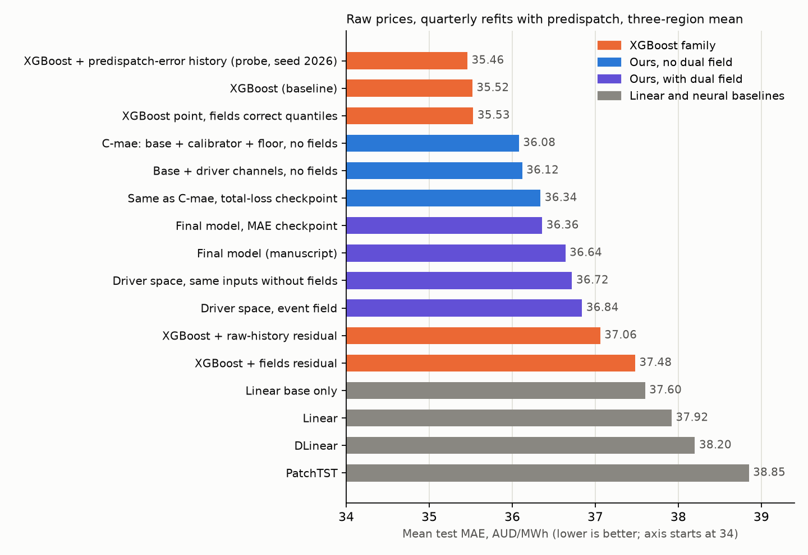

# 实验总览与当前困境（2026-10-10）

范围：2026-10 这一轮围绕"双场（趋势场 CTF + 事件场 DGF）能否在 NEM 小时电价预测上带来增益"所做的全部实验。
论文文字没有修改，这里只记录实验证据。除特别说明外：原始价格，季度重训（2023-2024 共 8 次），预调度输入，
三个种子（2026-2028），NSW1 / QLD1 / TAS1 各 17,521 个测试起点，三地区取平均。MAE 的算法对所有模型相同：
全部起点 × 24 小时的绝对误差取平均（`forecasting/evaluate_paper_metrics.py:point_metrics`）。

（图由 `plot_mae_overview.py` 生成。轴从 34 开始；探针一行只有种子 2026。）

## 1. 任务口径

- 预测对象是 NEM 的实时现货价格（5 分钟价格平均成小时），不是日前拍卖价格。
- 起点每小时滚动一次，每个起点预测未来 24 小时，每个目标小时的提前量是 1 到 24 小时。
- 输入：72 小时价格和需求历史，到起点为止已发布的最新预调度（价格、需求、可用发电、净互联）、PD PASA（备用容量、
  需求预测、风光可用量），气价，日历。
- 双场自己只读价格和需求历史；外生信息在预测头里才进入。

## 2. 实验清单

| # | 实验 | 问题 | 主要结果 | 分支 / tag |
|---|---|---|---|---|
| 1 | 论文主结果 | 双场 + 线性基座 + 校准器 + 下界对 5 个基线 | MAE 36.64，第二（XGBoost 35.52）；整体 CRPS 排第五；负价格小时的分位数最好 | `feature/paper-revision-audit`，`aemo-paper-revision-audit` |
| 2 | 尖峰可预测性 | 尖峰能否从外生变量、价格历史、预报修订、驱动轨迹预测 | 价格历史最强（PR-AUC 0.37–0.44 对仅外生 0.15–0.27）；修订和轨迹在价格历史之上无增益 | `feature/spike-precursor-predictability`，`aemo-spike-precursor-predictability` |
| 3 | 文献梳理 | 尖峰预测有无先例 | 备用裕度、需求趋势、状态转换、风险模型早已有人做；Cornell 等的"训练集过滤尖峰"是直接竞争思路 | 同上，`logs/forecasting/spike_predictability/LITERATURE.md` |
| 4 | MAE 对齐 + 无双场对照 | 按验证 MAE 选 checkpoint 有用吗；去掉双场呢 | MAE 选择降 0.28（p<0.001）；去掉双场后 MAE 低 0.29（p<0.001）；有场的优势只在尖峰小时 CRPS | `feature/mae-aligned-selection`，`aemo-mae-aligned-nofields-control` |
| 5 | 误差分布 | 误差集中在哪 | 最差 1% 的小时占 NSW1 总误差 49%、QLD1 38%、TAS1 18%；17–18 点误差约 200，其他时间 15–25；两模型曲线几乎重合 | 同上 |
| 6 | XGBoost 基座 + 双场残差 | 双场在最强基线上有无增益 | 点预测变差约 2（p<0.001）；尾部好处原始历史对照也有；预先写好的标准一条未完整达成 | `feature/xgboost-base-fields`，`aemo-xgboost-base-fields` |
| 7 | 数据盘点 | 供给阶梯、缺备用通知等能否补足 | 报价数据可按时间点还原但约 125 GB；通知很便宜但归档只到 2024-07；2024-08 起报价只有最终版本 | `feature/spike-driver-data-audit` |
| 8 | 驱动空间双场 | 事件放在驱动变量里是否更好 | 不如同样输入不分解（MAE +0.12，p=0.008）；驱动通道本身对 MAE 无增益 | `feature/driver-space-dual-field`，`aemo-driver-space-dual-field` |
| 9 | 历史信息探针 | 历史条件信息还有多少 | XGBoost 加预调度误差历史，MAE 只降 0.09（p=0.006），CRPS 和尾部无变化 | `feature/history-attention-probe`，`aemo-history-attention-probe` |

分析类（无新训练）：RE-Price 的低 MAE 来自尖峰被截断或剔除后的口径（截到 650 或去掉含尖峰窗口后我们的 NSW1/QLD1 与之重合，TAS1
未能解释）；NBEATSx 的低 MAE 来自日前拍卖市场、2015-2018 年、几乎无尖峰，按相对朴素预测的比值（rMAE）我们与之同量级。

## 3. 关键数字

| 变体 | MAE | CRPS~ |
|---|---:|---:|
| XGBoost | 35.52 | 23.11 |
| C-mae（线性基座 + 校准器 + 下界，无双场，MAE 选 checkpoint） | 36.08 | 24.90 |
| 论文最终模型 A（双场 + 校准器 + 下界） | 36.64 | 25.07 |
| A 改用 MAE checkpoint（B） | 36.36 | 25.14 |
| XGBoost 点预测 + 双场修正分位数 | 35.53 | 23.87 |
| XGBoost + 双场残差（点预测也修正） | 37.48 | 23.87 |
| 驱动空间事件场 | 36.84 | 26.20 |

## 4. 困境

1. **点预测上没有任何方向赢过 XGBoost。** 最好的自有模型 C-mae 没有双场，仍差 0.55；带双场的变体都在 36.4–37.5。
2. **双场的核心主张被四个独立实验否定**：线性基座上去掉双场更好；XGBoost 基座上叠加双场点预测变差；驱动空间不如同样输入不分解；历史条件信息
   只值约 0.09，早期的历史注意力实验注意力均匀、快速过拟合。
3. **根源在任务而不是结构。** 预测力来自预调度和备用容量等前瞻性输入，会用它们的模型都收敛到 35.5–38.9，而"报中位数"是 67；
   误差集中在极少数尖峰小时，所有模型（包括 XGBoost）都预测不了。
4. **唯一的亮点很窄。** 尖峰小时 CRPS 有场比无场好 25–30（原始价格），但原始历史分支也能做到。
5. **尖峰方向有天花板。** 预调度已抓到约三分之二的尖峰（精确率 18%–43%）；剩下的主要是最后几分钟的重新报价；供给阶梯数据体量大且测试期最后 5 个月无按时间点版本。
6. **评估期已被反复使用。** 2023-2024 经历多轮方法选择；2025 年数据尚未使用。论文口径尚未同步更新。

## 5. 可走的路（待决定）

1. 改成实证研究：重建好不等于预测好，分解结构何时有用，以这些控制实验为证据。
2. 转向尖峰小时的分位数预测，先用 2025 年留出。
3. 先补外部基线（NBEATSx、日前口径）和"完全不用历史"的 XGBoost，再决定。

## 6. 复现要点

- 各实验的脚本、日志、显著性检验结果都在对应分支的 `logs/forecasting/<实验名>/` 下；预先写好成功标准的计划文档：
  `PLAN_XGBOOST_BASE_FIELDS.md`、`PLAN_DRIVER_SPACE.md`。
- 显著性：Diebold-Mariano，Newey-West 方差 48 阶，三地区平均损失，`forecasting/significance.py`。
- 已知口径提示：主表 CRPS 是各种子分别计算再平均，检验里的 CRPS 用种子平均后的分位数，两者数值不必相等。
